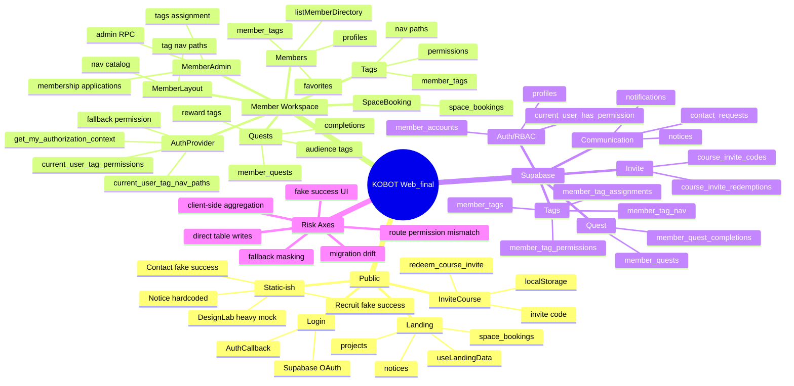
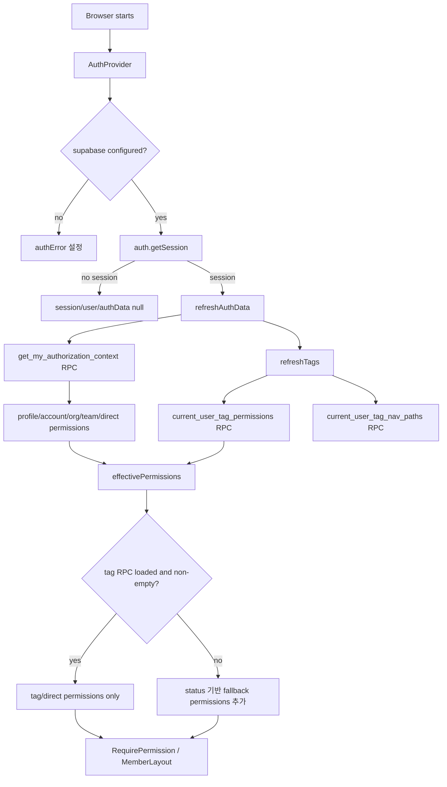

# 2026-05-05 전체 코드 감사 및 시스템 명세

> 목적: 앞으로 작업자가 이 문서만 보고도 페이지, API, DB, 권한, fallback, 검증 흐름을 빠르게 이어 잡도록 만든다.  
> 범위: `src`, `supabase`, `docs`, `scripts`, 루트 설정 파일. `node_modules`, `dist`, 이미지 바이너리는 제외했다.

## 0. 결론

현재 코드의 가장 큰 문제는 fallback 자체가 많다는 사실보다, fallback이 "DB 스키마와 프론트 코드가 같은 시점에 있지 않을 수 있다"는 구조적 불안을 흡수하고 있다는 점이다.

즉 대부분의 fallback은 사용자를 친절하게 보호하려고 생긴 것이 아니라, migration 미적용, RLS 불일치, 과도기 mock, 권한 모델 전환 실패를 화면에서 덜 터지게 만들기 위해 생겼다. 이 방식은 단기 시연에는 좋지만 운영에서는 장애를 빈 배열, 빈 대시보드, 가입 미완료, 권한 없음처럼 보이게 만든다.

가장 먼저 봐야 할 P0는 다음이다.

1. `profiles.tech_tags` 제거 후 `get_my_authorization_context()`가 여전히 `p.tech_tags`를 참조한다. 이 상태로 최신 migration을 적용하면 로그인 직후 권한 컨텍스트 RPC가 깨진다.
2. `course_member`를 `active`로 합치는 방향과 DB `current_user_has_permission()`의 status 기반 권한 판정이 충돌한다. 태그가 권한 원천이라면 DB 권한 함수도 태그 기반으로 바뀌어야 한다.
3. 라우트 권한과 메뉴 권한이 다르다. 메뉴에서 숨긴 페이지가 직접 URL로 들어갈 수 있다.
4. 미션 audience가 서버에서 충분히 강제되지 않는다. 직접 insert RLS와 RPC 가드가 다르다.
5. 멤버 디렉터리, 연락처 후보, 태그 카운트, quest completion 등에서 민감 데이터와 전체 row를 클라이언트로 넓게 가져온다.

## 1. 감사 방식과 Ouroboros 로그

### 사용한 방식

- 6개 서브에이전트 병렬 감사:
  - Supabase/DB/RLS
  - 인증/세션/라우팅
  - 멤버 도메인 페이지/API
  - 공개 페이지/API
  - 공용 UI/유틸/스타일
  - 문서/테스트/빌드/운영 흔적
- 메인 프로세스 직접 검증:
  - `git status`, `git diff --stat`, 주요 변경 diff 확인
  - DB 객체, API 호출, fallback 패턴 검색
  - 핵심 파일 라인 단위 재확인
  - Ouroboros 설치 및 brownfield scan

### Ouroboros 설치/적용 상태

- GitHub repo: `https://github.com/Q00/ouroboros`
- 설치 위치: `C:\Users\jongh\.codex\tools\ouroboros`
- 설치 방식:
  - repo clone
  - Codex bundled Python 3.12.13로 `.venv` 생성
  - `pip install -e C:\Users\jongh\.codex\tools\ouroboros`
  - `ouroboros codex refresh` 성공
  - `~/.codex\rules\ouroboros.md`, `~/.codex\skills`에 20개 스킬 설치
- `ouroboros status health`: Database/Configuration OK, Providers warning
- `ouroboros setup scan C:\Users\jongh\Desktop\kook\2026-1\코봇\Web_final`: repo 1개 등록 성공

### 이번 작업에서 배운 하네스 규칙

| 사건 | 원인 | 다음 규칙 |
|---|---|---|
| `rg.exe` Access denied | 현재 WindowsApps/실행 정책 쪽에서 일부 exe 실행이 막힘 | `rg` 실패 시 즉시 기록하고 `Get-ChildItem` + `Select-String`으로 전환한다. 같은 `rg` 명령 반복 금지. |
| `codex.exe` Access denied | `C:\Program Files\WindowsApps\OpenAI.Codex...` 실행 거부 | Ouroboros Codex runtime을 직접 실행하는 detect/evaluate는 이 환경에서 실패할 수 있다. Codex Desktop 세션 안에서는 스킬 문서를 수동 적용한다. |
| Ouroboros scan cp949 crash | Rich spinner 문자 `⠹`가 cp949 콘솔에서 인코딩 실패 | `PYTHONUTF8=1`, `PYTHONIOENCODING=utf-8`, `TERM=dumb`, `NO_COLOR=1` 지정 후 재실행한다. |
| `ouroboros detect PATH --backend codex` 실패 | Typer 옵션 순서 문제 | 옵션은 path 앞에 둔다: `ouroboros detect --backend codex PATH`. |
| `ouroboros detect --backend codex` 실패 | Codex CLI Access denied | 현재는 수동 mechanical contract를 문서화하고, CLI 접근이 가능한 WSL/정상 PATH에서 다시 detect한다. |

## 2. 전체 시스템 마인드맵

## 3. 데이터 흐름: 인증과 권한

### 핵심 문제

- `AuthProvider.refreshTags()`는 RPC result의 `error`를 명시적으로 검사하지 않는다. Supabase RPC 실패는 throw가 아니라 `{ error }`로 올 수 있으므로 실패가 빈 배열처럼 처리된다.
- `effectivePermissions`는 tag 권한이 로드되지 않았거나 비어 있으면 status 기반 hardcoded 권한을 섞는다.
- DB의 `current_user_has_permission()`은 여전히 org/team/status 중심이고, 새 tag 권한 테이블을 권위 원천으로 삼지 않는다.
- 그래서 UI 권한과 RLS 권한이 서로 다를 수 있다.

## 4. DB 도메인 명세

| 도메인 | 주요 테이블 | 주요 RPC/함수 | 현재 의미 |
|---|---|---|---|
| Auth/RBAC | `profiles`, `member_accounts`, `permissions`, `org_positions`, `team_roles`, `team_memberships` | `get_my_authorization_context`, `current_user_has_permission`, `resolve_login_email` | 세션 사용자의 프로필, lifecycle status, 기존 권한 계산 |
| Tag Permission | `member_tags`, `member_tag_permissions`, `member_tag_nav`, `member_tag_assignments` | `current_user_tag_permissions`, `current_user_tag_nav_paths`, `sync_member_status_tags` | 새 권한/메뉴/소속 단일 진리원천으로 의도됨 |
| Invite | `course_invite_codes`, `course_invite_redemptions`, `invite_redeem_attempts` | `redeem_course_invite`, `apply_course_invite_after_application` | 초대 코드로 태그 부여 및 가입 후 상태 전환 |
| Member Admin | `membership_applications`, `profile_change_requests`, `member_favorite_profiles` | `admin_set_member_status`, `admin_update_member_profile`, `admin_delete_member`, `admin_member_application_status` | 관리자 승인/수정/삭제, 신청 상태 조회 |
| Directory | `profiles`, `member_accounts`, `org_position_assignments`, `project_team_memberships`, `member_tag_assignments` | 직접 select 위주 | 멤버 카드/필터/즐겨찾기 |
| Quest | `member_quests`, `member_quest_audience_tags`, `member_quest_reward_tags`, `member_quest_completions` | `current_user_can_see_quest`, `submit_quest_completion`, `review_quest_completion`, `apply_quest_completion_rewards` | 대상 태그 기반 미션, 승인 시 보상 태그 부여 |
| Booking | `space_bookings` | 직접 CRUD | 공간 예약 |
| Communication | `contact_requests`, `contact_request_events`, `notices`, `notice_comments`, `notifications` | `create_contact_request`, `decide_contact_request`, `report_contact_request_spam` | 연락 요청, 공지, 알림 |
| Project | `project_teams`, `project_team_memberships`, `project_team_join_requests` | 일부 helper/RLS | 프로젝트 목록/상세/참여 |

## 5. 페이지별 연결 명세

| 페이지 | 프론트 API | DB/RPC | 주고받는 데이터 | 위험 |
|---|---|---|---|---|
| `/` Landing | `useLandingData` | `notices`, `space_bookings`, `member_accounts`, `project_teams` | 공개 통계, 행사, 공지 | 실패를 0/빈 배열로 삼킴. 공개 RLS가 사실상 보안 경계. |
| `/login` | `signInWithGoogle`, login id flow | Supabase Auth, `resolve_login_email` | OAuth, ID login | callback next 경로와 초대 flow가 꼬일 수 있음. |
| `/auth/callback` | `redeem_course_invite`, `refreshAuthData` | `redeem_course_invite` RPC | 초대 코드 적용 결과 | redeem 실패 catch가 비차단이라 코드 적용 실패가 숨음. |
| `/invite/course/:code` | `signInWithGoogle` | 이후 callback RPC | code를 localStorage에 저장 | 이미 로그인된 사용자는 redeem 없이 `/member`로 갈 수 있음. |
| `/member` Dashboard | `loadDashboardData` | notifications, notices, projects, bookings, contact_requests | 섹션별 데이터와 `failedSections` | 섹션 실패가 빈 데이터로 보일 수 있음. |
| `/member/members` | `listMemberDirectory`, `updateOwnDirectoryProfile`, `setMemberFavorite` | profiles, member_accounts, tags, positions, teams, projects, favorites | 멤버 카드, 태그, 즐겨찾기 | `safeRows`가 RLS/네트워크 오류를 빈 배열로 숨김. |
| `/member/admin` | `listAdminMembers`, `admin*`, tag assign/remove | admin RPC, profiles, accounts, tags, applications | 관리자 목록, 상태 변경, 태그 부여 | 일부 route/UI 권한 불명확. 직접 table write가 많음. |
| `/member/tags` | `listTagsWithCounts`, `createTag`, `deleteTag` | member_tags, tag relations | 태그/카운트 | 카운트를 전체 row select 후 클라이언트 집계. |
| `/member/tags/:slug` | `getTagBySlug`, `updateTag`, `setTagPermissions`, `setTagNav`, `assignTagToUser` | tag tables, member directory | 권한/메뉴/부원 연결 | delete-then-insert로 부분 실패 시 기존 권한 손실 가능. |
| `/member/quests` | quest API + tag API | member_quests, audience/reward/completions, RPC | 미션, 대상 태그, 보상 태그, 완료 신청 | audience 서버 강제와 직접 insert RLS 불일치. |
| `/member/space-booking` | `listBookingsInRange`, `createBooking` | space_bookings | 예약 기간/시간/참여자 | 겹침, end > start, 인원, 삭제 권한 검증 부족. |
| `/contact`, `/recruit` | 없음 | 없음 | 입력 후 fake success | 사용자는 접수된 줄 알지만 저장되지 않음. |
| `/notice` public | 내부 hardcoded `NOTICES` | 없음 | 정적 공지 | DB 공지 API와 분리되어 최신성 없음. |
| `/design-lab` | 없음 | 없음 | 대형 mock UI | 운영 번들/공개 경로에 무거운 실험 페이지. |

## 6. 주요 fallback 목록

| 위치 | fallback | 왜 생겼을 가능성 | 문제 |
|---|---|---|---|
| `AuthProvider.refreshAuthDataInternal` | `get_my_authorization_context` 실패 시 session-only/non-active fallback | 초기 DB migration 미적용 상태에서도 로그인 화면을 죽이지 않기 위해 | 실제 RPC 파손을 가입 미완료/권한 없음으로 오해하게 함 |
| `AuthProvider.refreshTags` | tag RPC 실패 catch 후 기존 값/legacy fallback | 태그 권한 시스템 도입 중 RLS/RPC 미적용 방어 | 권한 정보 실패와 권한 없음이 구분되지 않음 |
| `AuthProvider.effectivePermissions` | tag 권한 없으면 status 권한 추가 | status 권한에서 tag 권한으로 이행하는 중간다리 | tag가 권위 원천이라는 설계와 충돌 |
| `member-directory.safeRows` | 오류 시 `[]` | 보조 테이블이 없거나 RLS가 막혀도 카드 렌더 유지 | 직책/팀/프로젝트/태그 오류가 데이터 없음처럼 보임 |
| `member-directory.listFavorites` | favorites table 실패 시 localStorage | `member_favorite_profiles` 미적용 환경 호환 | 서버 동기화 실패를 정상 즐겨찾기로 보이게 함 |
| `member-directory` tag assignment select | `is_club` 실패 시 legacy select, 2차 실패 시 `[]` | `20260506030000` rollout 전후 호환 | RLS/네트워크 오류까지 태그 없음으로 숨길 수 있음 |
| `tags.ts` list/create | `is_club` 컬럼 누락 legacy fallback | 운영 DB migration 지연 | 상세/수정에는 같은 fallback이 없어 일관성 깨짐 |
| `invite-codes.ts` | `default_tags` 누락 시 legacy select/insert, 기본 KOSS | 초대 코드 확장 컬럼 rollout | 실제 DB 상태를 숨기고 태그 자동 부여가 안 될 수 있음 |
| `dashboard.ts` | 섹션별 `withFallback` | 대시보드를 부분적으로라도 표시하려고 | 장애가 빈 섹션이 됨 |
| `useLandingData` | 실패 시 빈 배열/0 | 공개 랜딩 무중단 | RLS/스키마/네트워크 오류가 운영에서 사라짐 |
| `AuthCallback` invite redeem | 실패 catch 비차단 | OAuth 성공 흐름을 막지 않기 위해 | 코드 미적용을 사용자가 놓침 |
| `Contact/Recruit/NoticeDetail` | API 없이 성공 UI | 데모/디자인 과도기 | 사용자 데이터 유실 |
| `ImageWithFallback` | 이미지 로드 실패 시 fallback 렌더 | 외부 이미지 안정성 | `src` 변경 시 복구 안 됨 |

## 7. 보안 평가

### P0

1. `tech_tags` 제거와 authorization RPC 불일치  
   `20260506040000_purge_club_strings_from_tech_tags.sql`은 `profiles.tech_tags`를 drop한다. 그런데 최신 `get_my_authorization_context()` 재정의는 `20260504144000_active_member_base_permissions.sql` 쪽에 남아 있고 `p.tech_tags`를 참조한다. 이 조합이면 로그인 후 권한 컨텍스트 RPC가 실패한다.  
   수정: `tech_tags` drop 전에 또는 같은 migration 안에서 `get_my_authorization_context()`를 재작성해서 profile JSON에서 `techTags`를 제거하거나 `member_tag_assignments` 기반으로 대체한다.

2. `course_member -> active` 통합과 권한 상승  
   `course_member`를 `active`로 합치려면 `active`의 status 기반 기본 권한이 그대로 붙는다. 그런데 기존 `course_member`는 제한 권한이었다. 태그가 권한 원천이라면 `current_user_has_permission()`도 `member_tag_permissions`를 읽어야 한다.  
   수정: status는 lifecycle만 표현하고, 권한은 DB/RLS 함수부터 tag 기반으로 통합한다. transition 기간에는 course tag만 가진 active에게 active 기본 권한을 주지 않도록 한다.

3. 라우트 권한과 메뉴 권한 불일치  
   `routes.tsx`에서 `study-log`, `study-playlist`, `peer-review`, `roadmap`, `retro`, `changelog`, `votes`, `space-booking`, `contact-requests` 등 일부 route는 명시 permission 없이 `RequireActiveMember`만 통과한다. 메뉴 숨김은 보안 경계가 아니다.  
   수정: 모든 member route에 permission 또는 nav entitlement를 명시한다. `MemberLayout`의 보이는 메뉴와 `routes.tsx`의 접근 조건을 같은 catalog에서 생성한다.

4. 미션 audience 서버 강제 불일치  
   `submit_quest_completion()`은 `current_user_can_see_quest()`를 확인하지만, 직접 insert RLS는 `user_id = auth.uid()` 중심이다. 숨김 quest id가 노출되면 직접 completion row 생성 가능성이 있다.  
   수정: direct insert/update/delete를 막고 제출/검토는 RPC만 허용한다. RLS도 `current_user_can_see_quest(quest_id)`를 check에 포함한다.

### P1

- `admin_member_application_status(uuid[])`는 security definer인데 permission check가 없다. authenticated 누구나 신청 상태를 조회할 수 있다.
- 연락 요청 후보 목록에서 email/phone까지 읽은 뒤 클라이언트에서 필터한다. 연락처는 수락된 요청 payload에서만 공개해야 한다.
- `notices.ts`는 published 필터가 없고, `projects.ts`는 visibility 필터가 약하다. 멤버 API와 공개 API를 분리해야 한다.
- 태그/퀘스트/권한/내비/태그부여가 direct table write 위주다. RLS가 유일한 방어선이며 트랜잭션 단위 무결성도 약하다.
- `space-bookings.ts`는 raw DB error message를 던지고, 예약 겹침/시간/인원/삭제 권한 검증이 부족하다.
- `dashboard.ts`의 알림 href는 `notification-policy.js`의 URL 정규화를 거치지 않는다.
- `safeImageUrl`은 `data:image/svg+xml`을 허용한다. 사용자 입력 이미지라면 SVG data URI는 막는 편이 안전하다.

## 8. 성능 평가

| 위치 | 문제 | 개선 |
|---|---|---|
| `routes.tsx` | 모든 페이지 정적 import. `Landing`, `DesignLab`, 큰 member pages가 초기 번들에 들어갈 가능성 | route-level `React.lazy` 분리 |
| `DesignLab.tsx` | 대형 mock/실험 페이지가 공개 경로에 있음 | 운영 번들 제외 또는 lazy/dev-only |
| `listMemberDirectory` | 여러 테이블 전체 조회 후 클라이언트 join | read model view/RPC로 서버 집계 |
| `listTagsWithCounts` | permissions/nav/assignments 전체 row를 받아 count | count RPC/view |
| `listQuests` | completions 전체 조회 후 pending/my state 계산 | quest별 count와 current user completion만 반환 |
| RLS `current_user_has_permission` | 행 단위 RLS에서 반복 조인 | tag permission cache/view, stable helper 최적화 |
| `Landing` | 공개 방문마다 Supabase 5중 쿼리 | 집계 RPC, 캐시, edge/server side precompute |
| CSS/sidebar | `left/right/width` layout animation | transform 기반 애니메이션 |

## 9. 코드 품질/접근성 평가

- `TagChip`은 클릭 가능한 `span role="button"`을 쓰지만 `tabIndex`, Enter/Space 처리, `aria-pressed`가 없다. 실제 `<button>` 또는 키보드 완비 컴포넌트로 바꿔야 한다.
- `ImageWithFallback`은 `src`가 바뀌어도 error state가 초기화되지 않는다. 프로필 이미지 변경 시 fallback에 갇힐 수 있다.
- `chart.tsx`는 `dangerouslySetInnerHTML`로 CSS를 주입한다. key/color 검증이 필요하다.
- `carousel.tsx`는 `reInit` event cleanup이 빠져 있다.
- shadcn 기본 `h-9`, checkbox/switch/slider 작은 터치 타깃은 모바일 접근성 기준에 부족할 수 있다.
- `PublicHeader`는 고정 grid/gap으로 모바일 overflow 위험이 있고 `aria-current`가 없다.

## 10. 테스트/운영 게이트 평가

현재 `package.json` scripts는 `build`, `dev`뿐이다. `scripts/*.mjs` 테스트는 존재하지만 npm script에 연결되지 않았다.

필수로 추가할 게이트:

1. `test`: `node --test scripts/*.mjs`
2. `typecheck`: TypeScript 설치 후 `tsc --noEmit`
3. `lint`: ESLint 또는 Biome
4. `build`: 기존 `vite build`
5. `migration:lint`: SQL parser 또는 Supabase local dry-run
6. `rls:test`: Supabase local seed + anon/auth role별 접근 테스트
7. `schema:drift`: 코드가 참조하는 컬럼/RPC와 migration 최종 상태 대조

Ouroboros `detect`는 Codex CLI 실행 거부 때문에 자동 생성에 실패했다. 현재 환경에서는 위 목록을 수동 mechanical contract로 삼고, WSL 또는 정상 Codex CLI PATH에서 다시 `ouroboros detect --backend codex <repo>`를 실행하는 것이 맞다.

## 11. 왜 Claude가 이렇게 fallback을 짰을까

가능성이 높은 순서대로 보면 다음이다.

1. Supabase migration push가 실제 운영 DB에 즉시 반영되지 않는 상황이 있었다. 새 컬럼을 바로 select하면 앱이 죽으니 `isMissingColumn`, `isMissingSchemaError`, localStorage capability cache가 생겼다.
2. 사용자가 화면이 깨지는 것을 싫어하는 압박 속에서, 에러를 드러내기보다 "일단 빈 화면이라도 렌더"하는 방향으로 보정했을 가능성이 높다.
3. `course_member`, `KOSS`, `club_affiliation`, `tech_tags`, `member_tags`가 동시에 존재하면서 도메인 단어가 흔들렸다. 명확한 단일 원천을 정하기 전 임시 연결 코드가 계속 누적됐다.
4. 테스트/CI가 없어서 fallback을 넣으면 당장은 문제가 덜 보였고, 실제로 권한/RLS/스키마가 어긋난 사실을 빨리 감지할 장치가 없었다.
5. 디자인/데모 페이지가 운영 페이지로 승격되며 fake success, mock, TODO가 남았다.

즉 "일부러 대충"이라기보다, 깨지는 지점을 직접 고치지 않고 증상을 흡수하는 쪽으로 계속 지역 최적화를 한 결과다. 하지만 지금은 그 지역 최적화가 권한 모델과 DB 진실원천을 흐리고 있다.

## 12. 수정 우선순위

### Phase 0: 배포 중지급 정합성

1. 최신 migration chain에서 `get_my_authorization_context()`를 `tech_tags` 없는 버전으로 재작성한다.
2. `current_user_has_permission()`을 tag 권한까지 포함하도록 바꾸거나, `course_member -> active` 통합을 보류한다.
3. `AuthProvider.refreshTags()`에서 RPC error를 검사하고, 실패 시 권한 fallback을 붙이지 않는다. "권한 로딩 실패" 상태를 UI에 노출한다.
4. 모든 member route에 explicit permission/nav entitlement를 건다.
5. `admin_member_application_status`에 permission check를 추가한다.

### Phase 1: 데이터 무결성

1. 태그 권한/내비 설정, quest audience/reward 설정, quest create/update를 트랜잭션 RPC로 이동한다.
2. `member_quest_completions` 직접 insert/delete/update RLS를 닫고 RPC 경유만 허용한다.
3. invite redeem에 `for update` 또는 atomic update 조건을 넣어 `max_uses` race를 막는다.
4. space booking에 DB constraint/RPC로 시간/겹침/인원/삭제 권한을 넣는다.

### Phase 2: fallback 제거와 관측성

1. fallback마다 삭제 조건을 주석/문서에 붙이고 ticket화한다.
2. schema capability를 localStorage가 아니라 DB/app schema version으로 판단한다.
3. dashboard/landing의 partial failure를 telemetry와 사용자 메시지로 분리한다.
4. fake success UI를 실제 API 연결 또는 명확한 준비 중 상태로 바꾼다.

### Phase 3: 성능/접근성/번들

1. route-level lazy loading.
2. tag/member/quest count RPC.
3. `TagChip`, `ImageWithFallback`, `safeImageUrl`, `carousel`, `chart` 개선.
4. 모바일 헤더와 터치 타깃 보정.

## 13. 다음 작업자가 봐야 할 핵심 파일

| 목적 | 파일 |
|---|---|
| 인증/권한 상태 머신 | `src/app/auth/AuthProvider.tsx`, `src/app/auth/guards.tsx`, `src/app/auth/types.ts` |
| 라우트 접근 경계 | `src/app/routes.tsx`, `src/app/layouts/MemberLayout.tsx`, `src/app/config/nav-catalog.ts` |
| 멤버 디렉터리 | `src/app/api/member-directory.ts`, `src/app/pages/member/Members.tsx` |
| 멤버 관리자 | `src/app/api/member-admin.ts`, `src/app/pages/member/MemberAdmin.tsx` |
| 태그 권한 | `src/app/api/tags.ts`, `src/app/pages/member/Tags.tsx`, `src/app/pages/member/TagDetail.tsx` |
| 미션 | `src/app/api/quests.ts`, `src/app/pages/member/Quests.tsx`, `supabase/migrations/20260505260000_member_quests.sql` |
| 초대 코드 | `src/app/api/invite-codes.ts`, `src/app/pages/public/InviteCourse.tsx`, `src/app/pages/public/AuthCallback.tsx` |
| 최신 DB 전환 | `supabase/migrations/20260505220000_member_tags.sql`, `20260506020000_collapse_course_member.sql`, `20260506030000_member_tags_club_kind.sql`, `20260506040000_purge_club_strings_from_tech_tags.sql` |
| 운영 게이트 | `package.json`, `vite.config.ts`, `vercel.json`, `scripts/*.mjs` |

## 14. 검증 메모

- `rg`는 Access denied로 실패했다. PowerShell `Get-ChildItem`/`Select-String`으로 대체했다.
- `npx tsc --noEmit`는 프로젝트에 `typescript` 패키지가 없어 서브에이전트 기준 실패했다.
- `node --test scripts\*.mjs`: 20개 테스트 통과.
- `npm run build`: 성공. 다만 `assets/index-*.js`가 약 1.32MB, gzip 약 370KB로 Vite 500KB chunk warning 발생. route-level code splitting이 필요하다.
- `git diff --check`: exit 0. 단, 여러 기존 파일에서 LF -> CRLF 경고가 표시됨.
- Ouroboros `detect`는 Codex CLI Access denied로 실패했다.
- Ouroboros brownfield scan은 UTF-8 환경변수 지정 후 성공했다.
