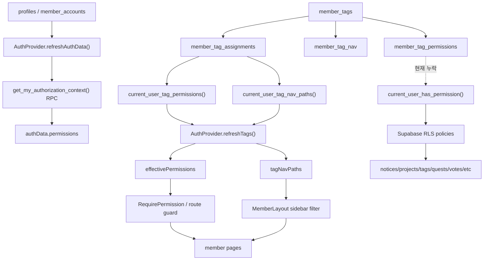

# 09. 전체 코드 재감사 v2 - 태그 권한, fallback, 보안/최적화

작성일: 2026-05-05  
범위: `src/app`, `supabase/migrations`, `scripts`, 주요 문서/설정  
목적: 이전 감사에서 놓친 태그 기반 권한/사이드바 구조를 기준으로 전체 보안, 최적화, fallback 위험을 다시 정리한다.

## 0. 이번 재감사에서 바로잡은 결론

이전 판단 중 가장 큰 오류는 태그를 단순 표시용 분류로 보고 `kind` 같은 분리 컬럼을 먼저 제안한 것이다. 현재 코드는 이미 태그를 다음처럼 설계하고 있다.

- `member_tags`: slug는 영어 식별자, label은 한국어 표시명, 색상/설명/동아리 표시 여부를 가진 태그 본체
- `member_tag_permissions`: 한 태그가 부여하는 권한 목록
- `member_tag_nav`: 한 태그가 사이드바에 노출시키는 메뉴 목록
- `member_tag_assignments`: 어떤 유저가 어떤 태그를 가졌는지

즉 현재 설계는 "태그 하나가 권한 0..N, 사이드바 0..N, 멤버 0..N을 가지는 번들"이다. 그래서 졸업, KOBOT, KOSS, 신입, 운영진, 회장 전용 같은 개념을 모두 태그로 표현하는 방향이 코드와 맞다. 단, 지금 구현은 프론트 태그 권한과 DB RLS 권한이 완전히 같은 권위 체계가 아니다. 이것이 핵심 위험이다.

## 1. 실제 시스템 맵



끊어진 부분은 마지막 점선이다. 프론트는 태그 권한을 읽지만, DB의 `current_user_has_permission()`은 아직 `member_tag_permissions`를 읽지 않는다. 따라서 화면에서는 권한이 있는 것처럼 보이는데 DB에서 막히거나, 반대로 legacy 직책/상태 권한이 DB에서 계속 살아남는 불일치가 생긴다.

## 2. 태그/권한/사이드바 실제 흐름

### 2.1 태그 생성

`src/app/pages/member/Tags.tsx`는 slug와 label을 명확히 분리한다. slug는 영어 식별자이고 label은 한국어 표시명이다. 생성 직후 `/member/tags/:slug`로 이동해서 권한과 사이드바를 설정하게 만든다.

근거:

- `src/app/pages/member/Tags.tsx:61-90`: `createTag({ slug, label, color, description, isClub })`
- `src/app/pages/member/Tags.tsx:205-219`: slug 입력은 "영어, 식별자", label 입력은 "화면 표시명"
- `src/app/api/tags.ts:8-25`: `MemberTag`에 `slug`, `label`, `isClub`, `autoStatus`

### 2.2 태그 상세에서 권한/사이드바를 설정

`src/app/pages/member/TagDetail.tsx`는 권한과 사이드바를 별도 탭으로 관리한다.

근거:

- `src/app/pages/member/TagDetail.tsx:88-89`: `permissions`, `navHrefs` 상태를 별도 관리
- `src/app/pages/member/TagDetail.tsx:165-194`: `setTagPermissions`, `setTagNav`
- `src/app/pages/member/TagDetail.tsx:532-580`: 권한/사이드바 체크박스 그리드
- `src/app/config/nav-catalog.ts:24-50`: 태그가 줄 수 있는 사이드바 목록
- `src/app/config/nav-catalog.ts:52-85`: 태그가 줄 수 있는 권한 목록

### 2.3 프론트 인증 컨텍스트

`AuthProvider`는 두 갈래로 권한을 만든다.

- `get_my_authorization_context()`에서 profile/account/direct permissions를 가져온다.
- `current_user_tag_permissions()`와 `current_user_tag_nav_paths()`에서 태그 권한/메뉴를 가져온다.
- 최종적으로 `authData.permissions + tagPermissions + fallbackPermissions`를 합쳐 `effectivePermissions`로 만든다.

근거:

- `src/app/auth/AuthProvider.tsx:557-595`: 태그 RPC 로딩
- `src/app/auth/AuthProvider.tsx:1026-1041`: legacy fallback 권한 병합

문제는 태그 RPC 에러를 검사하지 않는다는 점이다. Supabase JS는 RPC 실패를 throw하지 않고 `{ error }`로 돌려줄 수 있는데, 현재 코드는 `permsResult.error`, `navsResult.error`를 보지 않는다. 그러면 실패가 빈 배열처럼 처리되고 fallback 권한이 켜질 수 있다.

### 2.4 사이드바 필터

`MemberLayout`은 `tagNavPaths`가 있으면 부원 섹션 메뉴를 태그가 허용한 메뉴로 제한한다. 하지만 `tagNavSet.size === 0`이면 부원 섹션 메뉴를 전부 보여준다.

근거:

- `src/app/layouts/MemberLayout.tsx:77-215`: 실제 사이드바 선언
- `src/app/layouts/MemberLayout.tsx:462-510`: `course_member` 분기와 tag-nav 필터

이 동작은 마이그레이션 중 "메뉴가 갑자기 사라지는 것"을 막으려고 넣은 fallback으로 보인다. 하지만 태그가 권한의 기준이라면 "태그 메뉴 로딩 실패"와 "정말 메뉴 권한이 없음"은 구분되어야 한다.

### 2.5 라우트 가드

라우트는 `src/app/routes.tsx`에서 별도 선언된다. 여기에는 태그 nav가 직접 들어가지 않는다. 즉 사이드바에서 숨긴다고 URL 직접 접근이 막히는 것은 아니다. 민감 페이지는 반드시 `RequirePermission`과 DB RLS가 같이 막아야 한다.

근거:

- `src/app/routes.tsx:62-87`: `memberElement` wrapper
- `src/app/routes.tsx:159-162`: 연락 요청은 permission 없이 `allowCourseMember`
- `src/app/routes.tsx:200-202`: 공간 예약은 permission 없이 `allowCourseMember`
- `src/app/routes.tsx:224`: 투표는 permission 없이 페이지 진입
- `src/app/routes.tsx:251-253`: 퀘스트도 permission 없이 `allowCourseMember`
- `src/app/auth/guards.tsx:107-109`: `allowCourseMember`가 true면 `RequirePermission`을 우회

## 3. P0/P1 보안 이슈

### P0-1. 최신 migration 뒤 로그인/권한 RPC가 깨질 수 있음

`20260506040000_purge_club_strings_from_tech_tags.sql`은 `profiles.tech_tags`를 drop한다. 그런데 `get_my_authorization_context()`는 여전히 `p.tech_tags`를 select하고 JSON에 넣는다.

근거:

- `supabase/migrations/20260504144000_active_member_base_permissions.sql:102`: `p.tech_tags`
- `supabase/migrations/20260504144000_active_member_base_permissions.sql:134`: `techTags`
- `supabase/migrations/20260506040000_purge_club_strings_from_tech_tags.sql:116-121`: `profiles.tech_tags`와 `merge_profile_tags()` 제거
- `src/app/auth/AuthProvider.tsx:128-148`: missing schema 감지는 `42P01`, `PGRST202`, `PGRST205` 중심이고 undefined column `42703`은 직접 처리하지 않음

영향:

- 최신 migration 적용 후 active 사용자의 auth context RPC가 `column p.tech_tags does not exist`로 실패할 수 있다.
- 로그인 직후 권한/프로필 로딩이 fallback path로 밀리거나 아예 실패한다.
- 이 fallback은 태그 권한 체계를 더 불안정하게 만든다.

수정:

- 새 migration으로 `get_my_authorization_context()`에서 `tech_tags`를 완전히 제거한다.
- 프론트 `AuthProfile.techTags`도 legacy optional로 낮추거나 제거한다.
- `isMissingWorkspaceSchemaError()`로 이 오류를 숨기는 대신 RPC를 고친다. 여기서는 fallback 추가가 아니라 schema contract 복구가 맞다.

### P0-2. 퀘스트 보상 태그를 직접 insert로 탈취할 수 있음

`member_quest_completions` insert policy는 `user_id = auth.uid()`만 확인한다. 그런데 보상 트리거는 `NEW.status = 'approved'`이면 보상 태그를 바로 `member_tag_assignments`에 넣는다.

근거:

- `supabase/migrations/20260505260000_member_quests.sql:152-155`: completion insert self policy
- `supabase/migrations/20260505260000_member_quests.sql:175-179`: authenticated에 insert/update/delete grant
- `supabase/migrations/20260505260000_member_quests.sql:184-205`: `status = 'approved'`이면 reward tags 부여

영향:

- 사용자가 RPC를 우회해 `member_quest_completions`에 직접 `status='approved'`로 insert할 수 있으면, 승인자 없이 보상 태그를 받을 수 있다.
- 보상 태그가 사이드바만 주면 기능 노출 문제가 되고, 권한까지 주면 권한 상승이다.

수정:

- `member_quest_completions`에 대한 직접 insert/update/delete 권한을 제거하거나, insert policy에서 `status = 'submitted'`, `reviewed_by is null`만 허용한다.
- 제출/검토는 `submit_quest_completion`, `review_quest_completion` RPC만 사용한다.
- 보상 트리거는 `OLD.status = 'submitted' AND NEW.status = 'approved' AND NEW.reviewed_by is not null` 조건을 요구한다.
- 퀘스트 관리 권한은 `permissions.manage`/`members.manage` 재사용 대신 `quests.manage`를 새로 두는 것이 안전하다.

### P0/P1. 태그 RPC 실패 시 legacy status 권한으로 열릴 수 있음

`refreshTags()`는 RPC result의 `error`를 확인하지 않는다. 실패가 빈 데이터처럼 처리되면 `tagPermissions.length === 0`이고, `effectivePermissions`는 legacy fallback을 다시 더한다.

근거:

- `src/app/auth/AuthProvider.tsx:566-589`: `permsResult.error`, `navsResult.error` 미검사
- `src/app/auth/AuthProvider.tsx:1026-1041`: 태그 권한이 비어 있으면 active/course_member base permission 추가

영향:

- "태그가 권한을 가져간다"는 정책과 달리 active 상태만으로 `members.read`, `projects.read`, `resources.read` 등이 살아난다.
- 태그 RPC 장애, RLS 장애, 함수 누락이 권한 실패가 아니라 권한 fallback으로 바뀐다.

수정:

- RPC result error를 반드시 확인하거나 `.throwOnError()`를 쓴다.
- `tag load success but empty`와 `tag load failed`를 별도 상태로 둔다.
- 권한 판단은 실패 시 fail closed가 맞다. 단, 개발환경 schema 미적용 안내는 별도 UI로 보여준다.

### P1. DB RLS의 `current_user_has_permission()`이 태그 권한을 모름

태그 권한 RPC는 따로 있지만, RLS에서 쓰는 `current_user_has_permission()`은 status base, org position, team role만 확인한다.

근거:

- `supabase/migrations/20260504144000_active_member_base_permissions.sql:4-79`: tag permission join 없음
- `supabase/migrations/20260505220000_member_tags.sql:251-280`: 태그 권한/nav RPC는 별도로 존재

영향:

- 태그 상세에서 권한을 줘도 DB 쓰기 정책에서는 인정되지 않을 수 있다.
- 반대로 legacy 직책/팀/상태 권한이 계속 DB에서 권한처럼 작동한다.
- 프론트와 DB가 서로 다른 진실을 말한다.

수정:

- `current_user_has_permission(requested_code)`에 `member_tag_assignments -> member_tag_permissions` union을 넣는다.
- status base permission은 제거하거나, KOBOT/KOSS 같은 system tag assignment로만 표현한다.
- bootstrap admin 예외는 별도 root/admin escape hatch로 두되 문서화한다.

### P1. nav catalog, sidebar, route guard가 세 군데로 갈라져 있음

현재 메뉴/권한 정책은 세 군데에 중복되어 있다.

- `MemberLayout.NAVIGATION`: 실제 사이드바
- `NAV_CATALOG`: 태그 상세 체크박스
- `routes.tsx`: 실제 접근 가드

이미 차이가 있다.

- `NAV_CATALOG`에는 `/member/quests`가 있으나 seed KOBOT nav에는 빠져 있다.
- `NAV_CATALOG`에는 `/member/member-admin`이 없다.
- `routes.tsx`에서 votes, quests, roadmap, retro, changelog 등은 별도 permission 없이 진입 가능하다.

수정:

- `member-route-policy.ts` 같은 단일 catalog를 만든다.
- 필드: `href`, `label`, `section`, `requiredPermissions`, `minimumRole`, `tagNavEligible`, `routeComponent`, `featureFlag`
- 사이드바, 태그 체크박스, 라우트 가드를 같은 catalog에서 생성한다.

### P1. `course_member`가 제거 중인데 runtime 권한으로 계속 남아 있음

문서와 migration은 `course_member`를 active로 collapse하려고 한다. 하지만 프론트에는 아직 `course_member` 우회가 많다.

근거:

- `src/app/auth/guards.tsx:70-72`: `allowCourseMember`
- `src/app/auth/guards.tsx:107-109`: `allowCourseMember`면 permission 우회
- `src/app/layouts/MemberLayout.tsx:463-475`: `course_member` 전용 사이드바 분기
- `src/app/routes.tsx`: contact, space-booking, quests 등에 `allowCourseMember`
- `src/app/auth/AuthProvider.tsx:1033-1034`: `COURSE_MEMBER_BASE_PERMISSIONS`

수정:

- 상태는 lifecycle만 담당한다.
- KOSS/수강생 같은 소속/권한은 태그로 표현한다.
- legacy `course_member`는 migration normalization 이후 runtime branch에서 제거한다.

### P1. 초대 코드 사용량 race condition

`redeem_course_invite`는 코드를 읽고 `uses >= max_uses`를 검사한 뒤, redemption insert 후 `uses = uses + 1`을 한다. 동시 요청에서 max_uses를 초과할 수 있다.

근거:

- `supabase/migrations/20260506040000_purge_club_strings_from_tech_tags.sql:49-78`

수정:

- `select ... for update`로 row lock을 잡는다.
- 또는 `update course_invite_codes set uses = uses + 1 where id = ... and (max_uses is null or uses < max_uses) returning id`를 먼저 성공시킨 뒤 redemption을 처리한다.

### P1. 신청 후 초대 적용 RPC가 승인 절차를 우회할 수 있음

`apply_course_invite_after_application()`은 redemption row 존재만 확인하고 상태를 active로 바꾼다. 실제 가입 신청서가 제출/승인되었는지와 연결되어 있지 않다.

근거:

- `supabase/migrations/20260506020000_collapse_course_member.sql:25-60`

수정:

- 정책 결정을 먼저 해야 한다.
- 초대 코드가 "자동 승인 코드"라면 이름과 UI를 그렇게 바꾼다.
- 아니라면 해당 함수는 pending 유지 또는 admin 승인 후 active 전환만 해야 한다.

### P1. 연락처/멤버 디렉터리의 개인정보 경계가 약함

`member-directory`는 `email`과 `publicEmail`을 둘 다 반환한다. 연락 요청 수신자 목록도 `profiles.email`, `profiles.phone`을 가져와 summary에 넣는다.

근거:

- `src/app/api/member-directory.ts:117-130`: `email`, `public_email` 모두 select
- `src/app/api/member-directory.ts:467-472`: `email`, `publicEmail` 모두 반환
- `src/app/api/contact-requests.ts:105-116`: `email`, `phone` select
- `src/app/api/contact-requests.ts:140-151`: summary에 email/phone 포함
- `src/app/api/contact-requests.ts:264-284`: active/course_member 전체 후보 목록 반환

프론트 버그도 있다. 승인된 연락 요청에서 요청자/수신자 모두 `responderContactPayload`를 보게 된다.

근거:

- `src/app/pages/member/ContactRequests.tsx:157-164`

수정:

- 디렉터리는 `public_email`만 기본 노출하고 auth email은 관리자/본인 전용으로 분리한다.
- 연락 요청은 DB RPC가 viewer 기준으로 마스킹된 payload만 반환하게 한다.
- 승인 상태에서 요청자는 responder payload를 보고, 수신자는 requester payload를 보도록 분기한다.

## 4. P2/P3 품질, 성능, 유지보수 이슈

### 4.1 delete-then-insert가 트랜잭션 없이 흩어져 있음

근거:

- `src/app/api/tags.ts:285-311`: 태그 권한/nav를 delete 후 insert
- `src/app/api/quests.ts:226-254`: 퀘스트 생성 후 audience/reward 별도 insert
- `src/app/api/quests.ts:278-302`: 퀘스트 audience/reward delete 후 insert

영향:

- 중간 실패 시 태그 권한이나 퀘스트 보상 규칙이 빈 상태/부분 상태로 남을 수 있다.

수정:

- `set_member_tag_grants(tag_id, permissions, nav_hrefs)`
- `create_quest_with_rules(...)`
- `set_quest_rules(quest_id, audience_tags, reward_tags)`

이런 RPC로 DB transaction 안에서 처리한다.

### 4.2 fallback이 에러를 너무 많이 삼킴

근거:

- `src/app/api/member-directory.ts:323-327`: `safeRows()`가 어떤 에러든 빈 배열로 반환
- `src/app/api/dashboard.ts:327-336`: section별 실패를 fallback 데이터로 숨김
- `src/app/api/tags.ts:69-70`: schema mismatch fallback은 일부 함수에만 있음

좋은 fallback과 나쁜 fallback을 나눠야 한다.

- 좋은 fallback: 이미지 로딩 실패 시 placeholder, 대시보드 일부 카드 실패 시 "일부 실패" 표시
- 나쁜 fallback: 권한 RPC 실패를 권한 허용으로 바꿈, DB schema mismatch를 빈 데이터로 바꿈, 개인정보 로딩 실패와 데이터 없음이 구분 안 됨

### 4.3 이미지 URL/HTML sink

근거:

- `src/app/utils/safe-image-url.ts:27-50`: `blob:`, `http://`, `data:image/svg+xml` 허용
- `src/app/components/ui/chart.tsx:82-95`: `dangerouslySetInnerHTML`로 CSS 변수 생성

수정:

- 프로필/아바타 URL은 `https://`, root-relative, 허용 CDN만 허용하는 것이 안전하다.
- SVG data URI는 프로필 이미지에서는 막는 편이 낫다.
- chart config가 외부 입력이 아니면 낮은 위험이지만, color/key는 CSS identifier/value validator를 거쳐야 한다.

### 4.4 접근성

근거:

- `src/app/components/TagChip.tsx:169-174`: 클릭 가능 span에 `role=button`만 있고 keyboard handler/tabIndex가 없음
- `src/app/pages/member/ContactRequests.tsx:404-424`: modal wrapper에 `role="dialog"`, `aria-modal`, close button label 없음

수정:

- 클릭 가능한 칩은 실제 `<button>`을 쓰거나 `tabIndex`, Enter/Space handler를 추가한다.
- modal은 dialog semantics와 focus 관리가 필요하다.

### 4.5 투표 기능은 DB만 있고 제품 구현은 placeholder

근거:

- `src/app/pages/member/Votes.tsx:1-5`: ComingSoon
- `supabase/migrations/20260428173000_member_workspace_core.sql:208-274`: vote tables 존재
- `supabase/migrations/20260428173000_member_workspace_core.sql:939-1015`: vote RLS 존재

주의:

- 현재 프론트 API가 없으므로 즉시 노출 기능은 아니다.
- 다만 나중에 direct insert API를 붙이면 ballot insert policy가 투표 기간, status, 선택 개수, 옵션-투표 일치, 태그 제외/예외 규칙을 충분히 강제하지 않는다.

### 4.6 테스트/빌드 설정

근거:

- `package.json:6-9`: `build`, `dev`만 있음
- `tsconfig.json:19-21`: `strict`, unused checks false
- `package.json:67-72`: Vite `6.3.5`

수정:

- `test`, `typecheck`, `audit` script를 추가한다.
- `tsc --noEmit`을 CI에 넣고, 장기적으로 strict를 켠다.
- Vite devDependency는 보안 감사 결과에 맞춰 업데이트한다.

## 5. 졸업/투표 예외 설계 추천

사용자 결정: "졸업도 태그로 한다"가 현재 코드와 가장 잘 맞는다.

추천 모델:

- `member_tags.slug = 'graduated'`, `label = '졸업'`
- 졸업 태그 자체에는 기본적으로 권한과 사이드바를 주지 않는다.
- 투표를 만들 때마다 제외 태그와 예외 인원을 선택한다.

투표 구현 시 추가할 테이블:

```sql
create table public.vote_excluded_tags (
  vote_id uuid not null references public.votes(id) on delete cascade,
  tag_id uuid not null references public.member_tags(id) on delete cascade,
  created_by uuid references auth.users(id),
  created_at timestamptz not null default now(),
  primary key (vote_id, tag_id)
);

create table public.vote_voter_overrides (
  vote_id uuid not null references public.votes(id) on delete cascade,
  user_id uuid not null references auth.users(id) on delete cascade,
  mode text not null check (mode in ('include', 'exclude')),
  reason text,
  created_by uuid references auth.users(id),
  created_at timestamptz not null default now(),
  primary key (vote_id, user_id)
);
```

판정 순서:

1. 투표가 active이고 기간 안인지 확인
2. 기본 대상인지 확인: all active / team / project / custom
3. 제외 태그를 가진 사람은 기본적으로 제외
4. `vote_voter_overrides.mode = 'include'`면 다시 포함
5. `mode = 'exclude'`면 최종 제외
6. ballot insert는 이 판정을 RPC 안에서만 수행

이렇게 하면 "졸업 태그를 가졌지만 아직 동아리 활동을 계속 하는 사람"을 투표마다 예외 포함할 수 있다. 태그 시스템을 더 복잡하게 만들 필요 없이, 투표 도메인의 예외는 투표 도메인 테이블에 둔다.

## 6. 왜 fallback이 이렇게 많아졌는지

의도는 악의라기보다 "schema가 계속 바뀌는 상태에서 화면을 안 터뜨리려는" 방향으로 보인다. 특히 이 레포는 짧은 기간에 다음 변화가 겹쳤다.

- `tech_tags`에서 `member_tags`로 모델 이동
- `course_member`를 active + tag로 collapse
- nav_visibility에서 member_tag_nav로 이동
- 초대 코드가 default_tags와 club_affiliation을 동시에 다룸
- 퀘스트 보상이 태그 assignment로 들어옴

이런 상태에서 구현자는 화면이 깨지는 것을 피하려고 다음 식으로 코드를 쌓은 것으로 보인다.

- 컬럼이 없으면 legacy select로 재시도
- 테이블/RPC가 없으면 빈 배열 반환
- 태그 권한이 안 오면 active 기본 권한 부여
- 대시보드 일부가 실패하면 빈 카드 표시

문제는 availability fallback과 authorization fallback이 섞였다는 점이다. 이미지나 대시보드 카드처럼 UX만 낮아지는 fallback은 괜찮다. 하지만 권한, RLS, 개인정보, 보상 태그처럼 보안 경계인 곳에서 fallback이 열리면 시스템의 진실이 무너진다.

앞으로 원칙:

- 권한/RLS/RPC 실패: fail closed
- schema 미적용: 운영자에게 명확한 오류 표시
- 읽기 전용 대시보드 카드: partial failure 허용하되 실패 이유 기록
- 이미지/비핵심 UI: fallback 허용

## 7. 수정 우선순위

1. 새 SQL hotfix: `get_my_authorization_context()`에서 `tech_tags` 제거, `current_user_has_permission()`에 tag permission union 추가
2. 퀘스트 completion 직접 insert/update/delete 차단 또는 submitted-only policy로 제한
3. `AuthProvider.refreshTags()`에서 RPC error 검사, 실패 시 권한 fail closed
4. `course_member` runtime branch 제거 또는 legacy-only로 축소
5. route/sidebar/nav catalog 단일화
6. 연락 요청/멤버 디렉터리 개인정보 반환 정리
7. 초대 코드 max_uses race와 apply_course_invite 승인 정책 결정
8. 태그/퀘스트 delete-then-insert를 transaction RPC로 교체
9. 투표 기능 구현 시 태그 제외/예외 테이블과 ballot RPC부터 설계
10. `package.json`에 test/typecheck/audit script 추가, Vite 업데이트

## 8. 한 줄 결론

태그 모델 자체는 방향이 맞다. 문제는 태그가 프론트 사이드바/권한에는 들어왔지만 DB RLS의 최종 권한 판정과 route policy에는 아직 완전히 통합되지 않았다는 점이다. 지금은 fallback으로 버틴 전환기 코드라서, 먼저 DB 권한 함수를 태그 중심으로 고정하고 그 다음 프론트 fallback을 줄여야 한다.
