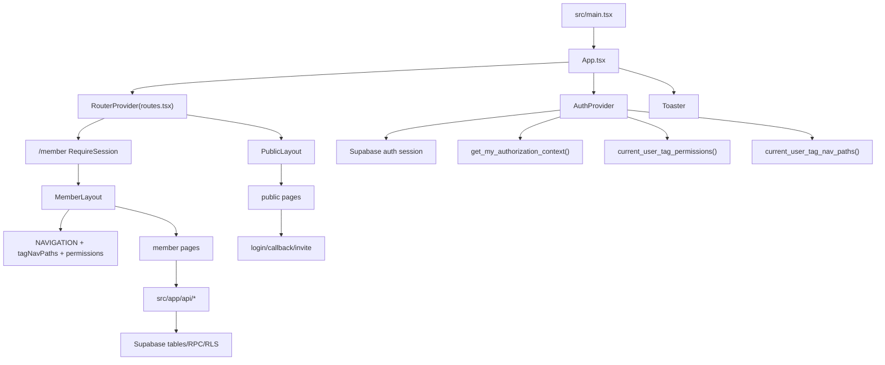
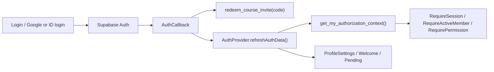
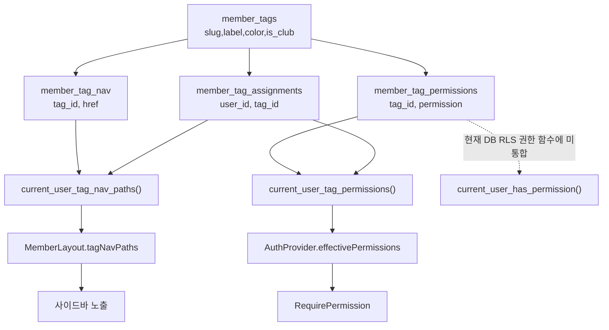
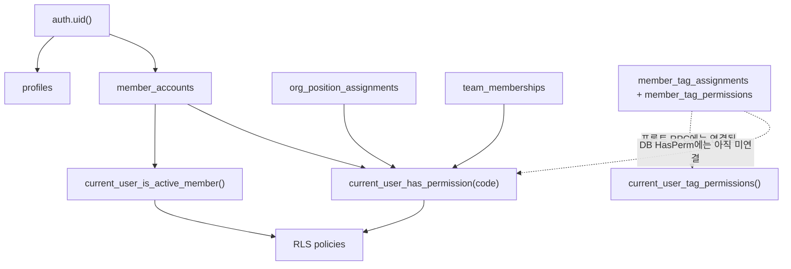

# 10. 프로젝트 전체 시스템 명세서 - 파일/도메인/데이터 흐름/파생 조사 지도

작성일: 2026-05-05  
대상: `C:\Users\jongh\Desktop\kook\2026-1\코봇\Web_final` 현재 워킹트리  
목적: 앞으로 수정할 때 어떤 파일을 같이 봐야 하는지, 어떤 데이터가 어디서 오고 어디로 가는지, 어떤 fallback/보안/성능 위험이 있는지 한 번에 파악하게 하는 작업용 명세서.

## 0. 조사 방식과 신뢰 범위

이번 조사는 DB만 본 것이 아니라 다음 범위를 병렬로 나눠 읽었다.

- 프론트 페이지/레이아웃/컴포넌트: `src/app/pages`, `src/app/layouts`, `src/app/components`
- API/Auth/Config/Utils: `src/app/api`, `src/app/auth`, `src/app/config`, `src/app/utils`
- DB/RLS/RPC: `supabase`, `supabase/migrations`
- 문서/설정/테스트: `docs`, `SECURITY_AUDIT*`, `HANDOFF.md`, `package.json`, `tsconfig.json`, `vite.config.ts`, `vercel.json`, `scripts`
- 정적 에셋/스타일/디자인 산출물: `public`, `src/assets`, `src/styles`, `design_dl`, `dist` 현 상태

`rg`는 이 환경에서 Access denied가 나올 수 있어 PowerShell `Get-ChildItem`, `Get-Content`, `Select-String`으로 조사했다. 생성물/외부 의존성인 `node_modules`, `.git`, `dist`, `build`, `.venv`, `.playwright-mcp`는 인벤토리 기본 집계에서 제외했다. 단, 성능/번들 관점에서는 현재 `dist`도 별도로 확인했다.

2차 교차검증 상세 부록은 `docs/analysis/11-cross-agent-appendix-2026-05-05.md`에 남겼다. 이 문서는 라우트별 guard/sidebar/API/DB 표, DB/RPC/RLS drift, 문서 신뢰도, 성능/자산/CSP 검증을 펼쳐 둔 참조 문서다.

## 1. 전체 인벤토리

생성물과 외부 의존성을 제외하면 현재 조사 대상 파일은 293개다.

| 영역 | 파일 수 | 역할 |
|---|---:|---|
| `src` | 161 | 실제 앱 코드. React/Vite SPA, Supabase 클라이언트, 페이지, API wrapper, UI 컴포넌트 |
| `docs` | 43 | DDD/제품/분석/작업 인수인계 문서. 최신/구문서가 섞여 있음 |
| `supabase` | 42 | migration, combined migration, Supabase local temp 파일 |
| `design_dl` | 15 | Claude/Figma 디자인 산출물. 앱에서 직접 import되지는 않음 |
| `scripts` | 6 | Node 내장 test 기반 정책 테스트 |
| `public` | 2 | favicon/OG 이미지. 현재 둘 다 대형 로고 PNG |
| 루트 설정/문서 | 24 | package, vite, vercel, 보안 감사 문서, env sample, 로그 등 |

코드/SQL/문서 라인 수 기준 복잡도 중심 파일은 다음이다.

| 파일 | 라인 | 의미 |
|---|---:|---|
| `src/app/pages/public/DesignLab.tsx` | 1907 | 디자인 실험/프로토타입 대형 페이지 |
| `src/app/pages/public/Landing.tsx` | 1731 | public 첫 화면. 이미지/애니메이션/브랜딩 복잡도 큼 |
| `src/app/pages/member/SpaceBooking.tsx` | 1690 | 공간 예약 UI. 자체 캘린더/모달/DB 예약 연동 |
| `src/app/pages/member/MemberAdmin.tsx` | 1126 | 운영자 멤버 관리. 상태/태그/프로필/RPC 연결 |
| `src/app/pages/member/Dashboard.tsx` | 1110 | 여러 API를 모아 보여주는 대시보드 |
| `src/app/pages/member/Members.tsx` | 1101 | 멤버 디렉터리, 필터, 카드/목록, 프로필 편집 |
| `src/app/pages/member/Quests.tsx` | 1009 | 미션/퀘스트 생성/수정/제출/검토/보상 |
| `src/app/pages/member/TagDetail.tsx` | 997 | 태그 상세, 권한, 사이드바, 멤버 배정 |
| `src/app/pages/member/ProfileSettings.tsx` | 945 | 가입/프로필 설정, onboarding과 연결 |
| `src/app/pages/member/InviteCodes.tsx` | 922 | 초대 코드와 기본 태그 관리 |
| `src/app/auth/AuthProvider.tsx` | 920 | 인증/권한/태그 권한/가입 상태의 중앙 상태 |
| `src/app/layouts/MemberLayout.tsx` | 823 | 멤버 사이드바/상단바/권한 기반 nav |

이 파일들을 고칠 때는 반드시 파생 파일을 같이 봐야 한다. 단일 파일처럼 보이지만 대부분 DB/RLS/route/nav/auth와 이어진다.

## 2. 앱 진입점과 런타임 구조



핵심 규칙:

- `main.tsx`는 `App`과 `styles/index.css`만 로드한다.
- `App.tsx`는 `AuthProvider`, `RouterProvider`, `Toaster`만 조립한다.
- `routes.tsx`가 모든 public/member 페이지를 정적으로 import한다. 현재 lazy route가 없어 첫 JS 청크가 커진다.
- `/member`는 먼저 `RequireSession`을 통과하고, 각 페이지별로 `RequireActiveMember`와 선택적 `RequirePermission`을 탄다.
- `MemberLayout`의 사이드바는 route guard와 같은 소스가 아니다. 실제 접근 권한은 `routes.tsx`가 결정하고, 메뉴 노출은 `MemberLayout.NAVIGATION`과 `tagNavPaths`가 결정한다.

## 3. 핵심 도메인 지도

### 3.1 Auth / 가입 / 권한

중앙 파일:

- `src/app/auth/AuthProvider.tsx`
- `src/app/auth/guards.tsx`
- `src/app/auth/types.ts`
- `src/app/auth/supabase.ts`
- `src/app/auth/onboarding.ts`
- `src/app/auth/redirects.ts`
- `src/app/pages/public/Login.tsx`
- `src/app/pages/public/AuthCallback.tsx`
- `src/app/pages/public/InviteCourse.tsx`
- `src/app/pages/member/ProfileSettings.tsx`
- `src/app/pages/member/Welcome.tsx`
- `src/app/pages/member/ApprovalPending.tsx`

데이터 흐름:



중요 포인트:

- `AuthProvider`가 `member_accounts.status = course_member`를 프론트 auth context에서 `active`처럼 정규화하는 흐름이 있다.
- `get_my_authorization_context()`는 최신 migration 뒤에도 삭제된 `profiles.tech_tags`를 참조한다.
- `RequirePermission`은 `allowCourseMember && memberStatus === "course_member"`이면 권한 검사를 우회한다. 현재는 course_member collapse와 섞여 판단이 복잡하다.
- `redirects.ts`는 next path를 내부 경로로 제한하는 좋은 보안 경계다.

### 3.2 태그 / 권한 / 사이드바

중앙 파일:

- `src/app/api/tags.ts`
- `src/app/pages/member/Tags.tsx`
- `src/app/pages/member/TagDetail.tsx`
- `src/app/components/TagChip.tsx`
- `src/app/config/nav-catalog.ts`
- `src/app/layouts/MemberLayout.tsx`
- `src/app/auth/AuthProvider.tsx`
- `supabase/migrations/20260505220000_member_tags.sql`

실제 모델:



정정된 결론:

- 태그는 단순 표시용이 아니다. 이미 `권한 + 사이드바 + 멤버 배정` 번들이다.
- slug는 영어 식별자, label은 한국어 표시명이다. 이것은 코드와 사용자 의도가 일치한다.
- `is_club`은 동아리 표시용 태그 분류일 뿐 권한 모델의 핵심이 아니다.
- 졸업은 별도 상태보다 태그가 맞다. 투표에서는 `excluded_tags`와 `voter_overrides` 같은 투표 도메인 테이블로 예외 처리하는 것이 맞다.

끊어진 부분:

- 프론트는 태그 권한을 읽지만, DB RLS 핵심 함수 `current_user_has_permission()`은 tag permission을 보지 않는다.
- `MemberLayout.NAVIGATION`, `nav-catalog.ts`, `routes.tsx`가 세 갈래로 분리되어 불일치한다.
- `NAV_CATALOG`에는 `/member/member-admin`이 없고, `routes.tsx`에는 `/member/nav-config`가 있지만 catalog/sidebar에는 없다.

### 3.3 멤버 디렉터리 / 멤버 관리

중앙 파일:

- `src/app/pages/member/Members.tsx`
- `src/app/pages/member/MemberAdmin.tsx`
- `src/app/api/member-directory.ts`
- `src/app/api/member-admin.ts`
- `src/app/components/TagChip.tsx`
- `src/app/utils/safe-image-url.ts`
- `supabase/migrations/20260505093000_member_directory_profile.sql`
- `supabase/migrations/20260505120000_member_directory_read_rls.sql`
- `supabase/migrations/20260505230000_member_admin_rpcs.sql`

데이터 흐름:

- `Members` -> `listMemberDirectory(currentUserId)`
- `listMemberDirectory` -> `profiles`, `member_accounts`, `org_position_assignments`, `team_memberships`, `project_team_memberships`, `member_tag_assignments/member_tags`, `member_favorite_profiles`
- 본인 프로필 일부 수정 -> `updateOwnDirectoryProfile`
- 즐겨찾기 -> `member_favorite_profiles`, 실패/부재 시 localStorage fallback
- `MemberAdmin` -> `listAdminMembers`, `admin_set_member_status`, `admin_update_member_profile`, `admin_delete_member`, `assignTagToUser`, `removeTagFromUser`

위험:

- `member-directory` 모델은 `email`과 `publicEmail`을 모두 반환한다.
- `Members`는 `publicEmail ?? email` 식으로 노출할 수 있어 공개 이메일 미설정자의 기본 이메일이 노출될 수 있다.
- `safeRows()`는 DB/RLS/schema 오류를 빈 배열로 삼킬 수 있다.
- 즐겨찾기 fallback은 DB 동기화가 안 되는데 UI상 정상 저장처럼 보인다.

### 3.4 연락 요청

중앙 파일:

- `src/app/pages/member/ContactRequests.tsx`
- `src/app/api/contact-requests.ts`
- `src/app/api/contact-request-policy.js`
- `src/app/api/dashboard.ts`
- `supabase/migrations/20260505152000_contact_requests_rpc_and_rls.sql`

데이터 흐름:

- 목록: `listContactRequests(viewerUserId)` -> `contact_requests` + 양쪽 `profiles` + `member_accounts`
- 후보: `listContactRequestRecipients(viewerUserId)` -> `profiles` + `member_accounts`
- 생성: `createContactRequest` -> `create_contact_request` RPC
- 결정: `decideContactRequest` -> `decide_contact_request` RPC
- 신고: `reportContactRequestSpam` -> `report_contact_request_spam` RPC

위험:

- 후보 목록에서 `email`, `phone`을 같이 가져와 summary에 담는다.
- accepted 상태에서 `visibleContactPayload()`가 requester/recipient 양쪽 모두에게 `responderContactPayload`를 반환한다.
- DB 최신 migration은 direct update/event insert는 닫지만 insert self policy는 남아 있다. RPC 검증을 완전히 강제하려면 insert도 RPC 전용이 더 안전하다.

### 3.5 초대 코드 / 가입 신청

중앙 파일:

- `src/app/pages/member/InviteCodes.tsx`
- `src/app/api/invite-codes.ts`
- `src/app/pages/public/InviteCourse.tsx`
- `src/app/pages/public/AuthCallback.tsx`
- `src/app/pages/member/Welcome.tsx`
- `src/app/pages/member/ProfileSettings.tsx`
- `supabase/migrations/20260504040000_course_invite_codes.sql`
- `supabase/migrations/20260506020000_collapse_course_member.sql`
- `supabase/migrations/20260506040000_purge_club_strings_from_tech_tags.sql`

데이터 흐름:

- 운영자가 InviteCodes에서 code/default tags/club affiliation/max uses 설정
- public invite link가 `InviteCourse`로 진입
- 로그인/콜백 과정에서 invite code를 localStorage에 보관했다가 `AuthCallback`에서 redeem
- `redeem_course_invite(code)`가 redemption row, profile club affiliation, member tag assignments를 처리
- `apply_course_invite_after_application()`은 redemption row 존재를 보고 active로 바꿀 수 있다

위험:

- 최신 `redeem_course_invite`도 `max_uses` 검사와 `uses + 1` 갱신이 atomic하지 않다.
- `apply_course_invite_after_application()`은 실제 신청서 제출/승인 상태보다 redemption row 존재에 더 의존한다.
- `course_member` 제거 방향과 legacy branch가 섞여 있다.

### 3.6 퀘스트 / 보상 태그

중앙 파일:

- `src/app/pages/member/Quests.tsx`
- `src/app/api/quests.ts`
- `src/app/api/tags.ts`
- `src/app/components/TagChip.tsx`
- `supabase/migrations/20260505260000_member_quests.sql`

데이터 흐름:

- 목록: `listQuests(currentUserId)` -> `member_quests`, audience/reward tag join, completions
- 생성/수정/삭제: client direct DML to `member_quests`, `member_quest_audience_tags`, `member_quest_reward_tags`
- 제출: `submit_quest_completion(quest_id, evidence)` RPC
- 검토: `review_quest_completion(completion_id, decision, reason)` RPC
- 승인 trigger: `apply_quest_completion_rewards()` -> `member_tag_assignments`

위험:

- `member_quest_completions` insert policy가 `user_id = auth.uid()`만 확인한다.
- 사용자가 직접 `status='approved'` insert를 할 수 있으면 보상 태그 탈취로 이어진다.
- `listQuests()`는 모든 completion을 가져와 pending count/myCompletion을 계산한다. 데이터가 커지면 성능과 정보 노출 위험이 생긴다.
- 관리자 권한이 `permissions.manage` 또는 `members.manage`로 넓다. `quests.manage`가 필요하다.

### 3.7 공지 / 댓글 / 알림 / 대시보드

중앙 파일:

- `src/app/pages/member/Announcements.tsx`
- `src/app/pages/member/AnnouncementDetail.tsx`
- `src/app/api/notices.ts`
- `src/app/api/announcement-policy.js`
- `src/app/pages/member/Notifications.tsx`
- `src/app/api/notifications.ts`
- `src/app/api/notification-policy.js`
- `src/app/pages/member/Dashboard.tsx`
- `src/app/api/dashboard.ts`
- `src/app/layouts/MemberLayout.tsx`

데이터 흐름:

- 공지 목록/상세/댓글은 `notices`, `notice_comments`, 작성자 `profiles`에 의존한다.
- 알림은 `notifications`와 actor `profiles`를 합치고, 내부 target href만 허용한다.
- `Dashboard`는 알림/공지/프로젝트/예약/연락 요청을 병렬로 모은다.
- `MemberLayout`은 unread count를 알림 API로 갱신한다.

위험:

- migration 체인 안에 `CREATE TABLE public.notices`가 없다. 외부 선행 schema를 가정한다.
- `dashboard.withFallback()`은 섹션 실패를 빈 값으로 바꾸고 원인 상세를 보존하지 않는다.
- 공지 생성에서 `authorId`를 클라이언트가 넘긴다. RLS/DB가 `auth.uid()`로 고정하지 않으면 spoofing 위험이 있다.

### 3.8 프로젝트

중앙 파일:

- `src/app/pages/member/Projects.tsx`
- `src/app/pages/member/ProjectDetail.tsx`
- `src/app/api/projects.ts`
- `src/app/api/project-policy.js`
- `supabase/migrations/20260428173000_member_workspace_core.sql`
- `supabase/migrations/20260501060000_tighten_identity_audit_project_scope.sql`

데이터 흐름:

- `project_teams`와 `project_team_memberships`를 읽고, member profile을 붙인다.
- project policy helper는 상태 라벨, progress, role label, detail path를 담당한다.
- DB RLS는 project lead/operator/delegation helper에 많이 의존한다.

위험:

- 읽기 권한과 project private access는 RLS에 강하게 의존한다.
- 프론트 API는 대부분 조회/가공용이고 mutation은 현재 제한적이다.

### 3.9 공간 예약

중앙 파일:

- `src/app/pages/member/SpaceBooking.tsx`
- `src/app/api/space-bookings.ts`
- `supabase/migrations/20260503100000_space_bookings.sql`

데이터 흐름:

- 월/일 범위 조회 -> `listBookingsInRange(start,end)`
- 예약 생성 -> `createBooking(input)`
- 예약 삭제 -> `deleteBooking(id)`

위험:

- API 파일이 `sanitizeUserError`를 쓰지 않고 raw `error.message`를 던진다.
- RLS가 `auth.uid()` 중심이라 active member 제한보다 넓다. pending/rejected/suspended도 REST 직접 호출 가능성이 있을 수 있다.
- `SpaceBooking.tsx`가 1690라인으로 독립 컴포넌트/상태 분리가 필요하다.

### 3.10 Public 사이트 / 디자인 / 에셋

중앙 파일:

- `src/app/pages/public/Landing.tsx`
- `src/app/pages/public/DesignLab.tsx`
- `src/app/pages/public/Login.tsx`
- `src/app/pages/public/AuthCallback.tsx`
- `src/app/layouts/PublicLayout.tsx`
- `src/app/components/public/PublicHeader.tsx`
- `src/app/hooks/useLandingData.ts`
- `src/assets/*`
- `public/favicon.png`
- `public/og-image.png`
- `design_dl/*`

위험/최적화:

- `routes.tsx`의 eager import 때문에 public/member/admin 대형 페이지가 첫 번들에 들어간다.
- 같은 658KB 로고가 `public/favicon.png`, `public/og-image.png`, `src/assets/mainLogo.png`에 중복된다.
- favicon이 3600x1200 대형 비정사각 PNG다.
- OG meta는 1200x630이라고 선언하지만 실제 이미지는 3600x1200이다.
- `design-tokens.css`의 외부 font `@import`가 CSS import 순서 문제로 dist에 반영되지 않을 수 있다.
- `safe-image-url.ts`와 `Landing.tsx` 이미지 URL 정책이 다르고, `data:image/svg+xml`, `blob:`, `http://` 허용 범위가 넓다.

## 4. 라우트 / 권한 / 사이드바 / API 매트릭스

### 4.1 Public routes

| Route | Component | 주요 연결 |
|---|---|---|
| `/` | `Landing` | `useLandingData`, auth 상태, 로고/이미지/애니메이션 |
| `/projects` | public `Projects` | 정적/공개 프로젝트 페이지 |
| `/notice` | public `Notice` | public notice UI |
| `/notice/:slug` | public `NoticeDetail` | notice detail, 로그인 사용자 댓글 상태 일부 |
| `/recruit` | `Recruit` | auth/onboarding 링크 |
| `/contact` | `Contact` | 외부 링크, public header |
| `/activities` | `Activities` | 정적 활동 소개 |
| `/faq` | `FAQ` | 정적 FAQ |
| `/privacy` | `Privacy` | 정책 문서 페이지 |
| `/terms` | `Terms` | 약관 페이지 |
| `/login` | `Login` | Supabase OAuth/ID 로그인 |
| `/invite/course`, `/invite/course/:code` | `InviteCourse` | invite code localStorage, login redirect |
| `/auth/callback` | `AuthCallback` | Supabase PKCE, invite redeem, onboarding redirect |
| `/design-lab` | `DesignLab` | 대형 디자인 실험 페이지 |

### 4.2 Member routes

| Route | Component | Guard | Sidebar/Catalog 상태 | 주요 API/DB |
|---|---|---|---|---|
| `/member` | `Dashboard` | `dashboard.read`, allowCourseMember | sidebar 있음, nav catalog 있음 | `loadDashboardData` -> notifications/notices/projects/space/contact |
| `/member/notifications` | `Notifications` | `notifications.read`, allowCourseMember | sidebar/catalog 있음 | `notifications` |
| `/member/contact-requests` | `ContactRequests` | active/course only, permission 없음 | sidebar/catalog 있음 | `contact_requests`, contact RPC, profiles |
| `/member/announcements` | `Announcements` | `announcements.read` or manage | sidebar/catalog 있음 | `notices`, `notice_comments` |
| `/member/announcements/:noticeId` | `AnnouncementDetail` | `announcements.read` or manage | detail route catalog 없음 | `notices`, comments |
| `/member/study-log` | `StudyLog` | active only | sidebar/catalog 있음 | ComingSoon |
| `/member/study-playlist` | `StudyPlaylist` | active only | sidebar/catalog 있음 | ComingSoon |
| `/member/peer-review` | `PeerReview` | active only | sidebar/catalog 있음, section은 teamLead | 정적/목업 성격 |
| `/member/projects` | `Projects` | `projects.read` or manage | sidebar/catalog 있음 | `project_teams`, memberships |
| `/member/projects/:slug` | `ProjectDetail` | `projects.read` or manage | detail route catalog 없음 | project detail |
| `/member/showcase` | `Showcase` | `projects.read` or manage | sidebar/catalog 있음, teamLead section | 정적/목업 성격 |
| `/member/events` | `Events` | `events.read` or manage | sidebar/catalog 있음 | ComingSoon |
| `/member/space-booking` | `SpaceBooking` | active/course only, permission 없음 | sidebar/catalog 있음 | `space_bookings` |
| `/member/members` | `Members` | `members.read` or manage, allowCourseMember | sidebar/catalog 있음 | member directory |
| `/member/resources` | `Resources` | `resources.read` or manage | sidebar/catalog 있음 | ComingSoon |
| `/member/templates` | `Templates` | `resources.read` or manage | sidebar/catalog 있음, teamLead section | 정적/목업 성격 |
| `/member/equipment` | `Equipment` | `resources.read` or manage | sidebar/catalog 있음 | ComingSoon |
| `/member/roadmap` | `Roadmap` | active only | sidebar/catalog 있음, vicePresident section | 정적/목업 성격 |
| `/member/retro` | `Retro` | active only | sidebar/catalog 있음, vicePresident section | 정적/목업 성격 |
| `/member/changelog` | `Changelog` | active only | sidebar/catalog 있음, vicePresident section | 정적/목업 성격 |
| `/member/votes` | `Votes` | active only | sidebar/catalog 있음 | ComingSoon, DB vote schema는 있음 |
| `/member/forms` | `Forms` | `forms.manage` | sidebar/catalog 있음 | 정적/목업 성격 |
| `/member/integrations` | `Integrations` | `integrations.manage` | sidebar/catalog 있음 | 정적/목업 성격 |
| `/member/permissions` | `Permissions` | `permissions.manage` | sidebar/catalog 있음 | 정적/관리 UI 성격 |
| `/member/nav-config` | `NavConfig` | `permissions.manage` | sidebar/catalog 없음 | `/member/tags/koss` redirect |
| `/member/tags` | `Tags` | `permissions.manage` | sidebar/catalog 있음 | tag CRUD |
| `/member/tags/:slug` | `TagDetail` | `permissions.manage` | detail route catalog 없음 | tag permissions/nav/assignments |
| `/member/member-admin` | `MemberAdmin` | `members.manage` or `permissions.manage` | sidebar 있음, nav catalog 누락 | admin member RPC/tag assignment |
| `/member/quests` | `Quests` | active/course only, permission 없음 | sidebar/catalog 있음 | quest tables/RPC |
| `/member/invite-codes` | `InviteCodes` | `members.manage` | sidebar/catalog 있음 | invite code/tag API |
| `/member/join` | `ProfileSettings` | session only via MemberLayout | sidebar와 분리 | profile/application |
| `/member/welcome` | `Welcome` | session only via MemberLayout | sidebar와 분리 | invite/application |
| `/member/pending` | `ApprovalPending` | session only via MemberLayout | sidebar와 분리 | auth refresh |
| `/member/profile` | `Profile` | active/course | account always visible | auth profile update |
| `/member/security` | `Security` | active/course | account always visible | Supabase auth update |
| `/member/account-info` | `AccountInfo` | active/course | account always visible | `profile_change_requests` |

큰 불일치:

- sidebar에 숨겨도 route guard가 active only면 URL 직접 접근이 가능하다.
- `nav-catalog.ts`는 `MemberLayout.NAVIGATION`을 mirror한다고 주석으로 말하지만 실제로 완전하지 않다.
- permission이 필요한 메뉴와 nav 표시 여부가 분리되어 있어서 "메뉴는 보이는데 권한 없음" 또는 "권한은 있는데 메뉴 없음"이 가능하다.

## 5. API / DB 계약

| API 파일 | 주요 함수 | DB/RPC | 주의점 |
|---|---|---|---|
| `contact-requests.ts` | list/create/decide/report | `contact_requests`, `profiles`, `member_accounts`, contact RPC | email/phone 후보 노출, accepted payload 분기 오류 |
| `dashboard.ts` | `loadDashboardData` | notifications/notices/projects/space/contact | 섹션 fallback이 원인 상세를 숨김 |
| `invite-codes.ts` | list/create/active/generate | `course_invite_codes` | default_tags legacy fallback, crypto fallback |
| `member-admin.ts` | list/update/status/delete | profiles/accounts/tags/applications/admin RPC | admin 개인정보 넓음, application 실패 무시 |
| `member-directory.ts` | list/update/favorite | profiles/accounts/tags/favorites/localStorage | private email 반환, safeRows fallback |
| `notices.ts` | notice/comment CRUD | `notices`, `notice_comments`, `profiles` | `notices` create migration 누락, authorId client 입력 |
| `notifications.ts` | list/count/read/dismiss | `notifications`, actor `profiles` | target href는 내부 경로 검증 |
| `projects.ts` | list/detail | `project_teams`, memberships, profiles | RLS 의존 강함 |
| `quests.ts` | list/create/update/delete/submit/review | quest tables/RPC | direct DML, completion insert 보상 탈취 위험 |
| `space-bookings.ts` | list/create/delete | `space_bookings` | raw error 노출, RLS active 제한 약함 |
| `tags.ts` | tag CRUD/permissions/nav/assignments | tag tables/tag RPC | delete-then-insert 비트랜잭션, schema fallback 일부만 |

## 6. DB / RLS / RPC 핵심 구조

테이블 군:

- 인증/RBAC: `organizations`, `profiles`, `member_accounts`, `org_positions`, `teams`, `permissions`, 각 assignment/permission join
- 워크스페이스: `notifications`, `contact_requests`, `project_teams`, votes, role transfer, delegation, exit request
- 기능: `profile_change_requests`, `space_bookings`, `course_invite_codes`, `member_favorite_profiles`, `notice_comments`, `member_tags`, `member_quests`

권한 그래프:



최상위 DB 위험:

1. `profiles.tech_tags` 삭제 후 `get_my_authorization_context()`가 깨질 수 있다.
2. `current_user_has_permission()`이 tag permissions를 보지 않는다.
3. `member_quest_completions` 직접 insert로 보상 태그 탈취 가능성이 있다.
4. `redeem_course_invite` max uses 경쟁 상태가 남아 있다.
5. `space_bookings` RLS가 active member보다 넓다.
6. `notices` 테이블 생성 migration이 체인 안에 없다.
7. `adminSetMemberStatus` 프론트 타입은 `course_member`, `project_only`를 아직 허용하지만 최신 RPC는 `pending/active/rejected/withdrawn`만 받는다.
8. direct table API 대상 중 `profiles`, `member_accounts`, `notifications`, `contact_requests`, `project_teams`, `course_invite_codes`, `space_bookings`, `member_favorite_profiles`, `membership_applications`, `notices`의 explicit grant가 repo migration 체인에서 명확하지 않다.

## 7. Fallback 분류

### 괜찮은 fallback

- `sanitizeUserError`: DB/RLS/JWT/schema 내부 오류를 사용자 문구로 숨김
- `redirects.ts`: `next` 경로를 내부 경로로 제한
- `notification-policy`: target href를 내부 경로만 허용
- `clipboard.js`: Clipboard API 실패 시 textarea copy
- `dashboard`: 섹션별 실패를 UI에 `failedSections`로 표시하는 partial failure
- 로그아웃 시 이미 만료된 session 오류 무시

### 위험한 fallback

- 권한 RPC 실패를 빈 권한처럼 처리하고 legacy status 권한을 붙임
- auth context RPC 실패를 가입 미완료/session-only fallback으로 바꿈
- tag nav가 비면 active member sidebar를 넓게 보여줌
- DB/RLS 오류를 빈 배열로 삼켜 "데이터 없음"처럼 보이게 함
- delete-then-insert가 실패하면 권한/nav/rules가 빈 상태로 남음
- raw `error.message`를 사용자에게 노출함
- 이미지 URL에서 `data:image/svg+xml`, `blob:`, `http://`를 넓게 허용함

원칙:

- 권한/RLS/RPC/schema contract 실패: fail closed
- 대시보드/이미지/비핵심 UI: partial fallback 가능
- migration transition fallback: 기한과 제거 조건을 문서화

## 8. 성능 / 번들 / 에셋 명세

현재 관찰:

- production build는 성공하지만 단일 JS 청크가 약 1.32MB다. 기존 dist 기준 JS는 약 1,322,047B, gzip 약 369,095B다.
- `routes.tsx`가 모든 페이지를 eager import한다.
- 대형 페이지: `Landing`, `DesignLab`, `SpaceBooking`, `Dashboard`, `Members`, `Quests`, `ProfileSettings`
- 같은 658KB 로고가 public favicon, public OG image, app asset으로 중복된다.
- `fonts.css`는 0바이트이고, `design-tokens.css`의 외부 font import는 import 순서 문제로 dist 반영이 불안정하다.
- source map은 꺼져 있고 dist에 `.map`은 없다.
- `vercel.json`의 CSP는 `script-src 'self'`지만 `style-src 'unsafe-inline'`에 의존한다. inline style이 많은 `DesignLab`, `SpaceBooking`, `Members`, `chart.tsx`를 정리하지 않으면 CSP 강화가 어렵다.

개선 우선순위:

1. 라우트 단위 lazy import로 public/member/admin 큰 페이지 분리
2. favicon/OG/mainLogo를 용도별 크기로 분리
3. 미사용 이미지 `ae67...png`, `e07...png`, `member-members-after-db.png` 정리 여부 확인
4. 외부 font import를 `index.css` 최상단 또는 HTML preload/link로 정리
5. image URL 정책 통합

## 9. 문서 신뢰도

| 문서 | 앞으로 기준으로 삼을지 | 이유 |
|---|---|---|
| `docs/product/tag-system.md` | 기준, 단 검증 필요 | 태그 단일 출처 방향을 잘 담음 |
| `docs/product/member-status.md` | 기준, 단 일부 오류 정정 필요 | status는 lifecycle, tag는 권한 방향 |
| `docs/product/invite-codes.md` | 기준, 단 DB와 충돌 있음 | 초대 코드 제품 방향 |
| `docs/product/quests.md` | 기준, 단 보안 이슈 정정 필요 | 보상 태그 설명은 맞지만 direct insert 위험 누락 |
| `docs/analysis/09-full-code-reaudit-v2-2026-05-05.md` | 기준 | 최신 보안/권한 감사 |
| 이 문서 `10-project-wide-system-spec` | 기준 | 전체 파일/도메인/파생 조사 지도 |
| `docs/analysis/11-cross-agent-appendix-2026-05-05.md` | 기준 | 2차 서브에이전트 교차검증 상세표 |
| `HANDOFF.md` | 주의/폐기 후보 | course_member, mock/미구현 상태가 현재 코드와 많이 다름 |
| `docs/analysis/01`-`07` | 역사 자료 | 2026-03-25 기준이라 현재 코드와 drift 큼 |
| `docs/ddd-workflow/15-member-directory-tagging-2026-05-05.md` | 주의 | `profiles.tech_tags`, course_member 기반 설명이 최신 방향과 충돌 |
| `SECURITY_AUDIT.md` | 주의 | 같은 문서 안에서 보안 헤더 적용/부재가 충돌 |
| `SECURITY_AUDIT_2026-05-04_CURRENT.md` | 참고 | 일부 지적은 유효하지만 이후 migration 반영 필요 |
| `SECURITY_AUDIT_2026-05-04_PATCH.md` | 참고/주의 | Supabase PAT 부분 식별자 기록 위험 |

## 10. 파생 조사 규칙

앞으로 작업할 때 아래 규칙으로 같이 조사한다.

| 고치는 대상 | 반드시 같이 볼 파일 |
|---|---|
| 권한/auth | `AuthProvider.tsx`, `guards.tsx`, `types.ts`, `routes.tsx`, `MemberLayout.tsx`, `active_member_base_permissions.sql`, `member_tags.sql` |
| 태그 생성/표시 | `api/tags.ts`, `Tags.tsx`, `TagDetail.tsx`, `TagChip.tsx`, `Members.tsx`, `MemberAdmin.tsx`, `member_tags.sql` |
| 사이드바/nav | `MemberLayout.tsx`, `routes.tsx`, `nav-catalog.ts`, `AuthProvider.refreshTags`, `member_tag_nav` |
| 멤버 디렉터리 | `Members.tsx`, `member-directory.ts`, `TagChip.tsx`, `safe-image-url.ts`, `ContactRequests.tsx`, profile migrations |
| 멤버 관리 | `MemberAdmin.tsx`, `member-admin.ts`, `tags.ts`, admin RPC migration, `member_accounts` status docs |
| 연락 요청 | `ContactRequests.tsx`, `contact-requests.ts`, `contact-request-policy.js`, dashboard contact section, contact RPC migration |
| 초대 코드 | `InviteCodes.tsx`, `invite-codes.ts`, `InviteCourse.tsx`, `AuthCallback.tsx`, `Welcome.tsx`, course invite migrations |
| 퀘스트 | `Quests.tsx`, `quests.ts`, `tags.ts`, `TagChip.tsx`, `member_quests.sql`, tag permissions |
| 공간 예약 | `SpaceBooking.tsx`, `space-bookings.ts`, `space_bookings.sql`, dashboard booking section |
| 공지/알림 | `Announcements.tsx`, `AnnouncementDetail.tsx`, `notices.ts`, `notifications.ts`, `MemberLayout` unread count, notice/comment migrations |
| 프로젝트 | `Projects.tsx`, `ProjectDetail.tsx`, `projects.ts`, project policy, project RLS migrations |
| 투표 | `Votes.tsx`, `ComingSoonPage.tsx`, `member-feature-flags.js`, vote DB tables/RLS, `routes.tsx`, `MemberLayout`, `nav-catalog.ts` |
| public landing | `Landing.tsx`, `PublicLayout.tsx`, `PublicHeader.tsx`, `useLandingData.ts`, assets, image fallback |
| 이미지 보안 | `safe-image-url.ts`, `ImageWithFallback.tsx`, `Members.tsx`, `Profile.tsx`, `Landing.tsx`, `vercel.json` CSP |
| 번들 성능 | `routes.tsx`, 대형 페이지들, `vite.config.ts`, `package.json`, assets |
| 문서 갱신 | 이 문서, `09-full-code-reaudit`, `docs/product/*`, `CHANGE_CHECKLIST`, `HANDOFF` |

## 11. 현재 우선순위

### P0

1. `get_my_authorization_context()`에서 삭제된 `profiles.tech_tags` 제거
2. `member_quest_completions` direct approved insert/보상 태그 탈취 차단
3. `AuthProvider.refreshTags()` RPC error 검사와 권한 fail closed
4. `public.notices` 생성/기준 schema를 migration 체인에 명시

### P1

1. `current_user_has_permission()`에 tag permission 통합
2. route/sidebar/nav catalog 단일화
3. `course_member` legacy runtime branch 정리
4. 연락 요청/멤버 디렉터리 개인정보 노출 축소
5. 초대 코드 max_uses race 제거
6. `space_bookings` active member RLS 강화
7. `notices` 테이블 생성/선행 schema 의존성 정리
8. `adminSetMemberStatus` 프론트 타입과 RPC 허용 status 값 일치
9. direct table API 대상의 explicit grant 정책 결정 및 migration 명시
10. 태그/퀘스트 설정 delete-then-insert 흐름을 원자적 RPC로 이동

### P2

1. 대형 라우트 lazy import
2. 로고/OG/favicon 에셋 분리 최적화
3. `safe-image-url` 정책 강화
4. `package.json`에 `test`, `typecheck`, `audit` script 추가
5. Vite 6.4.2 이상 업데이트 검토
6. 오래된 문서 폐기/대체 표시

## 12. Ouroboros / 검증 계약

Ouroboros CLI는 설치되어 있고 `status health`는 Database/Configuration ok, Providers warning이다. `detect --force .`는 Claude SDK 부재로 자동 mechanical contract 생성에 실패했다. 그래서 직접 `.ouroboros/mechanical.toml`을 작성했다.

검증 명령:

```toml
test = "node --test scripts/*.mjs"
build = "npm run build"
audit_prod = "npm audit --omit=dev"
audit_all = "npm audit"
diff_check = "git diff --check"
```

주의:

- 현재 설치된 Ouroboros CLI에는 `evaluate` 명령이 없고, 스킬 문서의 `evaluate` 설명과 CLI 버전이 어긋난다.
- 실제 반복 검증은 위 명령을 직접 실행하거나 `ouroboros auto/run` 사용법을 확인해야 한다.

## 13. 2차 교차검증에서 추가로 확정한 것

서브에이전트 2차 루프에서 다음이 추가로 확정됐다.

1. 라우트 접근과 sidebar 노출은 같은 정책이 아니다. 특히 `allowCourseMember`가 permission 검사를 우회하는 라우트는 메뉴에서 숨겨도 URL 직접 접근이 가능하다.
2. `NAV_CATALOG`는 `MemberLayout.NAVIGATION`을 mirror한다고 주석으로 말하지만 `/member/member-admin`을 빠뜨리고 있다.
3. route guard가 `read OR manage`를 허용하는데 sidebar는 한쪽 permission만 보는 메뉴가 있다. announcements, projects, events, members, resources 계열이 여기에 해당한다.
4. `public.notices` 생성 migration은 repo 체인에서 보이지 않는다. 외부 baseline이 없다면 migration apply 단계에서부터 실패할 수 있다.
5. `adminSetMemberStatus` 타입과 최신 DB RPC가 허용하는 status 값이 다르다.
6. 성능상 가장 큰 병목은 `routes.tsx`의 eager import다. 최적화는 라우트 lazy loading부터 시작해야 한다.
7. 문서 기준은 `코드 + supabase/migrations`가 1순위이고, product 문서는 정책 방향으로만 신뢰한다. 오래된 HANDOFF/DDD/보안 감사 문서는 현재 구현을 단정하는 근거로 쓰면 위험하다.

## 14. 한 문장 결론

이 프로젝트의 핵심 문제는 기능이 없어서가 아니라, 기능이 빠르게 붙으면서 `route`, `sidebar`, `tag permission`, `DB RLS`, `문서`, `fallback`이 서로 다른 속도로 변했다는 점이다. 앞으로는 파일 하나를 고칠 때 위 파생 조사 규칙대로 연결 파일을 같이 보고, 특히 권한/개인정보/보상/상태 변경은 DB RPC/RLS를 최종 진실로 맞춰야 한다.
