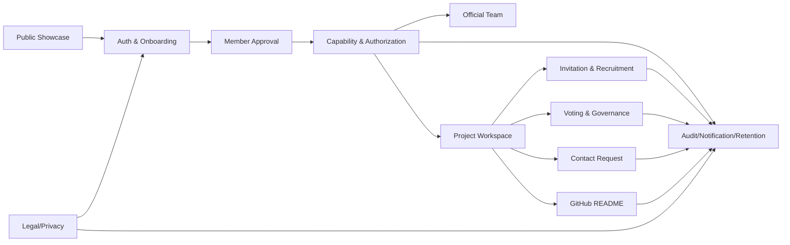

# 02. 도메인 발견

## 1. 유비쿼터스 언어

### 1.1 반드시 구분할 용어

| 용어 | 정확한 의미 | 혼동하면 생기는 문제 |
| --- | --- | --- |
| 공개 페이지 | 발표, 포트폴리오, 시연용 외부 페이지 | 내부 운영 기능을 공개 페이지에 과도하게 설명함 |
| Member Workspace | 로그인 후 실제 동아리원이 쓰는 운영 공간 | 메인 페이지와 목적이 섞임 |
| 회장 | 최고 관리자 | 부회장/공식 팀장과 동일 권한처럼 처리됨 |
| 부회장 | 전체 운영 보조 관리자 | 회장 전용 권한과 섞임 |
| 공식 팀 | 로봇 A~D, IoT, 연구팀 같은 동아리 운영 단위 | 프로젝트 팀과 섞임 |
| 공식 팀장 | 공식 팀을 운영하는 운영진 | 프로젝트 팀장과 같은 “팀장”으로 처리됨 |
| 프로젝트 팀 | 실제 협업 단위 | 공식 팀 소속 권한과 섞임 |
| 프로젝트 팀장 | 특정 프로젝트 책임자 | 운영진으로 잘못 표시됨 |
| project_operator | 프로젝트 내부 운영 보조자 | 팀장 변경/공개범위 변경까지 가능해짐 |
| 임시 위임자 | 기간과 scope가 제한된 대행자 | 정식 팀장처럼 권한이 확산됨 |
| 가입 요청서 | `/member/join`에서 작성하는 심사 정보 | 승인 대기 안내와 섞임 |
| 승인 대기 | 가입 요청 제출 후 `/member/pending`에서 보는 상태 | ID 생성/프로필 수정 CTA가 노출됨 |

### 1.2 금지 표현

| 금지 표현 | 이유 | 대체 표현 |
| --- | --- | --- |
| 팀장 이상 | 공식 팀장과 프로젝트 팀장이 섞임 | 운영진, 공식 팀장 이상, 이 프로젝트 관리자 |
| 관리자 | 전체 관리자처럼 보임 | 전체 운영 관리자, 프로젝트 관리자 |
| 승인자 | 승인 종류가 불명확 | 가입 승인자, 프로젝트 승인자, 참여 승인자 |
| 팀장 권한 | 공식 팀/프로젝트 팀 혼동 | 공식 팀장 권한, 프로젝트 팀장 권한 |
| pending 사용자 | 상태가 넓음 | 가입 정보 미완성 사용자, 승인 대기 사용자 |

## 2. 바운디드 컨텍스트

### 2.1 컨텍스트 목록

| 컨텍스트 | 책임 | 주요 파일/문서 | 핵심 위험 |
| --- | --- | --- | --- |
| Public Showcase | 발표/포트폴리오용 공개 페이지 | `src/app/pages/public/*` | 내부 운영 정보 과노출 |
| Auth & Onboarding | Google OAuth, ID 로그인, 가입 요청, pending 분기 | `src/app/auth/*`, `Login.tsx`, `AuthCallback.tsx`, `ProfileSettings.tsx` | callback origin 오류, pending/profile 혼동 |
| Member Approval | 가입 승인/반려/정지/탈퇴 | `member_accounts`, `ApprovalPending.tsx`, Admin | 승인 책임과 감사 로그 누락 |
| Capability & Authorization | Role, permission, scope, source, delegation | `auth_rbac.sql`, `member_workspace_core.sql` | `projects.manage` 과범위 |
| Official Team | 공식 팀/공식 팀장/공식 팀원 | `teams`, `team_memberships` | 공식 팀원과 공식 팀장 혼동 |
| Project Workspace | 프로젝트 생성, 승인, 멤버십, 공개범위 | `project_teams`, `Projects.tsx` | 프로젝트 팀장과 운영진 혼동 |
| Invitation & Recruitment | 초대 코드, 링크, 모집 카드, 참여 신청 | `invitation_codes`, `project_team_join_requests` | 코드 race condition, target_type 혼동 |
| GitHub README | private/public README 조회, snapshot, fallback | 정책 문서, 아직 DB 테이블 부족 | token 노출, private README 과노출 |
| Contact Request | 연락 요청, 수락/거절/신고/스팸 제한 | `contact_requests`, `ContactRequests.tsx` | 연락처 payload 과노출 |
| Voting & Governance | 회장 선거, 일반 안건, 익명 투표 | `votes`, `vote_ballots`, `Votes.tsx` | 익명성 깨짐, 투표권 범위 오류 |
| Audit/Notification/Retention | 감사 로그, 알림, 1년 보존/삭제 | `audit_logs`, `notifications` | 개인정보 원문 과보관, 사용자 직접 insert |
| Legal/Privacy | 개인정보 처리방침, 약관, 고지 | `Privacy.tsx`, `Terms.tsx`, `docs/product/legal*` | 실제 수집 항목과 고지 불일치 |

### 2.2 컨텍스트 관계



## 3. Aggregate 후보

### 3.1 계정/권한 계열

| Aggregate | Root | Entity | Value Object | 불변식 |
| --- | --- | --- | --- | --- |
| MemberAccount | `member_accounts` | Profile, ApprovalRecord | MemberStatus, SchoolEmail | active 전 기능 접근 가능, pending은 join/pending만 |
| ProfileIdentity | `profiles` | NicknameHistory | NicknameSlug, PublicCreditMode | nickname_slug는 active 기준 대소문자 무관 unique |
| AuthoritySource | OrgPosition/TeamRole/Delegation | Assignment | Scope, Capability | Role, Capability, Delegation을 섞지 않음 |
| AuditLog | `audit_logs` | AuditPayload | Sensitivity, RetentionPolicy | 사용자 직접 insert/update/delete 금지 |

### 3.2 팀/프로젝트 계열

| Aggregate | Root | Entity | Value Object | 불변식 |
| --- | --- | --- | --- | --- |
| OfficialTeam | `teams` | TeamMembership, TeamLeadAssignment | OfficialTeamSlug | 공식 팀장은 운영진, 일반 팀원은 운영진 아님 |
| ProjectCreationRequest | 신규 필요 | PreMember, ReviewRecord | ProjectType, RecruitmentAudience | 승인 전 프로젝트는 전체 목록 미노출 |
| ProjectTeam | `project_teams` | ProjectMembership | Visibility, ProjectStatus | 프로젝트 팀장은 자기 프로젝트만 관리 |
| ProjectRecruitment | 신규/분리 필요 | RequiredRole, TechTag | SharePolicy | 공유 페이지는 소개서/README 중심 |
| Invitation | `invitation_codes` | InvitationRedemption | TokenHash, Expiry, MaxUses | redeem은 원자적 RPC로만 처리 |

### 3.3 협업/거버넌스 계열

| Aggregate | Root | Entity | Value Object | 불변식 |
| --- | --- | --- | --- | --- |
| ContactRequest | `contact_requests` | ContactRequestEvent | ContactPayload, AbuseSignal | 수락 전/후 공개 범위 분리 |
| Vote | `votes` | Option, Ballot, Nomination | EligibilityScope, Anonymity | active 이후 선택지 수정 금지 |
| LeadershipTransfer | `role_transfer_requests` | ApprovalStep | TransferType, AfterStatus | 수락/승인/적용 상태 분리 |
| TemporaryDelegation | `authority_delegations` | DelegationScope | Expiry, ScopeList | 최대 7일, 재위임/팀장 변경 금지 |
| GitHubRepositoryConnection | 신규 필요 | ReadmeSnapshot, SyncAttempt | RepoFullName, CommitSha | private README는 서버/GitHub App으로만 조회 |

## 4. 현재 코드와 도메인 불일치

### 4.1 가장 큰 불일치

| 위치 | 불일치 | 위험 |
| --- | --- | --- |
| `current_user_is_project_team_lead()` | lead, maintainer, accepted delegation을 함께 true | 팀장이 아닌 사용자가 팀장급 권한 획득 |
| `projects.manage` | scope 없는 넓은 permission | 공식 팀장이 전체 프로젝트 관리자처럼 작동 |
| `can_read_private_project()` | 공식 팀 membership 포함 | 공식 팀 일반 팀원이 private project를 볼 수 있음 |
| `vote_ballots` | voter_user_id와 선택 연결 | 운영진/DB에서 익명 투표 추적 가능 |
| `audit_logs` | active member insert 허용 | 감사 로그 신뢰성 저하 |

### 4.2 원칙

```text
Role = 신분
Capability = 행위 가능성
Delegation = 기간제 capability
```
