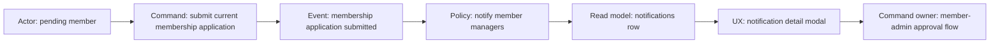

# Notification / Membership Application Flow - DDD Note

Date: 2026-05-05

## 1. Domain Understanding

The real-world process is: a pending member submits a join application, managers receive an inbox notification, managers inspect the submitted details, then approve or hold the member from the member administration screen.

This is not simple navigation. It crosses three bounded contexts:

- Membership Application: owns the submitted profile snapshot and application status.
- Notification Inbox: owns delivery, read/dismiss state, and event explanation.
- Member Administration: owns approval/hold/delete commands.

Costly mistake: routing the notification to the public member directory makes the manager lose the approval action and hides why the notification exists.

## 2. Ubiquitous Language

| Korean | Code term | Meaning | Banned ambiguity |
| --- | --- | --- | --- |
| 가입 신청 | `membership_application` | Submitted request to become active member | Not the same as `member_accounts.status` |
| 가입 신청 알림 | `membership_application_submitted` | Inbox item created for managers after submission | Not an approval command |
| 알림 상세 | `NotificationDetailModal` | Explanation of who did what and when | Not direct navigation |
| 승인 업무 화면 | `/member/member-admin?filter=submitted` | Screen that owns approve/hold/delete actions | Not `/member/members` |

## 3. Bounded Contexts

| Context | Owns | Emits / Exposes | Security risk |
| --- | --- | --- | --- |
| Membership Application | `membership_applications`, `profile_snapshot`, status | `membership_application.submitted` audit event | PII in snapshot |
| Notification Inbox | `notifications`, read/dismiss state, CTA policy | notification read model | leaking PII if snapshot is copied into notification |
| Member Administration | status transition commands, admin filters | `?filter=submitted` read model | approving without application context |

## 4. Entities And Value Objects

- `Notification`: entity. Identity `notifications.id`, lifecycle `read_at/deleted_at/expires_at`.
- `MembershipApplication`: entity. Identity `membership_applications.id`, lifecycle `submitted/approved/rejected/canceled`.
- `ProfileSnapshot`: value object. Contains PII; equality is by captured value at submission time.
- `NotificationTargetHref`: value object. Must be internal-only and type-policy-derived.

## 5. Aggregates

| Aggregate | Root | Commands | Invariants |
| --- | --- | --- | --- |
| Notification Inbox | `notifications` | mark read, mark all read, dismiss | Row click opens detail first; CTA performs navigation |
| Membership Application | `membership_applications` | submit current application | Snapshot is captured once per submission and not copied into notification metadata |
| Member Administration | `member_accounts` plus application read model | approve, hold, withdraw, delete | Application approval happens in member-admin, not directory |

## 6. Invariants

1. `membership_application_submitted` CTA target is `/member/member-admin?filter=submitted`.
2. `/member/members` is a directory read model and must not be used as the approval target.
3. Notification click marks read and opens detail modal; it does not immediately navigate.
4. Dashboard notification links deep-link to `/member/notifications?notification=<id>` so the same detail modal is reused.
5. `membership_applications.profile_snapshot` is readable only by self, `members.manage`, `admin.access`, or the actual recipient of the matching membership application notification.
6. If application detail enrichment fails, the notification list still loads with redacted/basic data.

## 7. Event Storming

## 8. Permission, State, And Visibility Review

| Action | Allowed actor | State | Visibility |
| --- | --- | --- | --- |
| Submit application | Pending member, self only | `member_accounts.status = pending` | Self |
| Read notification | Notification recipient or manager/admin | non-deleted, non-expired | Recipient/operator |
| Read application snapshot | Self, manager/admin, matching notification recipient | application exists | PII protected |
| Approve application | `members.manage` or `admin.access` | submitted/pending member | Operator-only |

## 9. Data Schema, RLS, RPC, Audit

- Migration: `supabase/migrations/20260506090000_notification_application_flow.sql`.
- RLS tightened: remove broad `members.read` access from `membership_applications`.
- RPC hardened: `admin_member_application_status(uuid[])` now allows self-only reads unless manager/admin.
- Event creator fixed: `submit_current_membership_application()` now writes `/member/member-admin?filter=submitted`.
- Backfill: old `membership_application_submitted` notification rows are updated to the same href.

## 10. UX And Product Flow

1. Manager opens `/member/notifications`.
2. Clicking a membership application notification opens a detail modal.
3. Modal shows actor, status, submitted time, profile snapshot fields, and source.
4. Footer CTA says `멤버 관리에서 승인하기`.
5. CTA navigates to `/member/member-admin?filter=submitted`.
6. MemberAdmin opens with the submitted application filter applied.

## 11. Implementation Plan

| Task | Files | Verification |
| --- | --- | --- |
| Type-based CTA policy | `notification-policy.js`, policy tests | `node --test scripts/notifications-policy.test.mjs` |
| Detail modal and deep links | `Notifications.tsx`, `Dashboard.tsx` | `npm run build` |
| Detail enrichment without hard-fail | `notifications.ts` | `npm run build` |
| MemberAdmin query filter | `MemberAdmin.tsx` | `npm run build` |
| DB route/RLS hardening | `20260506090000_notification_application_flow.sql` | migration review |
| Product docs | `docs/product/notifications.md`, checklist | doc review |

## 12. Review Log

| Reviewer | Scope | Result |
| --- | --- | --- |
| Domain Reviewer | Event ownership and route ownership | Approved with requirement: DB href must also be fixed, not only frontend policy |
| Implementation Reviewer | Modal flow and dashboard bypass | Approved after adding detail modal, deep link, and enrichment fallback |
| Risk Reviewer | RLS/PII exposure | Approved after narrowing application snapshot access and hardening status RPC |

## Disagreement Register

| Disagreement | Evidence | Decision |
| --- | --- | --- |
| Whether related table alone should force member-admin CTA | Future application status notifications may use the same table | Accepted: only exact `membership_application_submitted` uses approval CTA |
| Whether application detail fetch should fail the inbox | RLS may reject detail reads | Accepted: inbox loads even when detail enrichment is unavailable |

## Unresolved Questions

- None blocking this slice. Future notification types still need their own action contract before implementation.

## Closure Decision

The loop can close for this slice after fresh build/test verification records pass. The domain owner for approval is now explicit in code, DB migration, and product docs.
