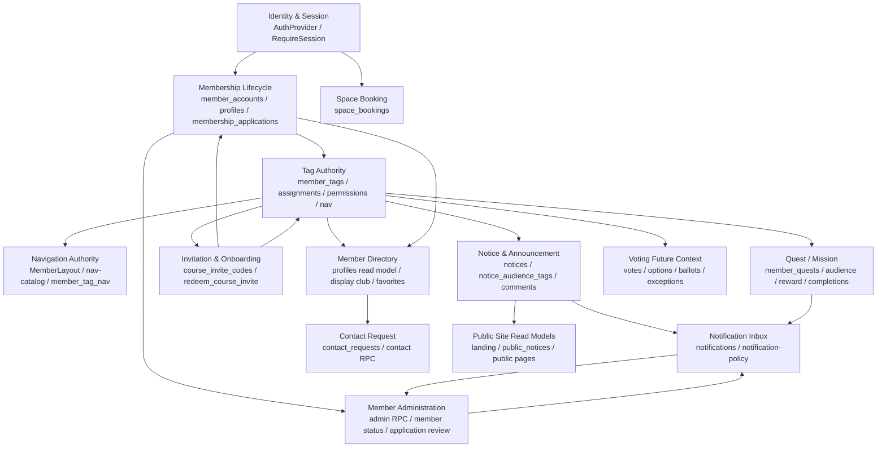

# KOBOT Web DDD 재분석 및 문제 레지스터

작성일: 2026-05-05  
범위: `src`, `supabase/migrations`, `scripts`, `docs` 중심의 전체 도메인 재검토  
방식: DDD 컨텍스트 매핑, RLS/RPC 보안 리뷰, 프론트 API/페이지 터치포인트 리뷰, Ouroboros 상태 확인, 서브에이전트 3개 병렬 리뷰 통합

## 1. 결론

이 프로젝트의 핵심 구조는 **태그 중심 회원 워크스페이스**다. `member_tags`가 표시용 배지이면서 동시에 권한, 사이드바 노출, 공지 공개 범위, 퀘스트 대상, 퀘스트 보상, 초대 코드 기본 부여값, 동아리 표시의 출처가 된다.

이 방향 자체는 사용자 요구와 맞다. 사용자는 태그를 직접 만들고, 그 태그에 운영 권한이나 사이드바 노출을 붙이고, 졸업도 상태가 아니라 태그로 처리하려고 한다. 따라서 "태그가 권한을 가질 수 없다"는 판단은 틀렸다. 더 정확히는 태그를 AWS IAM group처럼 봐야 한다. `member_tags`는 그룹이고, `member_tag_permissions`는 그 그룹에 attach된 permission policy이고, `member_tag_assignments`는 사용자를 그 그룹에 넣는 행위다. 문제는 태그가 강한 도메인 권한 토큰이 되었는데도 일부 변경이 여전히 프론트 직접 쓰기, silent fallback, 넓은 RLS 정책에 흩어져 있다는 점이다.

가장 먼저 닫아야 할 위험은 네 가지다.

1. 멤버 디렉터리 RLS가 `profiles`의 민감 컬럼까지 읽을 수 있게 열려 있다.
2. `members.manage` 보유자가 권한이 붙은 태그를 부여해 권한 상승을 만들 수 있다.
3. 사용자가 자기 `notifications` row를 수정할 수 있고, 그 row가 `membership_applications` 조회권의 근거로 사용된다.
4. 퀘스트 가시성 함수는 active 계정을 요구하지만 실제 `member_quests` select policy는 그 함수를 사용하지 않는다.

fallback은 대부분 "운영 DB와 로컬 코드의 마이그레이션 타이밍이 맞지 않을 때 화면을 죽이지 않기 위해" 생겼다. 그러나 지금은 권한/개인정보/데이터 무결성까지 빈 배열이나 임시 표시로 덮는 형태가 섞여 있다. 앞으로 fallback은 **읽기 전용 표시 영역의 migration-missing 호환**에만 허용하고, 권한 결정, private visibility, write command, RLS 오류에는 금지해야 한다.

## 2. 검토 범위

PowerShell 기준으로 `node_modules`, `dist`, `.git`, `.vite`를 제외하고 다음 파일군을 훑었다.

| 영역 | 파일 수/형태 | 목적 |
| --- | ---: | --- |
| `src/app` | TS/TSX/JS/CSS 중심 | 라우트, 페이지, API wrapper, auth/guard, 사이드바, 공통 UI |
| `supabase/migrations` | 38개 SQL | 테이블, RLS, RPC, SECURITY DEFINER, seed/trigger |
| `scripts` | 7개 테스트 스크립트 | 정책 단위 테스트 |
| `docs` | 60개 Markdown | 기존 명세, touchpoint, DDD ledger, product policy |
| `.ouroboros` | seed/mechanical/status | 이전 안정화 목표와 검증 계약 |

`rg`는 이 환경에서 Access denied 문제가 있었으므로 파일 탐색은 `Get-ChildItem`/`Select-String`으로 진행했다.

## 3. Context Map

## 4. Ubiquitous Language

| 한국어 | 코드/DB 용어 | 현재 의미 | 반드시 지킬 규칙 |
| --- | --- | --- | --- |
| 회원 계정 | `member_accounts` | 가입 lifecycle와 active 여부의 최종 출처 | 권한 이름이나 표시 태그 대신 쓰면 안 된다. |
| 회원 상태 | `member_accounts.status` | `pending`, `active`, `rejected`, `withdrawn` 등 lifecycle | 졸업, KOBOT, KOSS 같은 분류를 상태로 만들지 않는다. |
| 졸업 | `member_tags.slug = alumni` 같은 태그 | 투표/공지/퀘스트 대상에서 제외할 수 있는 그룹 | 전역 권한 박탈이 아니라 각 기능의 eligibility rule에서 사용한다. |
| 태그 | `member_tags` | AWS IAM group 같은 도메인 그룹. 표시 배지이면서 policy attachment를 가질 수 있다. | label은 한글 표시, slug/code는 영어 안정 키로 유지한다. |
| 동아리 태그 | `member_tags.is_club = true` | 프로필 소속/초대 코드 동아리 열의 출처 | KOBOT/KOSS만 특수 처리하지 않는다. 모든 `is_club=true` 태그가 같은 규칙을 탄다. |
| 표시 동아리 | `profiles.display_club_tag_id` | 여러 동아리 태그 중 멤버 카드에 대표로 보일 태그 | 실제 소속 권한은 `member_tag_assignments`로 다시 검증한다. |
| 태그 권한 정책 | `member_tag_permissions` | 태그 그룹에 attach된 permission policy | 태그 생성/수정 화면에서 설정한다. 이 정책이 붙은 태그를 누가 멤버에게 부여할 수 있는지가 별도 보안 규칙이다. |
| 태그 사이드바 정책 | `member_tag_nav` | 태그 그룹에 attach된 member nav path policy | `MemberLayout`, `nav-catalog`, route guard와 계약이 같아야 한다. |
| 공지 | `notices`, `notice_audience_tags` | public 또는 tag scoped announcement | public landing은 `public_notices`, member 영역은 RLS/RPC가 최종 판단한다. |
| 알림 | `notifications` | 이벤트 inbox/read model | 알림 클릭은 command 실행이 아니라 상세 설명과 적절한 CTA를 제공한다. |
| 가입 신청 | `membership_applications` | pending 회원이 프로필을 제출한 review 대상 | 승인/반려 command는 멤버 관리 context가 소유한다. |
| 퀘스트/미션 | `member_quests` | 대상 태그, 완료 제출, 리뷰, 보상 태그가 있는 aggregate | 생성/수정은 atomic command RPC가 필요하다. |
| 투표 | `votes` future context | include/exclude tag와 예외 멤버가 필요한 future domain | 졸업 태그 제외/예외 허용은 투표별 정책으로 둔다. |

## 5. Bounded Context별 명세

### 5.1 Identity & Membership Lifecycle

소유 데이터:

- `profiles`
- `member_accounts`
- `membership_applications`
- `audit_logs`

주요 코드:

- `src/app/auth/AuthProvider.tsx`
- `src/app/auth/guards.tsx`
- `src/app/auth/types.ts`
- `src/app/pages/member/ProfileSettings.tsx`
- `src/app/pages/member/Welcome.tsx`
- `src/app/pages/member/ApprovalPending.tsx`
- `src/app/api/member-admin.ts`
- `supabase/migrations/20260506090000_notification_application_flow.sql`

현재 흐름:

1. 사용자가 로그인하면 `AuthProvider`가 Supabase session과 authorization context를 만든다.
2. 초대 코드를 redeem하면 `course_invite_codes.default_tags`의 slug가 `member_tag_assignments`로 부여된다.
3. pending 사용자는 프로필을 채우고 `submit_current_membership_application()`으로 신청서를 제출한다.
4. 신청서는 `membership_applications.profile_snapshot`에 PII를 저장하고, 관리자에게 `notifications`를 만든다.
5. 승인은 `member-admin.ts`의 admin RPC 계열이 소유한다.

문제:

- `course_member`를 폐기한다는 문서/마이그레이션이 있는데 `types.ts`, `guards.tsx`, `MemberLayout.tsx`, welcome flow에는 잔재가 있다.
- `membership_applications.profile_snapshot`에 email, studentId, phone, college, department가 남지만 보존/삭제 정책이 없다.
- `audit_logs`를 active member가 직접 insert할 수 있는 정책이 있어 감사 로그 신뢰성이 약하다.

권장:

- status union과 guard에서 `course_member`를 제거하거나, 살아있는 상태라면 별도 lifecycle 규칙으로 복원한다. 추천은 제거다.
- 신청서 PII는 승인/반려 후 일정 기간 뒤 redaction하는 RPC/job을 둔다.
- `audit_logs` 직접 insert는 막고 trigger/RPC 내부 기록으로만 남긴다.

### 5.2 Tag Authority

소유 데이터:

- `member_tags`
- `member_tag_assignments`
- `member_tag_permissions`
- `member_tag_nav`
- `profiles.display_club_tag_id`

주요 코드:

- `src/app/api/tags.ts`
- `src/app/pages/member/Tags.tsx`
- `src/app/pages/member/TagDetail.tsx`
- `src/app/components/TagChip.tsx`
- `src/app/layouts/MemberLayout.tsx`
- `src/app/config/nav-catalog.ts`
- `supabase/migrations/20260505220000_member_tags.sql`
- `supabase/migrations/20260506030000_member_tags_club_kind.sql`
- `supabase/migrations/20260506080000_invite_club_tags_and_display_choice.sql`

IAM식 현재 흐름:

1. 관리자가 태그를 만든다. 이 태그는 "그룹"이다.
2. 태그에는 label/color/description/isClub/autoStatus 같은 표시/분류 메타데이터가 있다.
3. `member_tag_permissions`는 그 태그 그룹에 attach된 permission policy다.
4. `member_tag_nav`는 그 태그 그룹에 attach된 sidebar/nav policy다.
5. `member_tag_assignments`는 사용자를 그 태그 그룹에 넣는 membership이다.
6. 멤버에게 태그를 부여하면 표시 배지뿐 아니라 attach된 권한, nav, notice/quest audience에도 영향을 준다.
7. TagChip은 멤버, 멤버 관리, 태그 목록, 초대 코드, 일부 퀘스트 화면에서 공통 표시 컴포넌트로 사용된다.

문제:

- `member_tags` 하나가 많은 bounded context를 연결한다. 이것은 의도된 그룹 모델이지만, policy attachment와 assignment 권한이 엄격히 분리되어야 한다.
- `members.manage`가 있는 사람이 permission policy가 attach된 태그를 부여할 수 있어 권한 상승 가능성이 있다. 여기서 문제는 "태그에 권한을 붙이는 것"이 아니라 "권한 붙은 태그를 누가 멤버에게 assign할 수 있느냐"다.
- 태그 생성/수정, 권한 저장, nav 저장이 여러 direct write로 나뉘어 partial save 가능성이 있다.
- 일부 화면은 `TagChip` 대신 수제 pill을 유지한다. 특히 공지 audience, 일부 picker, 상세 헤더 쪽을 계속 추적해야 한다.

권장:

- `member_tags`는 계속 단일 그룹 모델로 유지한다. 태그를 여러 모델로 쪼개는 것이 아니라, 태그에 붙은 capability/policy attachment를 명확히 한다. 예: `is_club`, attached permissions, attached nav paths, audience/reward 사용처.
- 태그 생성/수정 화면에서 permission policy와 nav policy를 함께 설정한다.
- permission policy가 붙은 태그의 생성/수정/부여는 `permissions.manage` 전용 command RPC로 묶는다.
- `members.manage`는 permission policy가 없는 일반 그룹/표시/동아리 태그만 부여할 수 있게 분리한다.
- `create_member_tag_with_policy`, `update_member_tag_with_policy`, `assign_member_tag` 같은 RPC로 원자성을 보장한다.

### 5.3 Navigation & Permission Contract

소유 데이터:

- `permissions`
- `member_tag_permissions`
- `member_tag_nav`
- `nav-catalog.ts`
- `MemberLayout` hardcoded nav
- `routes.tsx` route guard

현재 흐름:

1. DB 권한은 `current_user_tag_permissions()`와 authorization context에서 계산된다.
2. 프론트 route guard는 route별 permission을 따로 검사한다.
3. 사이드바는 `MemberLayout`의 hardcoded navigation과 `member_tag_nav` 결과를 결합한다.
4. `nav-catalog.ts`는 MemberLayout과 수동으로 맞춰야 하는 mirror다.

문제:

- source of truth가 네 군데다. DB, route, sidebar, nav-catalog가 어긋날 수 있다.
- `tagNavSet.size > 0` 조건이 있어 태그 nav가 비어 있으면 일부 페이지가 넓게 보일 수 있다.
- `allowCourseMember` 우회는 폐기된 status 잔재와 결합하면 권한 검사를 우회할 위험이 있다.

권장:

- route metadata, nav catalog, DB nav path를 하나의 contract 파일 또는 generated table로 통합한다.
- `member_tag_nav`가 비어 있을 때의 의미를 "아무 추가 메뉴 없음"으로 닫을지, "전체 기본 메뉴 허용"으로 둘지 명시한다. 권한 안전성 기준 추천은 "추가 메뉴 없음"이다.
- guard와 sidebar가 같은 permission decision helper를 사용한다.

### 5.4 Invitation & Onboarding

소유 데이터:

- `course_invite_codes`
- `course_invite_redemptions`
- `invite_redeem_attempts`
- `member_tag_assignments`

주요 코드:

- `src/app/api/invite-codes.ts`
- `src/app/pages/member/InviteCodes.tsx`
- `src/app/pages/public/InviteCourse.tsx`
- `supabase/migrations/20260504040000_course_invite_codes.sql`
- `supabase/migrations/20260505123000_course_invite_default_tags.sql`
- `supabase/migrations/20260506080000_invite_club_tags_and_display_choice.sql`

현재 흐름:

1. 관리자 화면에서 초대 코드와 기본 부여 태그를 만든다.
2. 동아리 열은 `default_tags` 중 `is_club=true` 태그를 slug 오름차순으로 정렬해 첫 번째 label을 표시한다.
3. 초대 코드 redeem은 해당 slug가 존재하는 태그를 `member_tag_assignments`에 넣는다.
4. 여러 동아리 태그가 있어도 실제 멤버 카드 대표 표시는 사용자가 `display_club_tag_id`로 선택한다.

문제:

- `default_tags`는 string array라 DB command에서 존재하지 않는 slug를 조용히 무시할 수 있다.
- `uses >= max_uses` 확인 후 `uses = uses + 1` 방식이라 동시 요청에서 max uses 초과가 가능하다.
- 프론트 `fallbackTagFor()`는 tag lookup 실패 시 임시 tag object를 만들어 표시한다. read-only 호환이면 괜찮지만 운영 장애를 감출 수 있다.
- 초대가 "태그 사전 부여"인지 "가입 신청 후 자동 승인권"인지 문서와 migration history가 흔들린 흔적이 있다. 최종 방향은 초대가 곧바로 status를 바꾸지 않는 쪽이 더 안전하다.

권장:

- invite 생성/수정도 command RPC로 옮겨 모든 `default_tags` slug 존재를 검증한다.
- redeem은 row lock 또는 조건부 atomic update로 max uses를 원자적으로 처리한다.
- `fallbackTagFor()`는 schema missing/read-only display에만 쓰고, invite 발급/수정에는 금지한다.
- auto approve가 필요하면 초대 코드에 `auto_approve_after_application` 같은 명시 필드를 별도로 둔다.

### 5.5 Member Directory & Member Admin

소유 데이터:

- `profiles`
- `member_accounts`
- `member_tag_assignments`
- `member_favorite_profiles`
- `membership_applications`

주요 코드:

- `src/app/api/member-directory.ts`
- `src/app/pages/member/Members.tsx`
- `src/app/api/member-admin.ts`
- `src/app/pages/member/MemberAdmin.tsx`
- `supabase/migrations/20260505120000_member_directory_read_rls.sql`
- `supabase/migrations/20260505230000_member_admin_rpcs.sql`

현재 흐름:

1. 멤버 디렉터리는 `profiles`, `member_accounts`, tag assignments, positions, teams, projects, favorites를 클라이언트에서 조립한다.
2. 멤버 관리는 `profiles`, `member_accounts`, tag assignments, positions, applications를 읽고, 상태/프로필/삭제는 RPC를 사용한다.
3. 가입 신청 필터는 `membership_applications` 상태를 함께 읽어 결정한다.

문제:

- RLS는 row 단위라 active member가 `profiles.email`, `student_id`, `phone` 같은 민감 컬럼을 직접 읽을 수 있다.
- `Members.tsx`는 `publicEmail`이 없으면 기본 email을 fallback으로 보여줄 수 있어 contact request domain을 우회한다.
- `member-admin.ts`는 `membership_applications` 직접 select 실패를 조용히 삼켜 submitted/draft 필터를 틀리게 만들 수 있다.
- `member-directory.ts`의 `safeRows()`는 오류를 빈 배열로 바꿔 장애와 "데이터 없음"을 구분하지 못한다.

권장:

- 공개 디렉터리용 view/RPC를 만들어 공개 필드만 반환한다. 민감 프로필은 별도 테이블로 분리하는 것이 가장 안전하다.
- 공개 이메일 fallback을 제거하고, 비공개 연락은 `contact_requests` command로만 이어지게 한다.
- member admin list도 통합 RPC 또는 `admin_member_application_status(user_ids)`를 통해 status를 계산한다.
- `safeRows()`는 migration-missing 오류만 fallback하고, RLS/네트워크/서버 오류는 degraded state로 노출한다.

### 5.6 Notice & Announcement

소유 데이터:

- `notices`
- `notice_audience_tags`
- `notice_comments`
- `public_notices`

주요 코드:

- `src/app/api/notices.ts`
- `src/app/pages/member/Announcements.tsx`
- `src/app/pages/member/AnnouncementDetail.tsx`
- `src/app/hooks/useLandingData.ts`
- `src/app/pages/public/Notice.tsx`
- `src/app/pages/public/NoticeDetail.tsx`
- `supabase/migrations/20260506060000_notice_tag_visibility.sql`
- `supabase/migrations/20260506070000_ouroboros_authority_closure.sql`

현재 흐름:

1. member announcement는 `notices`를 읽는다.
2. 생성/수정은 `create_notice_with_audience`와 `update_notice_with_audience` RPC로 공지 row와 audience tag를 트랜잭션으로 처리한다.
3. public landing은 `public_notices`를 읽는다.
4. 일부 public notice page는 hardcoded notice 배열을 사용한다.

문제:

- "공지/안내/announcement/notice" read model이 세 갈래다. member DB, `public_notices`, hardcoded public page가 다를 수 있다.
- 삭제와 댓글은 direct table write다. RLS가 막더라도 command/audit 일관성은 약하다.
- audience tag UI 일부는 `TagChip` 공통 디자인과 다르게 표시될 수 있다.

권장:

- public notice page도 `public_notices`/DB 기반으로 맞춘다.
- delete/comment command도 RPC화하고 audit을 남긴다.
- tag scoped notice는 반드시 `current_user_can_read_notice()`가 최종 판단해야 한다.

### 5.7 Notification Inbox

소유 데이터:

- `notifications`
- `membership_applications` 상세 조회 projection

주요 코드:

- `src/app/api/notifications.ts`
- `src/app/api/notification-policy.js`
- `src/app/pages/member/Notifications.tsx`
- `scripts/notifications-policy.test.mjs`
- `supabase/migrations/20260506090000_notification_application_flow.sql`

현재 흐름:

1. notification은 event inbox/read model이다.
2. 가입 신청 알림은 클릭 시 상세 팝업을 띄우고, CTA로 멤버 관리 승인 화면에 연결한다.
3. category는 `notification-policy.js`가 type/string을 기준으로 추론한다.
4. read/dismiss는 `notifications` row update/delete로 처리된다.

문제:

- 사용자가 자기 notification row 전체를 update할 수 있고, `membership_applications` select policy가 notification row를 조회권 근거로 사용한다.
- `type`, `related_entity_table`, `href`, `metadata`가 느슨한 text/json이라 event taxonomy가 약하다.
- 알림은 read model이어야 하는데 access ticket처럼 쓰이면 보안 경계가 흐려진다.

권장:

- notification 직접 update는 금지하고 `mark_notification_read`, `dismiss_notification` RPC로 제한한다.
- column grant를 쓰더라도 `read_at`, `deleted_at`만 수정 가능해야 한다.
- `membership_applications` 조회권은 admin permission 또는 본인 여부를 기준으로 하고, 사용자가 수정 가능한 notification row에 의존하지 않는다.
- notification type enum 또는 domain event contract를 만든다.

### 5.8 Quest / Mission

소유 데이터:

- `member_quests`
- `member_quest_audience_tags`
- `member_quest_reward_tags`
- `member_quest_completions`

주요 코드:

- `src/app/api/quests.ts`
- `src/app/pages/member/Quests.tsx`
- `docs/product/quests.md`
- `supabase/migrations/20260505260000_member_quests.sql`
- `supabase/migrations/20260506070000_ouroboros_authority_closure.sql`

현재 흐름:

1. 퀘스트 목록은 quest, audience tags, reward tags, completions를 직접 select해서 조립한다.
2. 생성은 quest insert 후 audience/reward insert를 별도 실행한다.
3. 수정은 quest update 후 audience/reward delete-insert를 별도 실행한다.
4. 제출/리뷰는 `submit_quest_completion`, `review_quest_completion` RPC를 사용한다.
5. 승인 시 reward tag가 자동 부여된다.

문제:

- `current_user_can_see_quest()`는 active 회원을 요구하지만 실제 select policy가 이 함수를 사용하지 않아 drift가 있다.
- audience/reward tag table policy가 quest visibility와 충분히 결합되어 있지 않으면 tag metadata 노출이 가능하다.
- 생성/수정이 원자적이지 않아 partial save가 가능하다.
- UI는 `permissions.manage` 또는 `members.manage`를 admin으로 보지만 DB write policy는 주로 `permissions.manage`만 본다.
- 승인 후 reward tag 회수 정책이 명확하지 않다.

권장:

- `member_quests` select policy를 `current_user_can_see_quest(id)`로 교체한다.
- audience/reward tag select도 읽을 수 있는 quest에 한정한다.
- `create_quest_with_policy`, `update_quest_with_policy`, `delete_quest_with_policy` RPC로 원자화한다.
- 퀘스트 관리 권한을 `quests.manage`로 분리하거나, `permissions.manage`/`members.manage` 중 어느 쪽인지 명시한다.
- reward tag는 불가역 보상인지, rejected/revoked 시 회수되는지 결정한다.

### 5.9 Contact Request

소유 데이터:

- `contact_requests`

주요 코드:

- `src/app/api/contact-requests.ts`
- `src/app/api/contact-request-policy.js`
- `src/app/pages/member/ContactRequests.tsx`
- `supabase/migrations/20260505152000_contact_requests_rpc_and_rls.sql`

현재 흐름:

1. 연락 요청 command RPC는 수신자 상태, method, reason 등을 검증한다.
2. 별도 contact request 화면에서 요청/처리를 다룬다.

문제:

- table direct insert policy가 RPC 검증보다 느슨하면 reason/method/status invariant를 우회할 수 있다.
- 멤버 디렉터리가 기본 email을 보여주면 contact request bounded context가 우회된다.

권장:

- direct insert를 막고 RPC만 허용하거나, RLS `WITH CHECK`에 RPC와 같은 invariant를 넣는다.
- directory email fallback 제거와 함께 contact request를 사적 연락의 유일 command로 둔다.

### 5.10 Space Booking

소유 데이터:

- `space_bookings`

주요 코드:

- `src/app/api/space-bookings.ts`
- `src/app/pages/member/SpaceBooking.tsx`
- `supabase/migrations/20260503100000_space_bookings.sql`

문제:

- RLS가 `auth.uid() is not null` 중심이라 active member 여부가 약하다.
- `space-bookings.ts`는 Supabase raw error message를 그대로 throw한다.

권장:

- RLS에 active member check를 넣는다.
- API error는 `sanitizeUserError()`를 거치게 한다.
- 예약 생성/삭제도 command RPC로 옮기면 overlap validation과 audit을 넣기 쉽다.

### 5.11 Voting Future Context

소유 데이터:

- `votes`
- `vote_options`
- `vote_ballots`
- `vote_nominations`

현재 상태:

- DB schema는 있다.
- `/member/votes` route와 nav는 있지만 UI는 Coming Soon이다.
- 사용자는 졸업을 tag로 두고, 투표별로 exclude tag와 exception member를 선택하려고 한다.

권장 모델:

- `vote_eligibility_rules`
  - `vote_id`
  - `include_tag_ids`
  - `exclude_tag_ids`
  - `snapshot_at`
- `vote_eligibility_overrides`
  - `vote_id`
  - `user_id`
  - `mode`: `force_include` 또는 `force_exclude`
  - `reason`
- 투표 생성 시 eligible voter snapshot을 만들지, 투표 시점에 동적으로 계산할지 결정해야 한다. 공식 선거라면 snapshot을 추천한다.
- 졸업 태그는 전역 권한 박탈이 아니라 각 vote의 exclude tag로 사용한다.

### 5.12 Placeholder / Static Contexts

아래 페이지들은 route/nav에 존재하지만 ComingSoon 또는 static/mock 성격이 강하다.

- `Votes.tsx`
- `Equipment.tsx`
- `Events.tsx`
- `Resources.tsx`
- `StudyLog.tsx`
- `StudyPlaylist.tsx`
- `Forms.tsx`
- `Integrations.tsx`
- `PeerReview.tsx`
- `Roadmap.tsx`
- `Retro.tsx`
- `Showcase.tsx`
- `Templates.tsx`
- `Attendance.tsx`
- `OfficeHours.tsx`

이 페이지들은 실제 DB/RPC invariant가 완성되기 전까지 "도메인 완료"로 보면 안 된다. route/nav가 열려 있다면 사용자에게 mock 데이터처럼 보일 수 있으므로 기능 flag나 ComingSoon 상태를 문서화해야 한다.

## 6. Page / API / DB 터치포인트

| 기능 | Page | API | DB/RPC | 태그 영향 |
| --- | --- | --- | --- | --- |
| 태그 관리 | `Tags.tsx`, `TagDetail.tsx` | `api/tags.ts` | `member_tags`, `member_tag_permissions`, `member_tag_nav`, `member_tag_assignments`, `current_user_tag_permissions`, `current_user_tag_nav_paths` | 권한, nav, 표시, 동아리, 공지/퀘스트/초대 전체에 전파 |
| 멤버 디렉터리 | `Members.tsx` | `api/member-directory.ts` | `profiles`, `member_accounts`, `member_tag_assignments`, `member_favorite_profiles` | member tag 표시, display club |
| 멤버 관리 | `MemberAdmin.tsx` | `api/member-admin.ts` | admin RPC, `membership_applications`, tag assignments | tag 부여/회수, status 변경 |
| 초대 코드 | `InviteCodes.tsx`, `InviteCourse.tsx` | `api/invite-codes.ts` | `course_invite_codes`, `redeem_course_invite` | default tags, is_club label 파생 |
| 공지 | `Announcements.tsx`, `AnnouncementDetail.tsx`, public notice pages | `api/notices.ts`, `useLandingData.ts` | `notices`, `notice_audience_tags`, `public_notices`, notice RPC | tag scoped visibility |
| 알림 | `Notifications.tsx`, `MemberLayout` badge | `api/notifications.ts`, `notification-policy.js` | `notifications`, `membership_applications` | 가입 신청 알림 상세와 멤버 관리 CTA |
| 퀘스트 | `Quests.tsx` | `api/quests.ts` | `member_quests`, audience/reward/completions, quest RPC | audience tags, reward tags |
| 연락 요청 | `ContactRequests.tsx`, `Members.tsx` | `api/contact-requests.ts` | `contact_requests`, contact RPC | private contact 우회 방지 필요 |
| 공간 예약 | `SpaceBooking.tsx` | `api/space-bookings.ts` | `space_bookings` | 현재 태그 영향 거의 없음 |
| 투표 | `Votes.tsx` | 없음 | vote tables | future eligibility tag rules |

## 7. 문제 레지스터

### P0 / High

| ID | 문제 | 근거 | 영향 | 권장 수정 |
| --- | --- | --- | --- | --- |
| DDD-001 | 멤버 디렉터리 RLS가 `profiles` 민감 컬럼까지 노출 | `20260505120000_member_directory_read_rls.sql`, `member-directory.ts`, `Members.tsx` | active member가 email/student_id/phone/department 등 PII를 직접 읽을 수 있음 | 공개 directory RPC/view를 만들고 민감 프로필은 별도 테이블로 분리 |
| DDD-002 | `members.manage`로 권한 태그 부여 가능 | `20260505220000_member_tags.sql`, `current_user_tag_permissions()` | 권한 상승 가능 | 권한 태그 부여는 `permissions.manage` 전용 RPC로 제한 |
| DDD-003 | notification row 변조가 신청서 조회권으로 이어짐 | `20260506090000_notification_application_flow.sql` | 사용자가 알림 row를 access ticket처럼 위조할 수 있음 | notification update를 read/dismiss RPC로 제한하고 신청서 RLS에서 mutable notification 의존 제거 |
| DDD-004 | quest visibility 함수와 실제 RLS policy drift | `20260505260000_member_quests.sql`, `20260506070000_ouroboros_authority_closure.sql` | pending/withdrawn 사용자의 quest/tag metadata 노출 가능 | select policy를 `current_user_can_see_quest(id)`로 교체 |

### P1 / Major

| ID | 문제 | 근거 | 영향 | 권장 수정 |
| --- | --- | --- | --- | --- |
| DDD-005 | `course_member` 폐기와 런타임 잔재 불일치 | `auth/types.ts`, `guards.tsx`, `MemberLayout.tsx`, `member-status.md` | 폐기 상태가 다시 들어오면 guard 우회 가능 | status union과 guard에서 제거하거나 공식 lifecycle로 복원 |
| DDD-006 | 태그 aggregate가 너무 넓고 invariant가 없음 | `member_tags`, `member_tag_permissions`, `member_tag_nav`, `notice_audience_tags`, quest reward | 태그 수정 하나가 여러 context를 흔듦 | `kind`/capability flag와 금지 조합, command RPC 도입 |
| DDD-007 | 태그/퀘스트/초대 생성 수정이 원자적이지 않음 | `tags.ts`, `quests.ts`, `invite-codes.ts` | partial save, race, audit 누락 | transaction RPC로 aggregate command 묶기 |
| DDD-008 | contact request direct insert가 RPC 검증을 우회할 수 있음 | `20260505152000_contact_requests_rpc_and_rls.sql` | 수신자/사유/method invariant 약화 | direct insert 금지 또는 동일 `WITH CHECK` 추가 |
| DDD-009 | invite max uses race condition | `redeem_course_invite` | 동시 redeem 시 사용 제한 초과 가능 | `FOR UPDATE` 또는 conditional update + returning |
| DDD-010 | member admin application status direct read + silent fallback | `member-admin.ts`, `admin_member_application_status` | submitted/draft 필터 오판 | RPC 기반 status read, 실패는 UI degraded/error |
| DDD-011 | space booking active check 약함 + raw error 노출 | `space_bookings.sql`, `space-bookings.ts` | 비활성 로그인 사용자 접근, 내부 오류 노출 | active RLS와 sanitized API error |

### P2 / Quality, Consistency, Performance

| ID | 문제 | 근거 | 영향 | 권장 수정 |
| --- | --- | --- | --- | --- |
| DDD-012 | fallback이 데이터 없음과 장애를 구분하지 못함 | `safeRows`, `withFallback`, `fallbackTagFor` | 운영 장애가 정상 빈 화면처럼 보임 | fallback 허용 범위와 error taxonomy 문서화/코드화 |
| DDD-013 | 공지 read model 분리 | `notices`, `public_notices`, hardcoded public `NOTICES` | public/member 화면 불일치 | public page도 DB/view 기반으로 통일 |
| DDD-014 | directory email fallback이 contact request를 우회 | `Members.tsx`, `member-directory.ts` | 비공개 연락처 정책 붕괴 | public email 없으면 연락 요청 CTA만 표시 |
| DDD-015 | notification taxonomy가 text/json 중심 | `notification-policy.js`, `notifications` table | 타입별 UI/권한 흐름 깨지기 쉬움 | domain event enum/contract 추가 |
| DDD-016 | SECURITY DEFINER revoke/grant 패턴 불일치 | 여러 migration RPC | 함수 실행 표면 증가 | 모든 security definer 함수에 revoke public/anon 후 필요한 role만 grant |
| DDD-017 | 클라이언트 join/count가 많음 | member directory, tags count, quest completions, notice comments | 데이터 증가 시 성능 저하 | pagination, aggregate RPC/view, count group by |
| DDD-018 | TagChip 통합이 끝나지 않음 | `TagChip.tsx`, `Announcements.tsx`, 일부 picker | 태그 디자인이 화면마다 달라질 수 있음 | 모든 tag ref에 `isClub` 포함, tag display/picker 공통화 |

## 8. fallback이 왜 생겼는지

현재 fallback은 대부분 나쁜 의도라기보다 brownfield 상황에서 생긴 방어 코드다.

1. 운영 DB에 마이그레이션이 아직 안 올라간 상태에서 프론트가 새 컬럼을 select했다.
   - 예: `member_tags.is_club`, `profiles.display_club_tag_id`, `course_invite_codes.default_tags`
2. Supabase direct client는 하나의 application service가 아니라 각 화면 API가 DB를 바로 조립한다.
   - 한 화면이 깨질 때 전체 member workspace가 죽지 않게 각 API에 fallback이 붙었다.
3. 데모/운영 화면을 계속 살리려는 압박 때문에 "임시로 빈 배열"이 반복되었다.
4. migration history가 여러 번 함수 재정의/정책 변경을 거치며 이전 schema와 새 schema를 동시에 맞추려는 코드가 남았다.

하지만 DDD 기준으로 fallback의 위치가 잘못되었다.

허용:

- public landing의 read-only preview
- dashboard section별 degraded state
- migration-missing 오류가 명확한 legacy read path
- tag visual preview의 임시 표시, 단 화면에 degraded 상태가 표시될 때만

금지:

- permission/nav/authorization 계산
- RLS/private visibility 판단
- write command
- member application/PII 접근
- invite redeem/tag assignment/quest reward 같은 도메인 상태 변경
- 보안/DB 내부 오류 메시지의 프론트 노출

## 9. 보안 평가

좋은 점:

- 주요 테이블 대부분 RLS가 켜져 있다.
- notice 생성/수정은 audience tag와 함께 RPC로 원자 처리한다.
- 최신 migration에서 여러 SECURITY DEFINER helper에 public/anon revoke가 추가되었다.
- UI 오류 sanitizer가 생겼고, 일부 raw DB 메시지 노출을 막았다.

위험:

- RLS가 row 단위라 `profiles`처럼 민감 컬럼과 공개 컬럼이 같은 테이블에 있으면 보호가 어렵다.
- 태그가 권한을 부여하는데 태그 assignment 권한이 넓다.
- notification row처럼 사용자가 수정 가능한 read model을 private data 접근 근거로 쓰면 안 된다.
- direct insert/update 정책이 RPC invariant를 우회할 수 있다.
- 익명 login id/email resolution RPC는 enumeration 표면이다.

보안 원칙:

1. private data는 table 직접 select가 아니라 최소 컬럼 RPC/view로 노출한다.
2. permission-bearing tag는 일반 member management가 아니라 permission management가 소유한다.
3. read model은 권한 근거가 아니라 결과물이어야 한다.
4. SECURITY DEFINER 함수는 항상 `revoke all from public, anon` 후 필요한 role만 grant한다.
5. 프론트에는 table, column, policy, migration, SQLSTATE, PGRST 등 내부 오류가 보이면 안 된다.

## 10. 최적화 평가

현재 병목 후보:

- `member-directory.ts`가 profiles/accounts/tags/positions/teams/projects/favorites를 클라이언트에서 대량 조립한다.
- `tags.ts`는 태그별 permission/nav/assignment count를 별도 결과로 합친다.
- `quests.ts`는 quests/audience/reward/completions를 클라이언트에서 합친다.
- `notices.ts`는 comment count와 audience tags를 별도 fetch 후 조립한다.
- dashboard는 여러 section을 동시에 가져오지만 실패를 fallback으로 숨긴다.

권장:

- directory는 paginated RPC/view로 공개 필드만 반환한다.
- admin directory와 member directory read model을 분리한다.
- tag detail count는 `count(*) group by tag_id` RPC/view로 계산한다.
- quest list는 current user visibility가 적용된 view/RPC를 사용한다.
- dashboard fallback은 section별 warning + retry를 표시하고 권한 관련 실패는 fail-closed 한다.

## 11. 다음 구현 순서 추천

1. **보안 차단 migration**
   - directory 공개 view/RPC
   - permission-bearing tag assignment 제한
   - notification update RPC화
   - quest select policy를 `current_user_can_see_quest(id)`로 교체
2. **fallback 정리**
   - migration-missing fallback만 허용
   - `safeRows()` 제거 또는 typed degraded result로 변경
   - `space-bookings.ts` raw error sanitize
3. **command RPC 원자화**
   - tag create/update/assign
   - quest create/update/delete
   - invite create/update/redeem
   - contact request direct insert 차단
4. **read model 통일**
   - public notice DB 기반 통일
   - member/admin directory 분리
   - notification event taxonomy 정의
5. **future vote context 설계**
   - include/exclude tags
   - per-vote member exceptions
   - eligibility snapshot 여부 결정

## 12. 사용자 결정 필요 항목

추천 포함 질문이다. 사용자가 정하면 그 값이 다음 migration/RPC/문서의 기준이 된다.

| ID | 질문 | 추천 |
| --- | --- | --- |
| Q1 | `course_member`는 완전히 폐기할까? | 결정됨: 폐기. active/pending/rejected/withdrawn만 lifecycle로 유지 |
| Q2 | 태그 권한 설정과 태그 부여 권한을 어떻게 분리할까? | 결정됨: 태그 생성/수정 화면에서 권한을 설정한다. 단, 동아리 태그와 초대코드 기본 태그에는 `admin.access`/`*.manage` 위험 권한을 붙일 수 없다. DB trigger는 `20260506100000`, `20260506103000`에서 적용했다. |
| Q3 | 태그를 여러 모델로 쪼갤까? | 아니오. 태그는 IAM group처럼 단일 모델로 유지한다. 권한/nav/동아리 여부는 tag에 attach된 policy/metadata로 붙인다. |
| Q4 | 디렉터리에서 기본 email을 보여줄까? | 결정됨: 보여준다. 다만 이것은 의도된 공개 정책으로 문서화해야 한다. |
| Q5 | 초대 코드는 무엇을 하나? | 결정됨: 초대 코드는 기본 태그를 부여한다. 동아리 열은 선택된 `is_club=true` 태그 중 slug 오름차순 첫 번째 label에서 파생한다. status 자동 승인은 기본 동작이 아니다. 위험 권한이 붙은 태그는 초대코드 기본 부여 대상이 될 수 없다. |
| Q6 | 퀘스트 reward tag는 승인 취소 시 회수할까? | 기본은 회수하지 않음. 단, "퀘스트 전용 보상 태그"는 회수 가능 옵션을 둔다 |
| Q7 | 투표 eligibility는 동적 계산일까 snapshot일까? | 공식 투표/선거는 snapshot, 단순 설문은 동적 계산 가능 |
| Q8 | 졸업 태그는 어디서 적용할까? | 전역 권한 박탈 금지. 투표/공지/퀘스트별 exclude/exception rule에서 적용 |

## 13. 리뷰 통합 로그

| Reviewer | 초점 | 주요 결론 |
| --- | --- | --- |
| Domain Reviewer | bounded context, ubiquitous language | 태그 중심 설계는 맞지만 tag aggregate 경계가 너무 넓고 `course_member`, invite lifecycle, club string 중복이 흔들린다. |
| Implementation Reviewer | API/page/direct write/fallback | quest RLS drift, member-admin direct read fallback, tag/quest partial writes, raw error 노출, TagChip 미통합을 확인했다. |
| Security/RLS Reviewer | RLS, RPC, privacy | directory PII 노출, 권한 태그 escalation, mutable notification 기반 신청서 조회권, invite race, contact insert bypass가 크다. |

## 14. Ouroboros / 검증 상태

확인한 Ouroboros seed:

- `.ouroboros/seeds/auth-tag-rls-stabilization-2026-05-05.yaml`

해당 seed의 핵심 원칙:

- authority는 fail-closed
- tag는 권한/visibility의 source가 될 수 있음
- DB/RLS/RPC가 protected write와 private visibility의 최종 권위
- 졸업은 status가 아니라 tag
- 투표는 future bounded context에서 vote-level exclusions/exceptions로 설계

최근 운영 DB migration 상태:

- `20260506070000_ouroboros_authority_closure.sql`
- `20260506080000_invite_club_tags_and_display_choice.sql`
- `20260506090000_notification_application_flow.sql`

위 migration은 운영 Supabase에 적용되었고, `member_tags.is_club` REST 조회도 HTTP 200으로 확인된 상태다.

이번 문서화 작업은 read-only 분석과 문서 추가가 중심이다. 코드/SQL 수정은 이 문서의 문제 레지스터를 기준으로 별도 작업 단위로 진행해야 한다.
