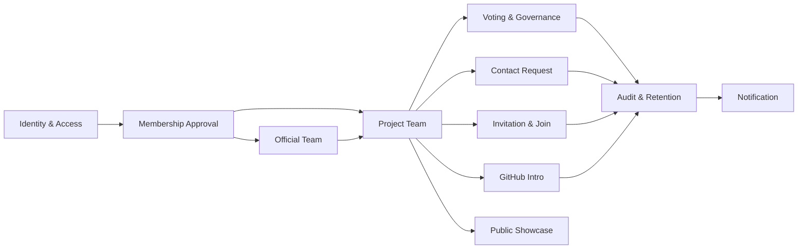
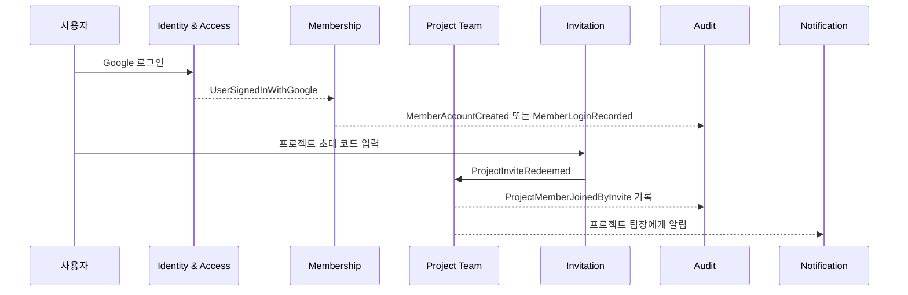

# 01. 도메인 지도와 핵심 모델

## 1. 설계 목표

KOBOT Web은 공개 홍보 페이지와 실제 동아리 운영 워크스페이스가 분리된 시스템입니다.

| 영역 | 목적 | 핵심 사용자 |
| --- | --- | --- |
| 공개 메인 페이지 | 발표, 포트폴리오, 시연, 외부 소개 | 방문자, 발표 청중, 지원자 |
| 멤버 워크스페이스 | 공지, 자료, 장비, 프로젝트, 투표, 연락, 권한 관리 | 코봇 부원, 운영진, 프로젝트 참여자 |

DDD 설계의 목표는 기능을 많이 적는 것이 아니라, 권한과 상태 전이가 꼬이지 않게 도메인 경계를 나누는 것입니다.

## 2. 유비쿼터스 언어

### 2.1 사람과 계정

| 용어 | 의미 | 주의점 |
| --- | --- | --- |
| 사용자 | Supabase Auth 계정이 있는 사람 | 아직 코봇 활동 권한이 없을 수 있습니다. |
| 코봇 활동 부원 | member account가 active인 정식 활동 사용자 | 멤버 워크스페이스 접근 가능 |
| 가입 요청 작성 중 사용자 | Google 로그인은 했지만 가입 요청 정보를 아직 제출하지 않은 사용자 | `/member/join`에서 실명, 닉네임, 학번, 연락처, ID 로그인 설정 |
| 승인 대기 사용자 | 가입 요청 정보를 제출했고 활동 승인을 기다리는 사용자 | `/member/pending`에서 안내, 새로고침, 문의, 로그아웃만 가능 |
| 프로젝트 전용 참여자 | 코봇 정식 부원은 아니지만 특정 프로젝트 참여가 허용된 사용자 | 전체 워크스페이스 권한과 분리 필요 |
| 운영진 | 회장, 부회장, 공식 팀장 | 프로젝트 팀장은 운영진이 아닙니다. |
| 회장 | 최고 관리자 | 모든 권한을 가질 수 있지만 권한 이전은 수락 절차를 둡니다. |
| 부회장 | 전체 운영 보조 관리자 | 회장 부재 시 임시 권한을 가질 수 있습니다. |
| 공식 팀장 | 로봇 A~D, IoT, 연구팀 같은 공식 팀의 운영자 | 자기 공식 팀 중심 권한입니다. |
| 프로젝트 팀장 | 특정 프로젝트의 책임자 | 자기 프로젝트 안에서만 권한을 가집니다. |
| 프로젝트 운영 보조자 | 프로젝트 팀장이 일부 운영 업무를 맡긴 사람 | 팀장이 아닙니다. |
| 임시 위임자 | 기간 제한으로 일부 프로젝트 운영 capability를 받은 사람 | role이 아니라 delegation입니다. |

### 2.2 팀과 프로젝트

| 용어 | 의미 | 주의점 |
| --- | --- | --- |
| 공식 팀 | 로봇 A팀, B팀, C팀, D팀, IoT팀, 연구팀 | 동아리 운영 단위 |
| 프로젝트 팀 | 실제 협업 단위 | 공식 팀과 별개로 존재합니다. |
| 공식 팀 기반 프로젝트 | 공식 팀 이름을 걸고 만드는 프로젝트 | 해당 공식 팀장 검토가 필요합니다. |
| 개인/자율 프로젝트 | 개인 또는 여러 부원이 새 이름으로 만드는 프로젝트 | 승인 후 공개 목록 노출 |
| 모집 공유 페이지 | 공지방/카카오톡 공유용 프로젝트 모집 카드 또는 페이지 | 승인 전에도 볼 수 있어야 합니다. |
| 프로젝트 소개서 | 내부 작성 소개서 또는 GitHub README에서 가져온 설명 | 내부 자료와 다릅니다. |
| 프로젝트 내부 자료 | 팀원만 보는 자료, 회의록, 코드/문서 링크 | 신청자는 볼 수 없습니다. |
| README 전용 공개 | 저장소 전체가 아니라 README/소개서만 보여주는 상태 | 비공개 GitHub 저장소도 가능해야 합니다. |

### 2.3 권한과 상태

| 용어 | 의미 | 주의점 |
| --- | --- | --- |
| Role | 사람의 책임 또는 지위 | 회장, 공식 팀장, 프로젝트 팀장 등 |
| Capability | 특정 command를 수행할 수 있는 능력 | `project.join_request.review` 같은 행위 중심 |
| Scope | capability가 적용되는 범위 | organization, official_team, project, self |
| Delegation | 일정 기간 특정 capability를 빌려주는 행위 | role이 아닙니다. |
| Audit Log | 누가 어떤 자격으로 무엇을 했는지 남기는 기록 | 1년 보관 후 삭제 정책 |
| Activity Log | 프로젝트 내부 활동 기록 | 감사 로그와 다릅니다. |

## 3. 바운디드 컨텍스트

### 3.1 Identity & Access Context

책임:

- Google OAuth 로그인
- 국민대 이메일 제한
- 외부 예외 계정 허용
- ID 로그인 보조 수단
- 세션 복구 및 auth callback
- 계정 상태별 접근 가드

대표 Aggregate:

| Aggregate | 책임 |
| --- | --- |
| Account | 로그인 가능 여부와 member status 관리 |
| Profile | 닉네임, 실명, 학번, 전화번호, 학과, 공개 표시 설정 관리 |
| LoginCredential | Google 계정과 ID/password 보조 로그인 연결 |
| AllowedLoginException | 비국민대 예외 계정 허용 |

핵심 불변식:

- 최초 가입은 Google OAuth로 시작합니다.
- 국민대 학교 계정 또는 운영진이 허용한 예외 계정만 계정 생성 가능합니다.
- ID 로그인은 새 계정 생성이 아니라 Google로 생성된 같은 계정에 붙는 보조 로그인입니다.
- 가입 요청 작성 중 사용자는 `/member/join`에서 ID 생성 및 필수 프로필 설정을 완료해야 합니다.
- 승인 대기 화면(`/member/pending`)에서는 ID 생성 및 프로필 설정 CTA를 보여주지 않습니다.
- 비국민대 계정은 학교 계정 안내/탈퇴 및 재가입 요청 화면만 볼 수 있습니다.

### 3.2 Membership Approval Context

책임:

- 신규 가입자 승인/반려/정지/졸업 처리
- 참여 코드로 활동 부원 전환
- 탈퇴 요청, 탈퇴 승인, 재가입
- 계정 상태 전이 기록

대표 Aggregate:

| Aggregate | 책임 |
| --- | --- |
| MembershipApplication | 신규 활동 승인 요청 |
| MemberAccount | 활동 상태와 승인 메타데이터 |
| MemberExitRequest | 탈퇴 요청 및 완료 처리 |
| MembershipStatusHistory | 상태 변경 이력 |

핵심 불변식:

- `pending` 상태는 멤버 워크스페이스의 실제 기능에 접근할 수 없습니다.
- `active`가 되어도 승인 기록이 없는 역할 assignment는 자동 권한으로 쓰면 안 됩니다.
- `suspended`, `rejected`, `alumni`는 기본 운영 권한이 없습니다.
- 탈퇴 후 산출물은 삭제하지 않고, 공개 표시 방식은 사용자의 마지막 선택을 따릅니다.
- 실명, 학번, 전화번호는 내부 프로젝트 참여자 목록에서만 필요한 범위로 노출합니다.

### 3.3 Official Team Context

책임:

- 공식 팀 목록 관리
- 공식 팀장 임명
- 공식 팀원 관리
- 공식 팀 초대 코드 발급
- 공식 팀 기반 프로젝트 검토

대표 Aggregate:

| Aggregate | 책임 |
| --- | --- |
| OfficialTeam | 로봇 A~D, IoT, 연구팀 같은 운영 단위 |
| OfficialTeamMembership | 사용자와 공식 팀의 소속 관계 |
| OfficialTeamLeadAssignment | 공식 팀장 임명/해임 |

핵심 불변식:

- 공식 팀장은 운영진입니다.
- 공식 팀장은 프로젝트 팀장이 아닙니다.
- 공식 팀장은 자기 공식 팀 범위에서만 검토/초대/로그 열람 권한을 가집니다.
- 공식 팀장이 모든 프로젝트 내부 자료를 볼 수 있어서는 안 됩니다.

### 3.4 Project Team Context

책임:

- 프로젝트 생성 신청
- 공식 팀 기반/개인 자율 기반 선택
- 프로젝트 승인/반려
- 공개/비공개 상태 관리
- 팀원 모집, 참여 신청, 팀원 목록
- 프로젝트 팀장 변경, 탈퇴, 임시 위임

대표 Aggregate:

| Aggregate | 책임 |
| --- | --- |
| ProjectCreationRequest | 승인 전 프로젝트 신청서 |
| ProjectTeam | 승인된 프로젝트의 생명주기 |
| ProjectMembership | 프로젝트 참여자와 역할 |
| ProjectRecruitment | 모집 공개 여부, 필요 역할, 기술 태그 |
| ProjectLeadershipTransfer | 팀장 양도/강제 변경 |
| TemporaryProjectDelegation | 기간제 업무 위임 |

핵심 불변식:

- 승인 전 프로젝트는 전원 공개 목록에 나오면 안 됩니다.
- 승인 전에도 모집 공유 페이지는 설정에 따라 볼 수 있습니다.
- 비공개 프로젝트는 운영진과 프로젝트 참여자만 볼 수 있습니다.
- 참여 신청자는 README/소개서만 볼 수 있고 내부 자료는 볼 수 없습니다.
- 프로젝트 팀장은 자기 프로젝트만 관리합니다.
- 프로젝트 팀장은 권한을 넘기기 전까지 탈퇴할 수 없습니다.
- 임시 위임자는 팀장 변경, 공개 범위 변경, GitHub 저장소 변경, 프로젝트 삭제를 할 수 없습니다.

### 3.5 Invitation & Join Context

책임:

- 코봇 활동 부원 코드
- 공식 팀 초대 코드
- 프로젝트 초대 코드/링크
- 참여 신청 및 승인/거절/만료
- 초대 사용 원자 처리

대표 Aggregate:

| Aggregate | 책임 |
| --- | --- |
| Invitation | 코드/링크, 대상, 만료, 사용 제한 |
| InvitationRedemption | 누가 언제 어떤 코드로 들어왔는지 |
| ProjectJoinRequest | 참여 신청 상태 전이 |

핵심 불변식:

- 코드 사용은 서버 RPC에서 한 트랜잭션으로 처리해야 합니다.
- 기본 초대 코드 기한은 5일입니다.
- 프로젝트 코드는 프로젝트 참여만 부여하고, 코봇 활동 부원 권한을 부여하지 않습니다.
- 초대 코드로 들어온 사용자는 즉시 참여 처리되지만 프로젝트 팀장에게 알림이 가야 합니다.

### 3.6 GitHub Intro Context

책임:

- GitHub 저장소 연결
- GitHub App 설치/권한 확인
- 공개/비공개 저장소 README 조회
- 내부 소개서와 GitHub README 동기화 정책
- README 스냅샷 저장

대표 Aggregate:

| Aggregate | 책임 |
| --- | --- |
| GitHubRepositoryConnection | 프로젝트와 GitHub 저장소 연결 |
| ReadmeSnapshot | 특정 시점 README 렌더링 결과 |
| ReadmeSyncAttempt | 동기화 성공/실패 기록 |
| IntroDisplayPolicy | 내부 소개서 우선/README 우선/최신 날짜 우선 |

핵심 불변식:

- 브라우저에 GitHub private token을 노출하지 않습니다.
- 비공개 저장소도 KOBOT 서버가 권한 확인 후 README만 보여줍니다.
- README 전체 공개 여부는 프로젝트 팀장이 선택하지만 승인 전 검토자는 확인할 수 있어야 합니다.
- GitHub 조회 실패 시 마지막 성공 스냅샷 또는 내부 소개서 fallback 정책을 명확히 둡니다.

### 3.7 Voting & Governance Context

책임:

- 회장/부회장 권한 이전
- 임시회장 복구 절차
- 회장 선거
- 일반 안건 투표
- 후보 추천/수락/사퇴
- 익명 투표와 결과 공개

대표 Aggregate:

| Aggregate | 책임 |
| --- | --- |
| RoleTransferRequest | 회장/부회장/공식 팀장/프로젝트 팀장 권한 이전 |
| Election | 회장 선거 흐름 |
| Vote | 일반 안건 투표 |
| Nomination | 후보 추천 및 수락/거절 |
| Ballot | 개별 투표 제출 |

핵심 불변식:

- 회장 권한 이전은 피요청자 수락 후 반영합니다.
- 회장 권한 이전 시 기존 회장은 이후 권한 상태를 선택합니다.
- 회장 공백 시 부회장 또는 공식 팀장 2명이 임시회장을 세울 수 있습니다.
- 임시회장은 2주 동안 권한을 가지며, 15일째 회장 투표가 열립니다.
- 회장 후보 모집 기간은 14일, 투표 기간은 3일입니다.
- 단일 후보는 찬반 투표로 진행합니다.
- 반대가 많으면 재투표합니다.
- 익명 투표는 운영진도 개별 ballot을 볼 수 없어야 합니다.

### 3.8 Contact & Abuse Context

책임:

- 연락 요청 보내기
- 연락처 첨부
- 수락/거절/대기/자동 거절
- 신고, 경고, 제한, 정지
- 반복/유사 요청 자동화 방지

대표 Aggregate:

| Aggregate | 책임 |
| --- | --- |
| ContactRequest | 연락 요청 상태와 사유 |
| ContactDecision | 수락/거절 및 공개 연락처 |
| AbuseReport | 스팸/부적절 신고 |
| RateLimitSignal | 반복 요청 감지 |

핵심 불변식:

- 연락 요청은 사유가 필요합니다.
- 요청자는 자신의 연락 가능한 연락처를 첨부할 수 있습니다.
- 수락 시 수락자가 넘길 연락처를 선택합니다.
- 3일 미응답 시 자동 거절되고 이유는 `미응답`입니다.
- 반복 요청은 확인창, rate limit, 유사 문구 탐지, 서버 제한을 함께 적용합니다.
- 신고 내용은 회장/부회장이 확인하고 조치합니다.

### 3.9 Audit & Retention Context

책임:

- 모든 요청/승인/반려/권한 변경/초대 사용/로그인 이상 기록
- 감사 로그 보관 및 삭제
- 개인정보 보존/삭제 정책
- 회장 전체 로그 열람

대표 Aggregate:

| Aggregate | 책임 |
| --- | --- |
| AuditLog | 행위 기록 |
| RetentionJob | 만료 로그 삭제 |
| PrivacyConsentSnapshot | 동의 시점의 고지 내용 스냅샷 |

핵심 불변식:

- 모든 중요한 command는 domain event와 audit log를 남깁니다.
- 감사 로그 기본 보관 기간은 1년입니다.
- 1년 이후 삭제합니다.
- 산출물은 탈퇴해도 삭제하지 않습니다.
- 내부 작성자 표시는 작성 당시 닉네임 snapshot을 유지합니다.
- 작성자 클릭 시 닉네임 변경 이력을 권한 범위에 맞게 보여줍니다.

## 4. Context 간 이벤트 흐름 예시

## 5. 구현 원칙

| 원칙 | 설명 |
| --- | --- |
| Command는 서버 RPC 또는 API에서 처리 | 상태 전이는 프론트 update로 처리하지 않습니다. |
| RLS는 최소한의 row 접근 가드 | 승인/상태 전이는 command 함수에서 검증합니다. |
| Domain Event는 과거형 | `ProjectJoinApproved`, `VoteClosed`처럼 이미 일어난 사실로 기록합니다. |
| Audit Log에는 권한 출처를 남김 | 누가 어떤 자격으로 실행했는지 추적합니다. |
| UI는 capability scope를 표시 | 버튼에 `이 프로젝트`, `이 공식 팀`, `전체 운영` 같은 범위를 표시합니다. |
| Pending은 승인 대기 안내 화면 | 가입 요청 제출 후에는 역할성 CTA, ID 생성, 프로젝트 생성은 금지합니다. |
