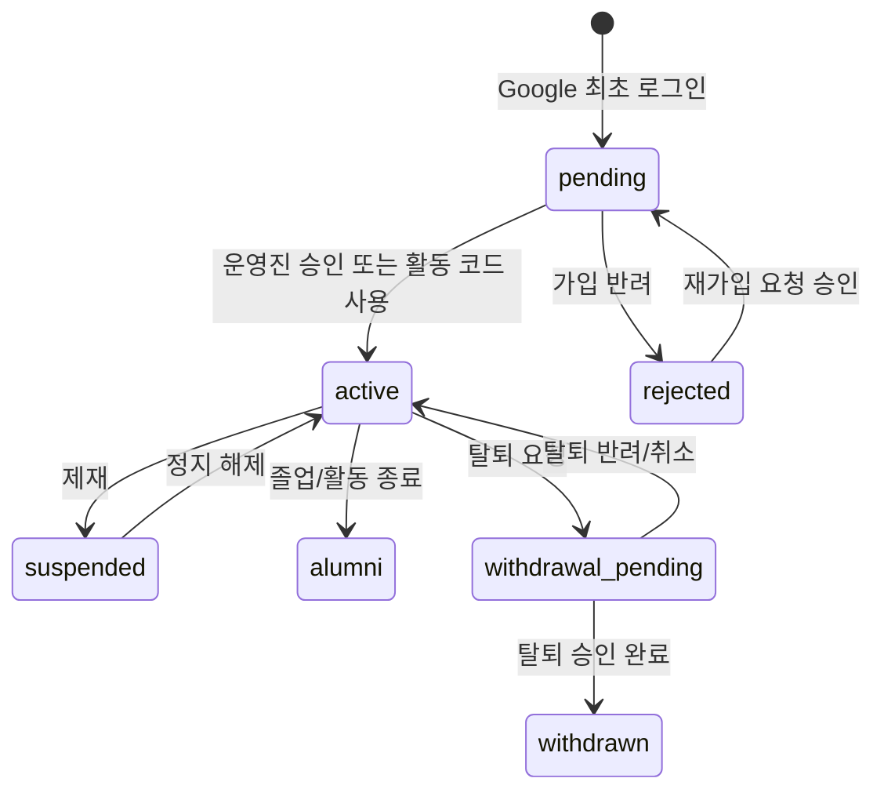

# 02. 이벤트 스토밍 보드

## 1. 표기 규칙

이미지 스토밍 보드의 색상 포스트잇을 문서에서는 다음 타입으로 표현합니다.

| 타입 | 색상 대응 | 의미 |
| --- | --- | --- |
| Actor | 노란색 | 행위를 시작하는 사람 또는 외부 시스템 |
| Command | 파란색 | Actor가 수행하려는 명령 |
| Domain Event | 주황색 | 도메인에서 이미 발생한 사실 |
| Policy/Saga | 보라색 | Event를 보고 다음 Command를 발생시키는 규칙 |
| Aggregate | 노란색 박스 | 불변식을 지키는 도메인 객체 |
| Read Model | 초록색 | 화면 조회용 모델 |
| External System | 분홍색 | Supabase, Google, GitHub, 이메일, 알림 등 |
| Question | 빨간색 | 아직 결정이 필요하거나 위험한 지점 |

## 2. 전체 이벤트 흐름 요약

```mermaid
flowchart LR
  A1["Google 로그인 시작"] --> E1["GoogleOAuthStarted"]
  E1 --> E2["GoogleOAuthCallbackReceived"]
  E2 --> P1{"학교 계정 또는 예외 계정인가?"}
  P1 -->|아니오| E3["NonKookminAccountRejected"]
  P1 -->|예| E4["MemberAccountCreatedOrFound"]
  E4 --> P2{"활동 승인 상태인가?"}
  P2 -->|pending + 정보 미완성| R0["JoinRequestFormView"]
  R0 --> C0["SubmitMemberJoinRequest"]
  C0 --> E0["MemberJoinRequestSubmitted"]
  E0 --> R1["ApprovalPendingView"]
  P2 -->|pending + 요청 제출| R1["ApprovalPendingView"]
  P2 -->|active| R2["MemberDashboardView"]
  R2 --> C1["SubmitProjectCreationRequest"]
  C1 --> E5["ProjectCreationRequested"]
  E5 --> P3["ProjectCreationApprovalPolicy"]
  P3 --> C2["ApproveProjectCreation"]
  C2 --> E6["ProjectCreationApproved"]
  E6 --> C3["PublishRecruitmentCard"]
  C3 --> E7["RecruitmentCardPublished"]
  E7 --> C4["RequestToJoinProject"]
  C4 --> E8["ProjectJoinRequested"]
  E8 --> C5["ApproveProjectJoinRequest"]
  C5 --> E9["ProjectMemberJoined"]
```

## 3. 인증과 계정 진입

| Actor | Command | Aggregate | Domain Event | Policy/Saga | Read Model | 질문/위험 |
| --- | --- | --- | --- | --- | --- | --- |
| 방문자 | StartGoogleLogin | Account | GoogleOAuthStarted | PreserveReturnPathPolicy | LoginPageState | 로그인 후 원래 링크로 돌아갈 next를 어디에 저장할 것인가? |
| Google | ReturnOAuthCallback | Account | GoogleOAuthCallbackReceived | ExchangeSupabaseSessionPolicy | AuthCallbackStatusView | localhost와 production domain이 섞이면 PKCE verifier가 사라집니다. |
| Supabase Auth Hook | ValidateSignInEmail | Account | SignInEmailValidated | KookminDomainPolicy | AuthDecisionView | `hd`가 없고 email suffix만 있는 경우 허용할 것인가? 현재는 허용. |
| Supabase Auth Hook | RejectNonAllowedEmail | Account | NonKookminAccountRejected | NonKookminGuidancePolicy | RestrictedAccountView | 비국민대 계정은 탈퇴/재가입 요청만 제공. |
| 시스템 | CreateMemberAccount | MemberAccount | MemberAccountCreated | DefaultPendingPolicy | JoinRequestFormView | 최초 bootstrap admin 외에는 pending이며, 가입 정보 미완성 사용자는 join 화면으로 보냅니다. |
| 사용자 | SubmitMemberJoinRequest | MemberAccount/Profile/LoginCredential | MemberJoinRequestSubmitted | JoinRequestCompletionPolicy | ApprovalPendingView | 실명은 Google 이름으로 자동 입력하고, 닉네임/학번/연락처/ID 로그인을 설정합니다. |
| 사용자 | RefreshApprovalStatus | MemberAccount | ApprovalStatusRefreshed | RedirectIfActivePolicy | ApprovalPendingView | pending 화면에는 ID 생성 CTA 금지. |
| 사용자 | SignOut | Account | UserSignedOut | ClearAuthStatePolicy | LoginPageState | nextPath도 지울지 결정 필요. |

### 필수 정책

| Policy | 내용 |
| --- | --- |
| PreserveReturnPathPolicy | 로그인 시작 시 `next`를 저장하고 callback 성공 후 해당 경로로 돌아갑니다. 저장 위치는 동일 origin의 storage/cookie여야 합니다. |
| KookminDomainPolicy | `@kookmin.ac.kr` 또는 운영진이 허용한 예외 계정만 생성합니다. |
| DefaultPendingPolicy | 신규 사용자는 기본 pending입니다. pending은 내부 기능 접근 금지입니다. |
| NonKookminGuidancePolicy | 비국민대 계정은 안내, 탈퇴 처리 요청, 재가입 진입만 표시합니다. |

## 4. 프로필, 닉네임, ID 로그인

| Actor | Command | Aggregate | Domain Event | Policy/Saga | Read Model | 질문/위험 |
| --- | --- | --- | --- | --- | --- | --- |
| pending 사용자 | OpenJoinRequestForm | Profile | JoinRequestFormViewed | PendingJoinOnlyPolicy | JoinRequestFormView | 가입 정보 미완성 pending만 접근. |
| pending 사용자 | CreateLoginId | LoginCredential | LoginIdCreated | JoinRequestLoginPolicy | JoinRequestFormView | 가입 요청서에서 필수 설정. |
| active 사용자 | OpenProfileSettings | Profile | ProfileSettingsViewed | ActiveMemberOnlyPolicy | ProfileSettingsView | active 이후 프로필 관리 화면. |
| active 사용자 | SetNickname | Profile | NicknameChanged | NicknamePolicy | NicknameHistoryView | 작성 당시 닉네임 snapshot 유지. |
| active 사용자 | HidePreviousNickname | Profile | PreviousNicknameHiddenFromMembers | NicknamePrivacyPolicy | PublicAuthorProfileView | 회장/부회장은 확인 가능. |
| active 사용자 | SetPublicCreditNameMode | Profile | PublicCreditNameModeChanged | PublicCreditPolicy | PublicCreditPreview | 기본값 anonymous. |
| active 사용자 | CreateLoginId | LoginCredential | LoginIdCreated | LoginIdPolicy | LoginMethodView | active 사용자가 아직 ID가 없을 때 추가 생성 가능. |
| active 사용자 | SetLoginPassword | LoginCredential | LoginPasswordEnabled | PasswordLoginPolicy | LoginMethodView | Google 계정에 보조 로그인 수단을 붙이는 구조. |

### 닉네임 정책

| 규칙 | 결정 |
| --- | --- |
| 중복 | 현재 활동 사용자 기준 중복 불가, 대소문자 구분 없음 |
| 탈퇴자 닉네임 | 재사용 가능. 단 작성 당시 snapshot은 유지 |
| 공백 | 입력 허용, 저장 slug는 `_` 변환, `_` 직접 입력은 불가 |
| 변경 주기 | 7일에 1회 |
| 부적절 닉네임 | 금칙어/부적절성 검사 통과 필요 |
| 이전 닉네임 | 변경 시 비공개 여부를 묻고, 회장/부회장은 감사 목적으로 확인 가능 |

## 5. 가입 승인과 회원 상태

| Actor | Command | Aggregate | Domain Event | Policy/Saga | Read Model | 질문/위험 |
| --- | --- | --- | --- | --- | --- | --- |
| 회장/부회장/공식 팀장 | ReviewMemberApplication | MembershipApplication | MemberApplicationReviewed | MembershipApprovalPolicy | MemberApprovalQueueView | 공식 팀장이 누구까지 승인 가능한가? |
| 회장/부회장/공식 팀장 | ApproveMember | MemberAccount | MemberActivated | AssignInitialTeamPolicy | MemberDirectoryView | 승인과 동시에 공식 팀 배정이 필요한가? |
| 회장/부회장/공식 팀장 | RejectMember | MemberAccount | MemberRejected | RejectionNoticePolicy | MemberApprovalQueueView | 재가입 허용 조건 필요. |
| 회장/부회장 | SuspendMember | MemberAccount | MemberSuspended | SuspendCapabilitiesPolicy | SuspendedAccountView | 정지 중 프로젝트 팀장인 경우 후속 조치 필요. |
| 사용자 | RequestWithdrawal | MemberExitRequest | MemberExitRequested | ExitApprovalPolicy | ExitRequestStatusView | 프로젝트 팀장은 권한 이전 전 탈퇴 불가. |
| 프로젝트 팀장 | ApproveProjectMemberExit | MemberExitRequest | ProjectMemberExitApproved | ProjectExitPolicy | ProjectMemberListView | 프로젝트 탈퇴와 코봇 탈퇴는 다름. |
| 회장/부회장 | CompleteWithdrawal | MemberAccount | MemberWithdrawn | RetainContributionPolicy | AuditTimelineView | 산출물은 삭제하지 않고 표시 정책만 반영. |

### 회원 상태 전이

중요:

- `withdrawn`은 현재 DB status에 없으므로 별도 상태 또는 탈퇴 완료 플래그가 필요합니다.
- `project_only`도 현재 DB status에 없으므로 외부 프로젝트 참여자를 위해 추가 검토가 필요합니다.

## 6. 공식 팀 운영

| Actor | Command | Aggregate | Domain Event | Policy/Saga | Read Model | 질문/위험 |
| --- | --- | --- | --- | --- | --- | --- |
| 회장 | CreateOfficialTeam | OfficialTeam | OfficialTeamCreated | OfficialTeamCatalogPolicy | OfficialTeamDirectoryView | 1차 seed는 로봇 A~D, IoT, 연구팀. |
| 회장 | AssignOfficialTeamLead | OfficialTeamLeadAssignment | OfficialTeamLeadAssigned | DirectAppointmentPolicy | OfficialTeamManagementView | 회장은 수락 없이 지명 가능할지? 이전 결정상 회장 권한 이전은 수락, 공식 팀장은 직접 지명으로 가도 됨. |
| 공식 팀장 | IssueOfficialTeamInvite | Invitation | OfficialTeamInviteIssued | InvitationExpiryPolicy | InvitationManagementView | 공식 팀장 자기 팀만 가능. |
| 공식 팀장 | ReviewOfficialTeamProject | ProjectCreationRequest | OfficialTeamProjectReviewed | ProjectCreationApprovalSaga | ProjectApprovalInboxView | 검토와 최종 승인을 분리할지 결정. |
| 공식 팀장 | RequestForcedProjectLeadChange | RoleTransferRequest | ForcedProjectLeadChangeRequested | PresidentApprovalRequiredPolicy | RoleTransferInboxView | 강제 변경은 회장/부회장 승인 필요. |

## 7. 프로젝트 생성과 승인

| Actor | Command | Aggregate | Domain Event | Policy/Saga | Read Model | 질문/위험 |
| --- | --- | --- | --- | --- | --- | --- |
| active 사용자 | StartProjectCreationDraft | ProjectCreationRequest | ProjectCreationDraftStarted | ProjectCreationPolicy | ProjectDraftForm | 공식 팀 기반/개인 자율 선택 필요. |
| active 사용자 | SubmitProjectCreationRequest | ProjectCreationRequest | ProjectCreationRequested | ProjectCreationApprovalSaga | ProjectApprovalInboxView | 승인 전 모집 가능 여부를 저장. |
| active 사용자 | AddPreTeamMembers | ProjectCreationRequest | ProjectPreTeamMembersAdded | PreTeamPolicy | ProjectApprovalDetailView | 승인자는 참여 예정자 목록을 봐야 함. |
| active 사용자 | SetRecruitmentAudience | ProjectRecruitment | RecruitmentAudienceSelected | RecruitmentAudiencePolicy | RecruitmentSharePreview | 동아리 내부/국민대 외부 사용자 모집 선택. |
| active 사용자 | SetProjectVisibility | ProjectTeam | ProjectVisibilitySelected | VisibilityPolicy | ProjectVisibilityBadge | 전원 공개/비공개 선택. |
| active 사용자 | SetIntroSource | ProjectIntro | ProjectIntroSourceSelected | IntroSourcePolicy | ProjectIntroPreview | 내부 소개서/GitHub README/최신 날짜 우선. |
| 공식 팀장/회장/부회장 | ApproveProjectCreation | ProjectCreationRequest | ProjectCreationApproved | ActivateProjectPolicy | ProjectCatalogView | 승인된 것만 목록 노출. |
| 공식 팀장/회장/부회장 | RejectProjectCreation | ProjectCreationRequest | ProjectCreationRejected | RejectionNoticePolicy | ProjectApprovalInboxView | 반려 사유 필수. |
| 시스템 | ActivateProjectTeam | ProjectTeam | ProjectTeamActivated | PublishIfPublicPolicy | ProjectDetailView | 승인 후 프로젝트 팀 생성 또는 pending project active 전환. |

### 승인 정책

| 프로젝트 유형 | 검토자 | 최종 승인자 | 공개 목록 노출 |
| --- | --- | --- | --- |
| 공식 팀 기반 | 해당 공식 팀장 | 회장/부회장 또는 정책상 해당 공식 팀장 | 승인 후만 |
| 개인/자율 | 회장/부회장/공식 팀장 | 회장/부회장 권장 | 승인 후만 |
| 연구팀성 프로젝트 | 연구팀 공식 팀장 또는 회장/부회장 | 회장/부회장 | 승인 후만 |

권장:

- 공식 팀장 검토와 회장/부회장 최종 승인을 분리하면 책임 추적이 명확합니다.
- 1차 구현에서 단순화하려면 공식 팀장은 `review`, 회장/부회장은 `approve`로 두는 것이 안전합니다.

## 8. 프로젝트 모집 공유와 참여 신청

| Actor | Command | Aggregate | Domain Event | Policy/Saga | Read Model | 질문/위험 |
| --- | --- | --- | --- | --- | --- | --- |
| 프로젝트 팀장 | PublishRecruitmentCard | ProjectRecruitment | RecruitmentCardPublished | SharePagePolicy | RecruitmentShareCardView | 로그인 필요 여부는 프로젝트 생성 시 선택. |
| 방문자/사용자 | ViewRecruitmentPage | ProjectRecruitment | RecruitmentPageViewed | RecruitmentAccessPolicy | RecruitmentSharePage | 승인 전에도 볼 수 있어야 함. |
| 사용자 | RequestToJoinProject | ProjectJoinRequest | ProjectJoinRequested | JoinRequestPolicy | MyJoinRequestView | 신청자 프로필 완성 조건 필요. |
| 사용자 | CancelJoinRequest | ProjectJoinRequest | ProjectJoinCanceled | JoinRequestCancelPolicy | MyJoinRequestView | 승인 후 취소는 탈퇴 요청으로 전환. |
| 프로젝트 팀장 | ApproveJoinRequest | ProjectJoinRequest | ProjectJoinApproved | AddProjectMemberPolicy | ProjectMemberListView | 승인 시 팀장에게 감사 로그 남김. |
| 프로젝트 팀장 | RejectJoinRequest | ProjectJoinRequest | ProjectJoinRejected | RejectionNoticePolicy | ProjectJoinQueueView | 반려 사유 권장 또는 필수. |
| 시스템 | ExpireJoinRequest | ProjectJoinRequest | ProjectJoinRequestExpired | ExpiryJobPolicy | MyJoinRequestView | 만료 기간 정책 필요. |

### 모집 공유 페이지에 표시할 정보

| 표시 항목 | 설명 |
| --- | --- |
| 프로젝트 이름 | 공개 가능한 이름 |
| 한 줄 소개 | 지원자가 이해할 수 있는 설명 |
| 프로젝트 유형 태그 | 공식 팀 기반/개인 자율/연구 등 |
| 공개 범위 배지 | 공개/비공개 |
| 모집 대상 | 동아리 내부/국민대 외부 사용자 포함 |
| 필요 역할 | 예: ROS, 회로, 프론트엔드, 문서/발표 |
| 기술 태그 | 지원자가 판단할 수 있는 태그 |
| README/소개서 | 내부 자료가 아닌 소개 내용만 |
| 참여 예정자 | 승인 전 검토자 화면에는 표시, 공개 페이지는 설정 필요 |
| 신청 CTA | 로그인 후 신청 또는 프로젝트 코드 입력 |

## 9. 초대 코드와 참여 코드

| Actor | Command | Aggregate | Domain Event | Policy/Saga | Read Model | 질문/위험 |
| --- | --- | --- | --- | --- | --- | --- |
| 회장/부회장/공식 팀장 | IssueMemberActivationCode | Invitation | MemberActivationCodeIssued | InvitationExpiryPolicy | InvitationManagementView | 코봇 활동 부원 전환 코드. |
| 공식 팀장 | IssueOfficialTeamInvite | Invitation | OfficialTeamInviteIssued | OfficialTeamInvitePolicy | OfficialTeamInviteView | 자기 공식 팀만 가능. |
| 프로젝트 팀장 | IssueProjectInvite | Invitation | ProjectInviteIssued | ProjectInvitePolicy | ProjectInviteView | 기본 기한 5일. |
| 사용자 | RedeemInvitation | InvitationRedemption | InvitationRedeemed | InvitationRedemptionSaga | InvitationResultView | 서버 RPC로 원자 처리. |
| 시스템 | ActivateMemberByCode | MemberAccount | MemberActivatedByCode | MemberActivationPolicy | MemberStatusView | member code만 전체 활동 권한 부여. |
| 시스템 | AddProjectMemberByInvite | ProjectMembership | ProjectMemberJoinedByInvite | ProjectJoinNotificationPolicy | ProjectMemberListView | 프로젝트 팀장에게 알림. |
| 발급자 | RevokeInvitation | Invitation | InvitationRevoked | RevokePolicy | InvitationManagementView | 사용 전/후 정책 필요. |
| 시스템 | ExpireInvitation | Invitation | InvitationExpired | ExpiryJobPolicy | InvitationManagementView | 만료 후 사용 불가. |

### 초대 코드 원자 처리 순서

1. code hash 조회
2. status active 확인
3. expires_at 확인
4. max_uses와 used_count 확인
5. 대상 타입 확인
6. actor 계정 상태 확인
7. 대상별 권한 부여
8. used_count 증가 또는 status used 처리
9. audit log 기록
10. notification 생성
11. 결과 반환

## 10. GitHub README 연동

| Actor | Command | Aggregate | Domain Event | Policy/Saga | Read Model | 질문/위험 |
| --- | --- | --- | --- | --- | --- | --- |
| 프로젝트 팀장 | LinkGitHubRepository | GitHubRepositoryConnection | GitHubRepositoryLinked | GitHubAccessVerificationSaga | GitHubIntegrationStatusView | GitHub App 설치 안내 필요. |
| 시스템 | VerifyGitHubAccess | GitHubRepositoryConnection | GitHubRepositoryAccessVerified | GitHubAppPolicy | GitHubIntegrationStatusView | private repo는 서버만 접근. |
| 프로젝트 팀장 | ChooseIntroDisplayPolicy | IntroDisplayPolicy | IntroDisplayPolicyChanged | IntroPolicyValidation | ProjectIntroPreview | 내부/GitHub/최신 날짜 우선. |
| 시스템 | SyncReadme | ReadmeSnapshot | ReadmeSyncSucceeded | ReadmeSnapshotPolicy | ReadmePreviewView | commit date와 내부 소개서 updated_at 비교. |
| 시스템 | FailReadmeSync | ReadmeSyncAttempt | ReadmeSyncFailed | ReadmeFallbackPolicy | ReadmePreviewView | fallback 정책 필요. |
| 프로젝트 팀장 | RequestIntroChange | IntroDisplayPolicy | IntroChangeRequested | ProjectLeadApprovalPolicy | IntroChangeRequestView | 팀원이 변경 요청, 팀장 승인. |
| 프로젝트 팀장 | ApproveIntroChange | IntroDisplayPolicy | IntroChangeApproved | ReadmeSyncPolicy | ProjectIntroPreview | 승인 후 표시 변경. |

### GitHub App 설치 안내 흐름

| 단계 | 화면 안내 |
| --- | --- |
| 1 | 프로젝트 팀장이 GitHub 저장소 URL 입력 |
| 2 | 시스템이 GitHub App 설치 여부 확인 |
| 3 | 미설치면 `Kmu-Kobot GitHub App 설치` 버튼 표시 |
| 4 | 설치 완료 후 저장소 접근 권한 확인 |
| 5 | README path 선택 또는 자동 탐색 |
| 6 | 공개/비공개 README 표시 범위 설정 |

## 11. 프로젝트 팀장 변경과 임시 위임

| Actor | Command | Aggregate | Domain Event | Policy/Saga | Read Model | 질문/위험 |
| --- | --- | --- | --- | --- | --- | --- |
| 프로젝트 팀장 | RequestProjectLeadTransfer | RoleTransferRequest | ProjectLeadTransferRequested | TransferAcceptancePolicy | RoleTransferInboxView | 기존 팀장의 이후 상태 선택. |
| 피요청자 | AcceptProjectLeadTransfer | RoleTransferRequest | ProjectLeadTransferAccepted | ApplyLeadTransferPolicy | ProjectMemberListView | 수락 시 자동 반영. |
| 피요청자 | RejectProjectLeadTransfer | RoleTransferRequest | ProjectLeadTransferRejected | TransferNoticePolicy | RoleTransferInboxView | 거절 사유 optional. |
| 공식 팀장 | RequestForcedProjectLeadChange | RoleTransferRequest | ForcedProjectLeadChangeRequested | PresidentApprovalRequiredPolicy | ForcedLeadChangeReviewView | 현재 팀장이 탈퇴/부재일 때. |
| 회장/부회장 | ApproveForcedProjectLeadChange | RoleTransferRequest | ForcedProjectLeadChangeApproved | ApplyLeadTransferPolicy | ProjectAuditTimelineView | 강제 변경도 감사 로그 필수. |
| 프로젝트 팀장 | RequestTemporaryDelegation | TemporaryProjectDelegation | TemporaryDelegationRequested | DelegationAcceptancePolicy | DelegationInboxView | 최대 7일. |
| 피요청자 | AcceptTemporaryDelegation | TemporaryProjectDelegation | TemporaryDelegationAccepted | DelegationActivationPolicy | ProjectOperationBanner | 수락 후 시작. |
| 시스템 | ExpireTemporaryDelegation | TemporaryProjectDelegation | TemporaryDelegationExpired | ExpiryJobPolicy | DelegationStatusView | 갱신은 새 요청. |

### 임시 위임 허용/금지

| 허용 가능 command | 조건 |
| --- | --- |
| ReviewProjectJoinRequest | delegation scope에 `review_join_requests` 포함 |
| IssueLimitedProjectInvite | scope와 max_uses 제한 |
| ManageProjectMaterials | 삭제/공개범위 변경 제외 |
| WriteProjectActivityLog | 프로젝트 내부 기록만 |
| RequestReadmeSync | 저장소 설정 변경 없이 sync 요청만 |

| 금지 command | 이유 |
| --- | --- |
| ChangeProjectLead | 권한 소유권 변경 |
| ChangeProjectVisibility | 비공개 정보 노출 위험 |
| DeleteOrArchiveProject | 회복 어려움 |
| LinkOrChangeGitHubRepository | private repo 접근권과 연결 |
| ReDelegateAuthority | 권한 확산 위험 |
| RemoveProjectMemberForcefully | 분쟁 위험 |
| StartOrCloseVote | 의사결정 조작 위험 |
| ReadSensitiveAuditLog | 민감 기록 접근 |

## 12. 연락 요청과 신고

| Actor | Command | Aggregate | Domain Event | Policy/Saga | Read Model | 질문/위험 |
| --- | --- | --- | --- | --- | --- | --- |
| 사용자 | SendContactRequest | ContactRequest | ContactRequestSent | ContactRateLimitPolicy | ContactRequestOutbox | 사유와 연락 가능 정보 첨부. |
| 피요청자 | AcceptContactRequest | ContactRequest | ContactRequestAccepted | RevealResponderContactPolicy | ContactRequestInbox | 수락 시 넘길 연락처 선택. |
| 피요청자 | RejectContactRequest | ContactRequest | ContactRequestRejected | ContactDecisionPolicy | ContactRequestInbox | 거절 사유 optional. |
| 시스템 | AutoRejectExpiredContactRequest | ContactRequest | ContactRequestAutoRejected | ContactExpiryPolicy | ContactRequestInbox | 3일 후 미응답 자동 거절. |
| 피요청자 | ReportContactSpam | AbuseReport | ContactRequestReportedAsSpam | AbuseReviewPolicy | AbuseReviewQueue | 회장/부회장 검토. |
| 시스템 | DetectRepeatedContactRequest | RateLimitSignal | RepeatedContactRequestDetected | AntiAutomationPolicy | ConfirmSendDialog | 확인창 + 서버 제한. |
| 회장/부회장 | ApplyAbuseAction | MemberAccount | AbuseActionApplied | SuspensionPolicy | AbuseActionHistory | 경고/제한/정지. |

## 13. 투표와 거버넌스

| Actor | Command | Aggregate | Domain Event | Policy/Saga | Read Model | 질문/위험 |
| --- | --- | --- | --- | --- | --- | --- |
| 부회장/공식 팀장 2명 | AppointTemporaryPresident | RoleTransferRequest | TemporaryPresidentAppointed | PresidentVacancyPolicy | GovernanceStatusView | 임시회장 2주. |
| 임시회장 | OpenPresidentCandidacy | Election | PresidentCandidacyOpened | ElectionSchedulePolicy | ElectionPage | 14일 후보 등록. |
| 사용자 | RecommendCandidate | Nomination | CandidateRecommended | CandidateNotificationPolicy | NominationInbox | 피추천자 알림. |
| 후보 | AcceptCandidacy | Nomination | CandidacyAccepted | CandidateListPolicy | CandidateListView | 임시회장은 기본 후보. |
| 후보 | WithdrawCandidacy | Nomination | CandidacyWithdrawn | CandidateListPolicy | CandidateListView | 투표 시작 전 가능. |
| 시스템 | OpenPresidentElectionVote | Vote | PresidentElectionOpened | ElectionOpenPolicy | VotePage | 15일째 시작, 3일 투표. |
| 사용자 | SubmitAnonymousBallot | Ballot | AnonymousBallotSubmitted | BallotPrivacyPolicy | MyVoteReceiptView | 익명 보장. |
| 시스템 | CloseVote | Vote | VoteClosed | ResultAggregationPolicy | VoteResultView | 종료 후 결과 공개. |
| 당선자 | AcceptPresidentRole | RoleTransferRequest | PresidentRoleAccepted | ApplyPresidentRolePolicy | GovernanceStatusView | 수락하지 않으면 재투표. |
| 시스템 | RestartElection | Election | PresidentElectionRestarted | NoAcceptedWinnerPolicy | ElectionPage | 결론 안 나면 부회장 대행. |
| 운영진/권한자 | CreateGeneralVote | Vote | GeneralVoteCreated | VoteScopePolicy | VoteListView | 투표 범위별 생성 권한 필요. |

### 투표 범위별 생성 권한

| 투표 범위 | 생성 가능자 |
| --- | --- |
| 전체 부원 | 회장, 부회장 |
| 공식 팀 | 회장, 부회장, 해당 공식 팀장 |
| 프로젝트 팀 | 해당 프로젝트 팀장 |
| 일반 참여자 투표 | 생성자가 선택한 범위의 권한자 |

`projects.manage`는 `votes.manage`가 아닙니다. 투표 capability는 반드시 분리해야 합니다.

## 14. 감사 로그와 알림

| Actor | Command | Aggregate | Domain Event | Policy/Saga | Read Model | 질문/위험 |
| --- | --- | --- | --- | --- | --- | --- |
| 모든 command handler | RecordAuditLog | AuditLog | AuditLogRecorded | AuditLoggingPolicy | AuditTimelineView | 권한 출처와 scope를 기록. |
| 시스템 | QueueNotification | Notification | NotificationQueued | NotificationRoutingPolicy | NotificationCenter | 사이드바 배지/이메일 선택. |
| 사용자 | MarkNotificationRead | Notification | NotificationRead | NotificationReadPolicy | NotificationCenter | 개인 알림만 수정 가능. |
| 시스템 | DeleteExpiredAuditLogs | RetentionJob | AuditLogsDeletedAfterRetention | RetentionPolicy | RetentionJobLog | 1년 후 삭제. |
| 사용자 | DeleteContactRequestView | ContactRequest | ContactRequestHiddenByUser | ContactPrivacyPolicy | ContactRequestInbox | 피요청자가 삭제 가능. |

### AuditLog에 반드시 들어가야 할 필드

| 필드 | 이유 |
| --- | --- |
| actor_user_id | 누가 했는지 |
| actor_account_status_snapshot | 당시 계정 상태 |
| authority_source | 어떤 자격으로 했는지 |
| authority_scope_type / scope_id | 어느 범위에서 했는지 |
| authority_source_id | 역할 assignment 또는 delegation id |
| command_type | 어떤 command였는지 |
| target entity | 대상 사용자/프로젝트/공식 팀 |
| old_data/new_data | 변경 전후 |
| reason | 승인/반려/변경 사유 |
| created_at | 발생 시각 |
| expires_at | 삭제 예정 시각 |

## 15. 공개 페이지와 산출물 표시

| Actor | Command | Aggregate | Domain Event | Policy/Saga | Read Model | 질문/위험 |
| --- | --- | --- | --- | --- | --- | --- |
| 프로젝트 팀장 | PublishProjectShowcase | PublicShowcase | ProjectShowcasePublished | PublicCreditPolicy | PublicProjectPage | 공개 이름 기본값 anonymous. |
| 프로젝트 참여자 | ChangePublicCreditMode | Profile | PublicCreditNameModeChanged | PublicCreditPropagationPolicy | PublicProjectPage | 공개 페이지만 익명 가능. |
| 탈퇴자 | ChooseWithdrawalCreditMode | MemberExitRequest | WithdrawalCreditModeSelected | RetainContributionPolicy | PublicProjectPage | 탈퇴 시 다시 묻기. |
| 시스템 | RenderPublicContributors | PublicShowcase | PublicContributorsRendered | PublicCreditPolicy | PublicProjectPage | 내부 페이지는 실명 우선, 공개는 선택. |

## 16. 이벤트 이름 규칙

| 나쁜 이름 | 좋은 이름 |
| --- | --- |
| TeamLeadApproved | OfficialTeamLeadReviewedProject 또는 ProjectLeadApprovedJoinRequest |
| AdminChangedRole | PresidentAssignedOfficialTeamLead 또는 ProjectLeadTransferred |
| MemberInvited | OfficialTeamInviteIssued 또는 ProjectInviteIssued |
| AuthorityDelegated | ProjectLeadAuthorityTemporarilyDelegated |
| RequestApproved | MemberApplicationApproved, ProjectCreationApproved, ProjectJoinApproved |
| UserUpdated | ProfileUpdated 또는 LoginIdCreated |

원칙:

- Event는 과거형이어야 합니다.
- 누가 어떤 범위에서 한 일인지 이름에서 드러나야 합니다.
- `Admin`, `Team`, `Request`처럼 넓은 단어는 피합니다.
