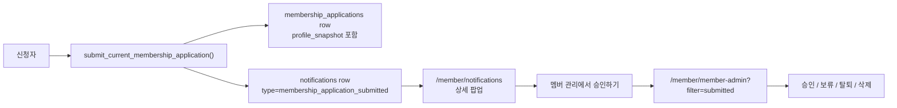

# 알림 도메인

알림은 운영 명령을 직접 실행하는 화면이 아니라, 도메인 이벤트를 받은 사람이 먼저 내용을 이해하는 받은편지함이다.

## 단일 원칙

| 알림 종류 | 원본 이벤트 | 상세 확인 | 실제 처리 화면 |
| --- | --- | --- | --- |
| 가입 신청 도착 | `membership_application_submitted` | `/member/notifications` 상세 팝업 | `/member/member-admin?filter=submitted` |
| 연락 요청 | `contact_request_*` | `/member/notifications` 또는 연락 요청 화면 | `/member/contact-requests` |
| 투표 | `vote_*` | `/member/notifications` 또는 투표 화면 | `/member/votes` |
| 승인/권한 | 권한/위임 관련 이벤트 | `/member/notifications` | 해당 운영 화면 |

## 가입 신청 알림 흐름

## Invariants

- 가입 신청 알림 row 클릭은 즉시 페이지 이동하지 않는다. 먼저 상세 팝업을 열고 읽음 처리한다.
- 상세 팝업 하단 CTA만 실제 처리 화면으로 이동한다.
- 가입 신청 승인/보류/거절은 `/member/member-admin` 이 소유한다. `/member/members` 는 공개 멤버 디렉토리 read model 이므로 승인 업무를 맡지 않는다.
- 가입 신청 알림의 CTA는 `type === "membership_application_submitted"` 기준으로 `/member/member-admin?filter=submitted` 를 사용한다.
- DB `notifications.href` 도 같은 값을 저장한다. 프론트 정책 보정은 legacy row 보호용이지 원본 DB 설계의 대체물이 아니다.
- `membership_applications.profile_snapshot` 은 PII 를 포함한다. 읽기 권한은 본인, `members.manage`, `admin.access`, 또는 해당 가입 신청 알림의 실제 수신자로 제한한다.
- `notifications.metadata` 에 원본 PII 를 복사하지 않는다. 알림에는 `applicationId` 만 두고, 상세는 RLS 가 걸린 `membership_applications` 에서 읽는다.

## Touchpoints

| 지점 | 파일 | 역할 |
| --- | --- | --- |
| 알림 목록/상세 팝업 | `src/app/pages/member/Notifications.tsx` | row click -> modal, CTA -> targetHref |
| 알림 fetch / 상세 enrichment | `src/app/api/notifications.ts` | notifications + actor + membership application snapshot 조합 |
| 타입별 라우팅/CTA 정책 | `src/app/api/notification-policy.js` | category, targetHref, action label |
| 대시보드 알림 링크 | `src/app/pages/member/Dashboard.tsx` | `/member/notifications?notification=<id>` 로 상세 팝업 진입 |
| 대시보드 알림 데이터 | `src/app/api/dashboard.ts` | raw href 를 정책 함수로 정규화 |
| 승인 업무 화면 | `src/app/pages/member/MemberAdmin.tsx` | `?filter=submitted` 로 승인 대기 신청만 표시 |
| DB 이벤트 생성/RLS | `supabase/migrations/20260506090000_notification_application_flow.sql` | href 정정, 기존 알림 backfill, RLS 축소 |

## 변경 체크

알림 타입을 추가하거나 알림 클릭 동작을 바꿀 때 반드시 확인한다.

1. 이벤트 원본 테이블과 소유 화면이 무엇인지 정한다.
2. `notification-policy.js` 에 `type` 기준 target/action label 을 추가한다.
3. 알림 row click 이 직접 이동하지 않고 상세 팝업을 거치는지 확인한다.
4. 상세에 PII 가 들어가면 원본 테이블 RLS/RPC 가 먼저 맞는지 확인한다.
5. 대시보드/사이드바/알림 목록이 같은 상세 흐름을 타는지 확인한다.
