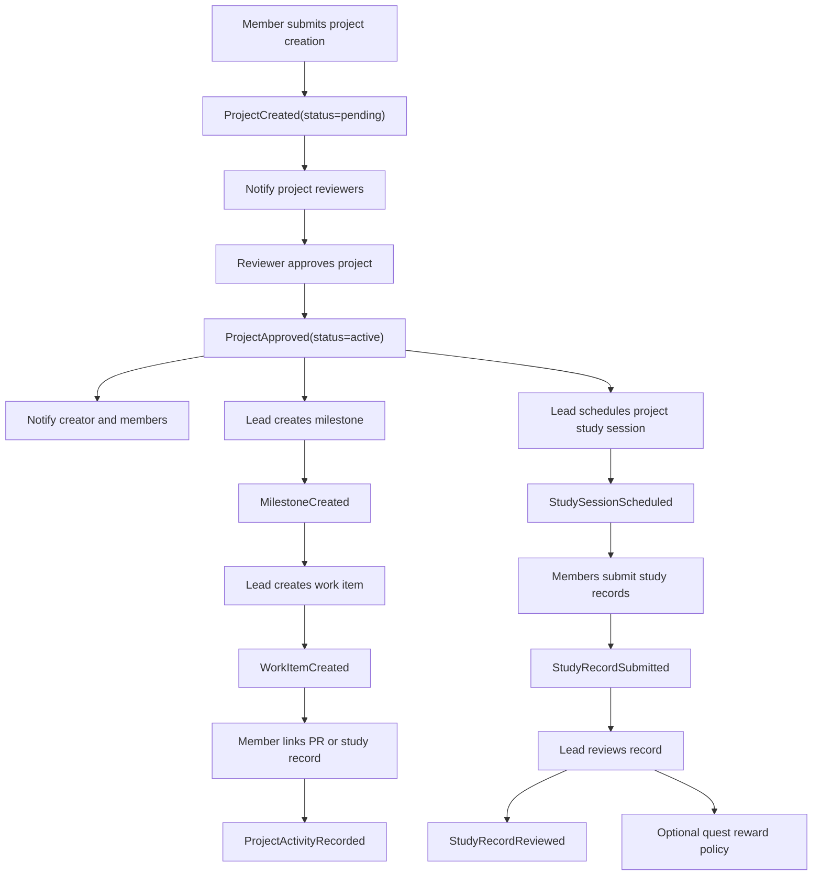

# 프로젝트 개발·스터디 DDD 명세

작성일: 2026-05-05
목적: 프로젝트를 실제 개발 작업 공간으로 확장하고, 프로젝트별 스터디 기록·자료·과제·활동 로그를 안전하게 연결하기 위한 사전 DDD 명세.

## 현재 상태

현재 구현은 프로젝트의 뼈대만 있다.

| 영역 | 현재 구현 | 근거 |
| --- | --- | --- |
| 프로젝트 목록·상세 | 목록, 검색, 상태 필터, 상세 보기 | `src/app/pages/member/Projects.tsx`, `src/app/pages/member/ProjectDetail.tsx` |
| 프로젝트 생성 | `projects.create`/`projects.manage` 권한 기반 생성 모달과 `create_project_team` RPC | `src/app/api/projects.ts`, `supabase/migrations/20260506110000_project_create_permission_and_role_tags.sql` |
| 프로젝트 DB | `project_teams`, `project_team_memberships`, `project_team_join_requests` | `supabase/migrations/20260428173000_member_workspace_core.sql` |
| 프로젝트 권한 | project member, lead, maintainer, `projects.manage` 기반 | `current_user_is_project_team_lead`, `can_read_private_project` |
| 스터디 기록 | 라우트는 있으나 Coming Soon | `src/app/pages/member/StudyLog.tsx` |
| 스터디 플레이리스트 | 라우트는 있으나 Coming Soon | `src/app/pages/member/StudyPlaylist.tsx` |
| 스터디 목업 | `Study.tsx`는 API 없는 고정 데이터 UI이고 라우트에 연결되지 않음 | `src/app/pages/member/Study.tsx` |
| 퀘스트 | 태그 기반 청중·보상 흐름은 있으나 프로젝트/스터디와 직접 연결 없음 | `src/app/pages/member/Quests.tsx`, `src/app/api/quests.ts` |

## Domain Understanding

이 기능은 단순 CRUD가 아니다. 실제 동아리 운영에서 다음을 다룬다.

- 누가 프로젝트를 제안하고, 누가 승인하는가.
- 프로젝트가 승인 전인지, 진행 중인지, 종료됐는지에 따라 누가 볼 수 있는가.
- 프로젝트 안에서 어떤 개발 작업이 진행 중이고 누가 맡았는가.
- 프로젝트와 연결된 스터디가 단순 학습 기록인지, 프로젝트 산출물 준비인지, 과제/제출인지.
- 기록, 자료, 링크, 파일, 회의록, 과제 제출물에 개인정보나 비공개 프로젝트 정보가 섞이는가.
- 나중에 누가 어떤 결정을 했는지 감사할 수 있는가.

비용 큰 실수:

- 비공개 프로젝트 자료가 전체 부원에게 보임.
- 프로젝트 멤버가 아닌 사람이 스터디 자료나 제출물을 봄.
- 프로젝트 승인/반려/참여 승인 없이 프로젝트가 운영됨.
- 스터디 과제와 퀘스트 보상 태그가 섞여 권한·보상이 잘못 부여됨.
- `project_teams`, `study_records`, `project_tasks` 같은 테이블을 UI에서 직접 여러 번 insert/update하다가 중간 실패로 부분 저장됨.

## Ubiquitous Language

| 한국어 | 코드/영문 | 의미 | 금지할 모호어 |
| --- | --- | --- | --- |
| 프로젝트 | `ProjectTeam` | 개발 또는 연구 활동을 담는 장기 작업 공간 | 스터디, 퀘스트, 공식팀과 혼용 금지 |
| 프로젝트 생성 신청 | `ProjectProposal` 또는 `pending ProjectTeam` | 승인 전 프로젝트. 현재는 `project_teams.status='pending'` row로 표현 | 그냥 "요청" |
| 프로젝트 팀 | `ProjectMembership` | 프로젝트 안의 참여자 집합 | 공식팀(`teams`)과 혼용 금지 |
| 공식팀 | `OfficialTeam` / `teams` | 개발 A-D팀 같은 동아리 조직 단위 | 프로젝트 팀 |
| 프로젝트 리드 | `ProjectLead` | 프로젝트 운영 책임자. `project_team_memberships.role='lead'` | 팀장, 회장 |
| 유지관리자 | `ProjectMaintainer` | 프로젝트 리드에 준하는 관리 역할 | 관리자 |
| 작업 | `WorkItem` | 개발자가 처리할 프로젝트 단위 일감 | 퀘스트, 과제 |
| 이슈 ID | `WorkItemKey` | 브랜치/커밋/PR에서 참조할 안정 식별자 | DB id |
| 마일스톤 | `Milestone` | 목표 날짜와 묶음 작업 단위 | 일정, 행사 |
| 활동 로그 | `ProjectActivityEvent` | 프로젝트 안에서 발생한 도메인 이벤트 read model | 감사 로그와 혼용 금지 |
| 스터디 세션 | `StudySession` | 특정 시간에 진행되는 학습 모임 | 회의, 과제 |
| 스터디 기록 | `StudyRecord` | 세션 또는 프로젝트 활동과 연결된 학습/진행 기록 | 작업 로그, 퀘스트 제출 |
| 스터디 자료 | `StudyMaterial` | 세션·프로젝트에 연결된 문서/링크/파일 | 프로젝트 파일 전체 |
| 스터디 과제 | `StudyAssignment` | 학습 확인을 위한 제출 요구 | 퀘스트 |
| 스터디 제출 | `StudySubmission` | 과제에 대한 개인/팀 제출물 | 퀘스트 완료 |
| 퀘스트 | `Quest` | 보상 태그를 줄 수 있는 별도 동기부여/운영 미션 | 스터디 과제 |
| 공개 범위 | `Visibility` | public/member/project/tag/private 중 누가 볼 수 있는지 | 상태 |

## Bounded Contexts

### Project Governance

목적: 프로젝트 생성, 승인, 반려, 종료, 공개 범위, 리드 변경.

- Actors: 생성자, 프로젝트 리드, 회장/부회장, 공식팀장, 승인자.
- Owned data: `project_teams.status`, `visibility`, `owner_user_id`, `lead_user_id`, `approved_by`, `approved_at`, `archived_at`.
- Commands: create project, review project, resubmit project, archive project, transfer lead.
- Events: ProjectCreated, ProjectApproved, ProjectRejected, ProjectArchived, ProjectLeadChanged.
- Security risk: 승인 전 프로젝트가 전체에게 보이거나, 생성자가 승인 없이 active로 바꿈.

### Project Workspace

목적: 실제 개발을 진행할 작업, 마일스톤, 링크, 파일, 활동 로그.

- Actors: 프로젝트 리드, 유지관리자, 프로젝트 멤버, 운영진.
- Owned data: work items, milestones, repositories, activity events, project materials.
- Commands: create work item, assign work item, change status, link PR, add material, update guide.
- Events: WorkItemCreated, WorkItemAssigned, WorkItemCompleted, PullRequestLinked, MaterialAdded.
- Security risk: private repo/파일 링크 노출, 작업 삭제로 감사 불가.

### Study

목적: 프로젝트 또는 동아리 전체 스터디 세션·기록·자료·과제·제출 관리.

- Actors: 스터디 주최자, 발표자, 참가자, 프로젝트 리드, 리뷰어.
- Owned data: sessions, records, materials, assignments, submissions, attendance.
- Commands: schedule session, publish material, write record, create assignment, submit assignment, review submission.
- Events: StudySessionScheduled, StudyRecordSubmitted, AssignmentCreated, AssignmentSubmitted, AssignmentReviewed.
- Security risk: 프로젝트 멤버 전용 스터디 기록이 전체 부원에게 노출.

### Authorization

목적: 태그 기반 권한, project role 기반 local authority, RLS helper.

- Actors: 회장, 권한관리자, 프로젝트 리드, 시스템.
- Owned data: `member_tags`, `member_tag_permissions`, `project_team_memberships`.
- Commands: assign tag, attach permission to tag, add project member.
- Events: TagAssigned, ProjectMemberAdded.
- Security risk: `members.manage` 보유자가 권한 태그를 자기 자신에게 붙여 권한 상승.

### Notification

목적: 프로젝트/스터디 이벤트를 사용자가 확인하고 적절한 처리 화면으로 이동.

- Actors: 이벤트 생성자, 수신자.
- Owned data: `notifications` read model.
- Commands: mark read, open detail, go to source.
- Events projected: ProjectJoinRequested, ProjectApproved, StudyAssignmentDue 등.
- Security risk: 사용자가 수정 가능한 notification row를 민감 데이터 접근권으로 사용.

## Entities And Value Objects

| 이름 | 종류 | 설명 |
| --- | --- | --- |
| `ProjectTeam` | Entity/Aggregate Root | 프로젝트 identity, lifecycle, visibility를 가진다 |
| `ProjectMembership` | Entity | 사용자와 프로젝트 역할의 관계 |
| `ProjectJoinRequest` | Entity | 프로젝트 참여 신청 lifecycle |
| `Milestone` | Entity | 프로젝트 목표와 기한 |
| `WorkItem` | Entity/Aggregate Root | 개발 작업 단위. 상태와 담당자 변경 이력이 중요 |
| `ProjectRepository` | Entity | GitHub 등 외부 repo 연결 |
| `ProjectMaterial` | Entity | 프로젝트 자료/파일/링크 |
| `ProjectActivityEvent` | Entity/Read Model | 프로젝트 화면의 활동 로그 |
| `StudySession` | Entity/Aggregate Root | 시간과 공개 범위가 있는 스터디 모임 |
| `StudyRecord` | Entity/Aggregate Root | 사용자가 작성한 학습/진행 기록 |
| `StudyMaterial` | Entity | 스터디 자료 |
| `StudyAssignment` | Entity/Aggregate Root | 스터디 과제 |
| `StudySubmission` | Entity | 과제 제출과 리뷰 상태 |
| `Attendance` | Entity | 세션 참석 상태 |
| `ProjectSlug` | Value Object | org 안에서 unique, `^[a-z][a-z0-9_-]{1,30}$` |
| `WorkItemKey` | Value Object | 프로젝트별 unique. 예: `ARM-001` |
| `BranchName` | Value Object | 표시/검증용 문자열. 실제 Git 작업과 연결 가능 |
| `MaterialUrl` | Value Object | HTTPS만 허용. javascript/data/file URL 금지 |
| `Visibility` | Value Object | public/member/project/tag/private |
| `PermissionCode` | Value Object | `permissions.code`와 일치해야 함 |

## Aggregates

### ProjectTeam Aggregate

- Root: `project_teams`
- Children: memberships, join requests, settings summary.
- Accepts commands: create, review, update metadata, archive, transfer lead.
- Invariants:
  - slug는 organization 안에서 unique.
  - 생성자는 pending 프로젝트의 lead membership을 가진다.
  - `projects.create` 또는 `projects.manage` 없이는 생성 불가.
  - `projects.manage`, project lead, maintainer 외에는 설정 변경 불가.
  - rejected/archived 프로젝트에는 새 work item이나 study session을 publish할 수 없다.
- Must not be changed directly from UI:
  - status, lead, owner, visibility, approval columns.
  - membership role.

### WorkItem Aggregate

- Root: `project_work_items`.
- Children: comments, links, assignee history.
- Invariants:
  - project가 active 또는 pending draft 권한 상태여야 생성 가능.
  - key는 project 안에서 unique.
  - assignee는 active project member여야 함.
  - done으로 변경할 때 review 정책이 있으면 reviewer 필요.

### StudySession Aggregate

- Root: `study_sessions`.
- Children: materials, attendance, linked assignments.
- Invariants:
  - project-linked session은 해당 project를 읽을 수 있는 사람에게만 보임.
  - project-linked session 생성은 project lead/maintainer 또는 `projects.manage`.
  - public/member-wide session 생성은 별도 `studies.manage` 또는 운영 태그 권한.
  - canceled session에는 새 attendance/submission 불가.

### StudyRecord Aggregate

- Root: `study_records`.
- Invariants:
  - project-linked record 작성자는 해당 시점에 active project member여야 함.
  - draft는 작성자만, submitted는 project lead/maintainer와 작성자가 봄.
  - locked/reviewed record는 작성자 직접 수정 불가.
  - 파일/링크는 안전 URL 또는 private storage object만 허용.

### StudyAssignment Aggregate

- Root: `study_assignments`.
- Children: submissions.
- Invariants:
  - assignment scope가 project면 제출자는 project member여야 함.
  - due_at 이후 제출 허용 여부를 정책으로 명시.
  - review 결과가 quest reward로 이어지는 경우, 명시적 `reward_tag_ids` 연결이 있어야 함.
  - 퀘스트 보상 태그 자동 부여와 study assignment 승인은 기본적으로 분리.

## Invariants

| Rule | Scope | Enforcing layer | Race strategy | Failure copy | Audit |
| --- | --- | --- | --- | --- | --- |
| 프로젝트 생성은 `projects.create/manage`만 가능 | org | RPC + RLS | RPC transaction | 프로젝트 생성 권한이 없습니다 | `project.create` |
| pending 프로젝트는 생성자/멤버/운영진만 읽음 | project | RLS helper | DB policy | 프로젝트를 볼 수 없습니다 | none |
| 프로젝트 승인/반려는 운영진 또는 공식팀장 권한 | project | RPC | row lock on project | 프로젝트를 검토할 권한이 없습니다 | `project.review` |
| 프로젝트 멤버 변경은 lead/maintainer/manage만 가능 | project | RPC + RLS | unique project/user | 멤버를 변경할 권한이 없습니다 | `project.member.*` |
| WorkItem assignee는 project member | project | RPC + FK/check via query | transaction | 프로젝트 멤버만 담당자로 지정할 수 있습니다 | `project.work.assign` |
| project study session은 project reader만 읽음 | study/project | RLS helper | DB policy | 스터디를 볼 수 없습니다 | none |
| study record 작성자는 project member | study/project | RPC | transaction | 프로젝트 멤버만 기록할 수 있습니다 | `study.record.submit` |
| material URL은 HTTPS만 허용 | material | RPC + UI | validation | 안전한 링크만 등록할 수 있습니다 | `material.add` |
| private file은 public bucket 금지 | material | storage policy | signed URL | 파일 접근 권한이 없습니다 | `material.file.add` |
| notification은 접근권 근거가 아님 | notification | RLS design | immutable source id | 알림 원본을 확인할 수 없습니다 | none |
| study assignment reward는 explicit link만 허용 | study/quest | RPC | transaction | 보상 태그 설정을 확인해 주세요 | `study.assignment.review` |

## Event Storming



### Command/Event 표

| Actor | Command | Event | Policy/Saga | Read Model |
| --- | --- | --- | --- | --- |
| 생성 권한자 | CreateProject | ProjectCreated | notify reviewers | project list/detail |
| 운영진 | ApproveProject | ProjectApproved | notify creator | dashboard, project list |
| 운영진 | RejectProject | ProjectRejected | notify creator with reason | project detail |
| 멤버 | RequestProjectJoin | ProjectJoinRequested | notify project leads | notifications |
| 리드 | ApproveProjectJoin | ProjectMemberAdded | notify requester | members tab |
| 리드 | CreateWorkItem | WorkItemCreated | activity event | tasks tab |
| 리드 | ScheduleStudySession | StudySessionScheduled | notify project members | study tab, calendar |
| 멤버 | SubmitStudyRecord | StudyRecordSubmitted | notify reviewers if review required | study records |
| 리드 | ReviewStudySubmission | StudySubmissionReviewed | optional quest reward | assignment detail |

## Permission, State, Visibility

### 프로젝트 상태별 가시성

| 상태 | 목록 | 상세 | 멤버 | 작업 | 스터디 |
| --- | --- | --- | --- | --- | --- |
| `pending` | 생성자, 프로젝트 멤버, 운영진 | 생성자, 멤버, 운영진 | 생성자/운영진 | draft만 허용 | draft 세션만 허용 |
| `active/public` | active member 전체 | active member 전체 | project member와 운영진만 상세 연락처 | project member 중심 | session visibility에 따름 |
| `active/private` | project member, 운영진 | project member, 운영진 | project member, 운영진 | project member | project member |
| `rejected` | 생성자, 운영진 | 생성자, 운영진 | 운영진 | 금지 | 금지 |
| `archived` | project member, 운영진 | read-only | read-only | read-only | read-only |

### 권한 원천

| 행위 | Global tag permission | Project role | 비고 |
| --- | --- | --- | --- |
| 프로젝트 생성 | `projects.create` 또는 `projects.manage` | 없음 | 태그 설정 UI에서 부여 |
| 프로젝트 승인/반려 | `projects.manage` 또는 `members.manage` | 공식팀장 가능 여부는 정책 결정 필요 | 현재 문서상 미구현 |
| 프로젝트 설정 변경 | `projects.manage` | lead/maintainer | status 변경은 운영진만 |
| 멤버 승인/제거 | `projects.manage` | lead/maintainer | 자기 자신 제거는 별도 command |
| work item 생성/수정 | `projects.manage` | lead/maintainer | member는 comment/progress만 |
| 스터디 세션 생성 | `projects.manage` 또는 future `studies.manage` | project lead/maintainer | project-linked면 local role 우선 |
| 스터디 기록 작성 | active member | project member if project-linked | self 작성 |
| 스터디 제출 리뷰 | `projects.manage` 또는 future `studies.manage` | project lead/maintainer | 보상 태그는 별도 권한 필요 |

## Data Schema 제안

### Project Workspace

```sql
project_repositories (
  id uuid pk,
  project_team_id uuid fk project_teams,
  provider text check in ('github','gitlab','external'),
  repo_url text,
  repo_full_name text,
  visibility text check in ('public','private'),
  created_by uuid,
  created_at timestamptz
)

project_milestones (
  id uuid pk,
  project_team_id uuid fk project_teams,
  title text,
  description text,
  status text check in ('planned','active','completed','canceled'),
  due_at timestamptz,
  sort_order int,
  created_by uuid,
  created_at timestamptz,
  updated_at timestamptz
)

project_work_items (
  id uuid pk,
  project_team_id uuid fk project_teams,
  milestone_id uuid nullable fk project_milestones,
  key text,
  title text,
  description text,
  status text check in ('backlog','ready','in_progress','blocked','review','done','canceled'),
  priority text check in ('low','medium','high','urgent'),
  assignee_user_id uuid nullable fk profiles,
  created_by uuid,
  updated_by uuid,
  created_at timestamptz,
  updated_at timestamptz,
  unique (project_team_id, key)
)

project_work_item_links (
  id uuid pk,
  work_item_id uuid fk project_work_items,
  link_type text check in ('issue','branch','commit','pull_request','study_record','material','external'),
  label text,
  url text,
  created_by uuid,
  created_at timestamptz
)

project_activity_events (
  id uuid pk,
  project_team_id uuid fk project_teams,
  actor_user_id uuid nullable fk profiles,
  event_type text,
  entity_table text,
  entity_id uuid,
  summary text,
  metadata jsonb,
  created_at timestamptz
)
```

### Study

```sql
study_sessions (
  id uuid pk,
  organization_id uuid fk organizations,
  project_team_id uuid nullable fk project_teams,
  title text,
  description text,
  host_user_id uuid fk profiles,
  starts_at timestamptz,
  ends_at timestamptz,
  location text,
  visibility text check in ('member','project','tag','public'),
  status text check in ('draft','scheduled','completed','canceled'),
  created_by uuid,
  created_at timestamptz,
  updated_at timestamptz
)

study_session_audience_tags (
  study_session_id uuid fk study_sessions,
  tag_id uuid fk member_tags,
  primary key (study_session_id, tag_id)
)

study_materials (
  id uuid pk,
  study_session_id uuid nullable fk study_sessions,
  project_team_id uuid nullable fk project_teams,
  title text,
  material_type text check in ('link','file','note'),
  url text,
  storage_path text,
  visibility text check in ('session','project','member','public'),
  created_by uuid,
  created_at timestamptz
)

study_records (
  id uuid pk,
  study_session_id uuid nullable fk study_sessions,
  project_team_id uuid nullable fk project_teams,
  work_item_id uuid nullable fk project_work_items,
  author_user_id uuid fk profiles,
  title text,
  body text,
  duration_minutes integer,
  occurred_at timestamptz,
  status text check in ('draft','submitted','reviewed','locked'),
  visibility text check in ('self','project','member','public'),
  reviewed_by uuid nullable fk profiles,
  reviewed_at timestamptz,
  created_at timestamptz,
  updated_at timestamptz
)

study_assignments (
  id uuid pk,
  study_session_id uuid nullable fk study_sessions,
  project_team_id uuid nullable fk project_teams,
  title text,
  instructions text,
  due_at timestamptz,
  status text check in ('draft','open','closed','canceled'),
  reward_policy text check in ('none','manual_quest','reward_tags'),
  created_by uuid,
  created_at timestamptz,
  updated_at timestamptz
)

study_submissions (
  id uuid pk,
  assignment_id uuid fk study_assignments,
  submitter_user_id uuid fk profiles,
  content text,
  url text,
  storage_path text,
  status text check in ('submitted','approved','rejected','needs_changes'),
  feedback text,
  reviewed_by uuid nullable fk profiles,
  submitted_at timestamptz,
  reviewed_at timestamptz,
  unique (assignment_id, submitter_user_id)
)

study_attendance (
  study_session_id uuid fk study_sessions,
  user_id uuid fk profiles,
  status text check in ('invited','attended','absent','excused'),
  checked_in_at timestamptz,
  checked_by uuid nullable fk profiles,
  primary key (study_session_id, user_id)
)
```

## RPC / RLS 설계

직접 table write를 최소화하고 command RPC 중심으로 닫는다.

| RPC | 책임 |
| --- | --- |
| `create_project_team(...)` | 이미 구현. pending 프로젝트와 lead membership 생성 |
| `review_project_team(project_id, decision, reason)` | 승인/반려, 승인자 기록, 알림 생성 |
| `request_project_join(project_id, reason)` | 참여 신청 생성 |
| `review_project_join_request(request_id, decision, reason)` | 멤버 추가/거절 |
| `create_project_work_item(project_id, input)` | key 생성/검증, 담당자 검증 |
| `update_project_work_item(item_id, patch)` | 상태 전이, 담당자 변경, 활동 로그 |
| `schedule_study_session(input)` | project/tag/member visibility 검증 |
| `submit_study_record(input)` | project membership 검증, 자료 링크 검증 |
| `create_study_assignment(input)` | scope 검증, due_at 검증 |
| `submit_study_assignment(assignment_id, input)` | 제출자 scope 검증, 중복 제출 정책 |
| `review_study_submission(submission_id, decision, feedback)` | review + optional reward policy |

RLS helper는 다음처럼 분리한다.

- `current_user_can_read_project(project_id)`
- `current_user_can_manage_project(project_id)`
- `current_user_can_review_project(project_id)`
- `current_user_can_read_study_session(session_id)`
- `current_user_can_manage_study_session(session_id)`
- `current_user_can_read_study_record(record_id)`
- `current_user_can_review_study_submission(submission_id)`

## UI 설계

### 프로젝트 상세 탭

| 탭 | 내용 | 1차 구현 우선순위 |
| --- | --- | --- |
| 개요 | 설명, 목표, 진척도, 가이드, 이슈 ID/브랜치 규칙 | 이미 일부 있음 |
| 작업 | work item board/list, 담당자, 상태, PR 링크 | 높음 |
| 스터디 | 프로젝트 연결 세션, 기록, 자료, 과제 | 높음 |
| 자료 | repo, 문서, 링크, 파일 | 중간 |
| 활동 | 프로젝트 activity events | 높음 |
| 멤버 | 역할, 참여 신청, 초대 링크, 리드 변경 | 높음 |
| 설정 | visibility, archive, guide, repo 연결 | 중간 |

### 스터디 기록 전역 화면

`/member/study-log`는 단순 Coming Soon이 아니라 다음 read model을 가져야 한다.

- 내 스터디 기록
- 프로젝트별 기록
- 공식 스터디 세션 기록
- 제출 필요한 과제
- 리뷰 대기/피드백 받은 제출
- 태그 필터, 프로젝트 필터, 기간 필터

### 프로젝트 스터디 탭

- 예정 세션
- 최근 기록
- 자료
- 과제와 제출 현황
- 참석 현황
- "작업과 연결" 버튼: study record를 work item에 연결

## Notification Contract

| type | 원본 | 상세 모달 필드 | CTA |
| --- | --- | --- | --- |
| `project.created` | `project_teams` | 생성자, 이름, 상태, 설명 | 프로젝트 검토 |
| `project.approved` | `project_teams` | 승인자, 승인일, 공개 범위 | 프로젝트 보기 |
| `project.rejected` | `project_teams` | 반려자, 사유 | 수정 후 재신청 |
| `project.join_requested` | `project_team_join_requests` | 신청자, 사유 | 멤버 탭 |
| `project.member_added` | `project_team_memberships` | 프로젝트, 역할 | 프로젝트 보기 |
| `study.session_scheduled` | `study_sessions` | 시간, 장소, 발표자, 프로젝트 | 스터디 세션 보기 |
| `study.assignment_created` | `study_assignments` | 마감, 제출 방식 | 제출하기 |
| `study.submission_reviewed` | `study_submissions` | 결과, 피드백 | 제출 상세 |

알림 row 자체를 접근권 근거로 쓰지 않는다. 알림은 read model이고, 원본 접근은 원본 테이블/RPC/RLS가 다시 판단한다.

## 기존 코드 Touchpoints

| 변경 주제 | 반드시 확인할 파일 |
| --- | --- |
| 프로젝트 생성/목록/상세 | `src/app/api/projects.ts`, `src/app/pages/member/Projects.tsx`, `src/app/pages/member/ProjectDetail.tsx` |
| 프로젝트 권한 | `src/app/config/nav-catalog.ts`, `src/app/layouts/MemberLayout.tsx`, `src/app/routes.tsx`, `supabase/migrations/*project*` |
| 스터디 메뉴 | `src/app/pages/member/StudyLog.tsx`, `src/app/pages/member/StudyPlaylist.tsx`, `src/app/api/member-feature-flags.js` |
| 목업 제거/재사용 | `src/app/pages/member/Study.tsx` |
| 대시보드 연동 | `src/app/api/dashboard.ts`, `src/app/pages/member/Dashboard.tsx` |
| 알림 연동 | `src/app/api/notifications.ts`, `src/app/api/notification-policy.js`, `src/app/pages/member/Notifications.tsx`, `docs/product/notifications.md` |
| 태그/권한 | `src/app/api/tags.ts`, `src/app/pages/member/Tags.tsx`, `src/app/pages/member/MemberAdmin.tsx`, `docs/product/tag-system.md` |
| 공간 예약의 study type | `src/app/pages/member/SpaceBooking.tsx`, `src/app/api/space-bookings.ts` |
| 퀘스트 경계 | `src/app/api/quests.ts`, `src/app/pages/member/Quests.tsx`, `docs/product/quests.md` |

## 현재 부족한 부분

### 기능 공백

- 프로젝트 승인/반려 UI와 RPC가 없다.
- 참여 신청/승인 UI가 없다.
- 프로젝트 작업(work item), 마일스톤, 활동 로그가 없다.
- 프로젝트 자료/파일/repo 연결 모델이 없다.
- 스터디 기록/플레이리스트가 Coming Soon이다.
- `Study.tsx` 목업이 라우트와 분리되어 있어 실제 제품과 혼동된다.
- 스터디와 퀘스트의 관계가 정의되지 않았다.
- 프로젝트/스터디 알림 타입이 없다.

### 보안·권한 공백

- 태그 assignment 권한이 넓으면 권한 태그 자체를 부여하는 권한 상승 위험이 있다.
- 프로젝트 자료와 스터디 파일은 private storage policy가 필요하다.
- URL 필드는 HTTPS allowlist와 XSS 방어가 필요하다.
- notification row를 원본 접근권 근거로 쓰면 안 된다.
- direct table insert/update는 RPC로 닫아야 한다.
- fallback이 권한/RLS 실패를 빈 데이터로 숨기면 운영자가 장애를 모른다.

### UX 공백

- empty state가 검색 결과 없음, 권한 없음, 아직 승인 전, 아직 프로젝트 없음으로 분리되어야 한다.
- pending/rejected/archived 상태별 상세 안내가 필요하다.
- 프로젝트 생성 폼의 가이드/ID/브랜치 규칙이 실제 작업 생성과 연결되어야 한다.
- 스터디 기록이 전역 메뉴와 프로젝트 상세 탭에서 어떻게 다르게 보이는지 정해야 한다.

## 구현 순서 추천

### Phase 0: 막아야 할 위험 먼저

1. 권한 태그 assignment 정책 분리: 권한이 붙은 태그는 `permissions.manage`만 부여 가능.
2. 프로젝트 approval RPC 추가: pending -> active/rejected 전이를 UI direct update로 하지 않게 닫기. 1차 구현: `20260506120000_project_review_join_study_core.sql`, `review_project_team(...)`.
3. 프로젝트 read helper 재검토: pending/rejected visibility 명확화.
4. URL/file sanitizer와 private storage 정책 초안 작성.
5. `project_teams` 직접 update 축소: lead가 `status`, `visibility`, `owner_user_id`, `lead_user_id`, `official_team_id`, 민감 `metadata`를 임의 변경하지 못하게 RPC로 닫기. 1차 구현: broad update policy 제거.
6. `project_team_memberships` 직접 insert/update/delete 축소: active 계정 확인, 역할 전이, 자기 lead 회수 금지, audit를 RPC에서 처리. 1차 구현: direct membership write policy 제거, `review_project_join_request(...)` 추가.
7. audit payload redaction: `to_jsonb(project)`처럼 metadata 전체를 audit에 저장하지 말고 allowlist 기반 요약만 저장.
8. course/KOSS 태그와 정식 부원 lifecycle 경계 재확인: 스터디/프로젝트 내부 자료 RLS가 태그만으로 열리지 않게 `member_accounts.status='active'`와 project membership을 별도 확인.

### Phase 1: 프로젝트 운영 완성

1. 프로젝트 검토 큐.
2. 승인/반려/재신청.
3. 참여 신청/승인/탈퇴.
4. 프로젝트 상세 탭 구조 개편.
5. 알림 타입 추가.

### Phase 2: 개발 작업 공간

1. milestone/work item schema + RPC.
2. 작업 상태 전이.
3. PR/branch/link 연결.
4. activity event read model.
5. 대시보드 today/project summary 반영.

### Phase 3: 프로젝트 스터디

1. study_sessions, study_records, study_materials schema + RLS. 1차 구현: schema/RLS/helper/RPC 추가.
2. 프로젝트 상세의 스터디 탭. 1차 구현: `ProjectStudyPanel.tsx`에서 프로젝트별 기록 조회/작성.
3. `/member/study-log` 전역 read model. 1차 구현: Coming Soon 제거, RLS로 읽히는 기록 목록 표시.
4. 참석/자료/기록 연결.

### Phase 4: 과제·제출·퀘스트 연결

1. study_assignments/submissions.
2. 리뷰와 피드백.
3. 퀘스트 보상과 연결할 경우 explicit reward policy.
4. 제출 마감/리뷰 알림.

## 검증 체크리스트

- 새 테이블은 RLS enabled + select/insert/update/delete policy가 명확한가.
- 모든 command는 RPC에서 권한, 상태, visibility, FK, URL을 검증하는가.
- UI fallback이 RLS/네트워크 오류를 빈 데이터로 숨기지 않는가.
- 프로젝트 멤버가 아닌 사용자가 private project study record를 볼 수 없는가.
- 프로젝트 리드가 아닌 member가 settings/status/member role을 바꿀 수 없는가.
- rejected/archived 프로젝트에 새 작업/스터디를 만들 수 없는가.
- 알림 CTA가 원본 접근권을 다시 검증하는가.
- study assignment가 quest reward tag를 자동으로 주지 않는가. 자동 부여가 필요하면 explicit reward policy가 있는가.
- file URL/storage path가 public leak을 만들지 않는가.
- docs/product/projects.md, docs/product/notifications.md, docs/product/tag-system.md, docs/product/CHANGE_CHECKLIST.md가 같이 갱신되었는가.

## Reviewer Notes

서브에이전트 검증에서 확인된 핵심 위험:

- 프로젝트 화면은 생성/상세 뼈대만 있고 승인, 참여, 작업, 스터디, 알림 흐름이 비어 있다.
- 스터디 기록/플레이리스트는 Coming Soon이고 `Study.tsx`는 라우트 없는 목업이다.
- 프로젝트 생성 폼의 작업 규칙/이슈 ID/브랜치 규칙은 아직 실제 work item, PR, activity log와 연결되지 않는다.
- route/sidebar/nav catalog/tag permission/RLS가 동시에 움직이므로 문서 Touchpoints 없이 고치면 메뉴와 접근권이 어긋난다.
- project/study integration에서는 private visibility, file/link leakage, notification source validation, fallback masking을 먼저 막아야 한다.
- 프로젝트 리드의 direct update 권한이 넓으면 승인 전 공개 전환, 리드 변경, 내부 metadata 변경이 audit 없이 가능하다.
- 프로젝트 멤버십 direct write가 넓으면 project-member-only 스터디 기록의 접근 범위를 리드가 임의로 바꿀 수 있다.
- Study Log는 독립 DB/RLS가 아직 없으므로 전역 active member 라우트에 바로 구현하면 project-only/private 기록이 샐 수 있다.
- 프로젝트 공개 카드, 프로젝트 내부 소개, 멤버 명단, 스터디 자료, 파일은 같은 `can_read_private_project` 하나로 묶지 말고 read model/RLS를 나눠야 한다.
- 스터디 주제 태그(`ROS`, `SLAM`, `PyTorch`)는 권한 태그인 `member_tags`에 섞지 말고 `study_topics`/`content_tags`로 분리해야 한다.
- 출석은 `StudyRecord` boolean이 아니라 `StudySession` + `StudyAttendance`로 분리하고, 출석 코드는 서버 nonce와 만료시간으로 검증해야 한다.

### 1차 구현 검증 메모

- `20260506120000_project_review_join_study_core.sql` 적용 후 remote migration list에서 local/remote가 일치했다.
- `project_teams` direct update policy와 `project_team_memberships` direct write policy는 제거했고, 승인/참여는 RPC로 이동했다.
- `study_records`는 select-only grant + RLS helper로 읽고, 작성은 `submit_study_record(...)` RPC로 처리한다.
- Supabase advisor는 기존 DB 전체에 대해 `public_notices` security definer view, mutable search_path 함수, anon GraphQL 노출, security definer RPC 경고를 보고한다. 이번 신규 RPC도 authenticated security definer 경고에 잡히지만 내부에서 actor/status/permission/project membership을 재검증하는 command RPC로 의도한 노출이다.

## Open Decisions

아래는 구현 전에 사용자 확인이 필요하다.

1. 프로젝트 생성은 지금처럼 `pending project_teams` row로 둘지, 별도 `project_creation_requests` 테이블로 분리할지.
2. 프로젝트 승인자는 회장/부회장만인지, 해당 공식팀장도 승인 가능한지.
3. 프로젝트 스터디는 project member 전용이 기본인지, 프로젝트별로 member/public/tag visibility를 선택하게 할지.
4. 스터디 과제와 퀘스트를 완전히 분리할지, 승인된 스터디 제출이 선택적으로 보상 태그를 줄 수 있게 할지.
5. GitHub 연동은 1차부터 실제 API로 연결할지, 우선 외부 링크/PR URL 수동 등록으로 시작할지.
## 2026-05-05 implementation update

이번 구현은 DDD 문서의 Phase 1/3 일부를 실제 코드로 연결했다.

- 프로젝트 생성: `Projects.tsx`에서 slug 입력을 제거하고 `create_project_team(...)` RPC가 자동 slug를 생성한다.
- 프로젝트 생성 관리: `/member/project-admin`을 추가해 pending/active/rejected/archived 프로젝트를 한 화면에서 관리한다.
- 프로젝트 승인/반려: 상세 화면과 관리 화면 모두 `review_project_team(...)` RPC를 사용한다.
- 프로젝트 참여: 상세 화면에서 참여 요청과 승인/반려가 `request_project_join(...)`, `review_project_join_request(...)`로 처리된다.
- 프로젝트 스터디 기록: 프로젝트 상세에는 해당 프로젝트 기록만, 전역 스터디 기록 화면에는 프로젝트별 그룹과 필터를 제공한다.
- 데모 데이터: `20260506130000_project_auto_slug_and_demo_seed.sql`이 4개 프로젝트와 5개 기록을 seed한다.
- 모집중 분리: `20260506140000_project_recruitment_scope.sql`이 프로젝트 lifecycle status와 모집 상태를 분리한다. 일반 부원은 자기 프로젝트와 active/public/open 모집중 프로젝트만 본다.

남은 DDD gap:

- milestone/work item/repository/material/activity event는 아직 스키마와 UI가 없다.
- study assignment/submission/review와 quest reward 연결은 아직 별도 Phase로 남아 있다.
- 프로젝트별 파일 저장소와 private storage policy는 아직 구현되지 않았다.
- 프로젝트 생성 후 "다음"은 상세로 이동하지만, 이후 단계형 설정 wizard는 아직 없다.
- 모집 안내 문구 수정 UI는 아직 별도 모달이 없다. 현재는 생성 시 입력하거나 모집 시작/마감만 토글한다.
