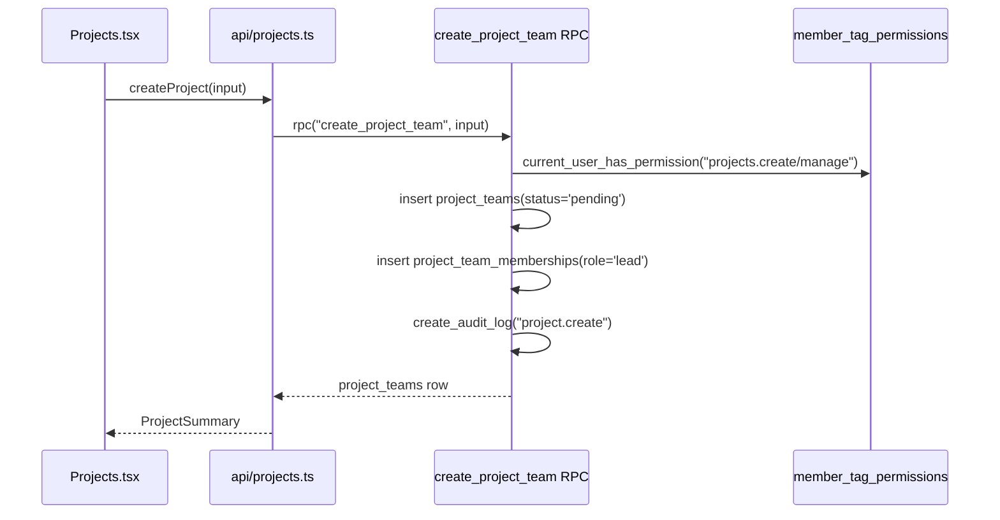
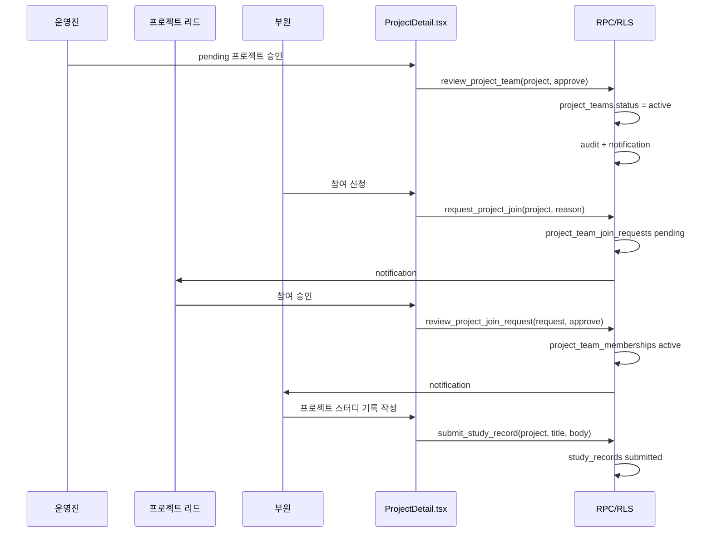

# 프로젝트 도메인

프로젝트의 실제 테이블은 `project_teams` 이고, 참여자는 `project_team_memberships` 로 연결된다. 생성 권한은 `projects.manage` 와 분리된 `projects.create` 로 둔다.

작업 공간, 스터디 기록, 자료, 과제, 알림, RLS까지 포함한 확장 설계는 [프로젝트 개발·스터디 DDD](./project-study-development.md)를 기준으로 한다.

## Invariants

1. **프로젝트 생성은 RPC로 한다.** 클라이언트가 `project_teams` 와 `project_team_memberships` 를 따로 insert 하지 않는다. `create_project_team(...)` 이 프로젝트 row 생성, 생성자 리드 멤버십 생성, 감사 로그를 한 트랜잭션에서 처리한다.
2. **생성 권한은 `projects.create` 또는 `projects.manage` 다.** `projects.read` 는 보기만 의미한다. `projects.manage` 는 기존 관리 권한이라 생성도 포함한다.
3. **생성자는 자동 리드다.** 프로젝트가 `pending` 상태여도 생성자는 `project_team_memberships.role='lead'` 로 붙어서 상세를 볼 수 있다.
4. **권한 부여는 태그에서 한다.** 운영자는 태그 생성/수정 팝업에서 `projects.create` 를 체크하고, 멤버 관리의 `+태그` 모달에서 해당 태그를 사용자에게 붙인다. 권한 체크만으로 태그나 사용자 할당이 자동 생성되지는 않는다.

## Touchpoints

| 영역 | 파일 | 역할 |
| --- | --- | --- |
| DB 권한/RPC | `supabase/migrations/20260506110000_project_create_permission_and_role_tags.sql` | `projects.create` seed, 직접 insert RLS 제한, `create_project_team(...)` |
| DB 운영/RLS | `supabase/migrations/20260506120000_project_review_join_study_core.sql` | 프로젝트 검토/참여 RPC, 직접 update/write 축소, 스터디 기록 테이블/RLS |
| API | `src/app/api/projects.ts` | `createProject()`, `reviewProjectTeam()`, `requestProjectJoin()`, `reviewProjectJoinRequest()` 가 RPC 호출 |
| 스터디 API | `src/app/api/studies.ts` | 프로젝트별 스터디 기록 조회/작성 |
| 목록 UI | `src/app/pages/member/Projects.tsx` | 권한이 있으면 `새 프로젝트` 버튼과 생성 모달 표시 |
| 상세 UI | `src/app/pages/member/ProjectDetail.tsx`, `src/app/pages/member/ProjectStudyPanel.tsx` | 프로젝트 승인/반려, 참여 신청/승인, 프로젝트 스터디 기록 |
| 전역 스터디 UI | `src/app/pages/member/StudyLog.tsx` | RLS로 읽을 수 있는 스터디 기록 목록 |
| 라우트 | `src/app/routes.tsx` | `/member/projects`, `/member/projects/:slug` 는 `projects.read/create/manage` 중 하나로 접근 |
| 사이드바 | `src/app/layouts/MemberLayout.tsx` | 프로젝트 메뉴 권한에 `projects.create` 포함 |
| 권한 UI | `src/app/config/nav-catalog.ts` | 태그 팝업에 `projects.create` 체크박스 노출 |

## 생성 흐름

## 운영 흐름

## 추가 Invariants

5. **프로젝트 승인/반려는 `review_project_team(...)` 으로만 한다.** direct `project_teams` update 정책은 제거했다.
6. **프로젝트 참여 신청/승인은 RPC로 한다.** direct `project_team_memberships` insert/update/delete 정책은 제거하고 `review_project_join_request(...)` 가 멤버십을 만든다.
7. **스터디 기록은 project member scope를 별도로 본다.** 프로젝트 공개 카드와 스터디 기록 권한을 같은 read helper 하나로 뭉치지 않는다.
8. **스터디 기록 오류는 원본 DB 오류를 프론트에 그대로 보여주지 않는다.** `sanitizeUserError` 를 통과한 사용자용 문구만 표시한다.
## 2026-05-05 update: project creation admin and auto slug

이번 변경에서 프로젝트 slug는 사용자가 직접 입력하지 않는다. 프론트는 `createProject()` 호출 시 `input_slug`를 `null`로 보내고, DB의 `create_project_team(...)` RPC가 프로젝트 이름을 기반으로 조직 안에서 중복되지 않는 slug를 자동 생성한다. 한글 이름처럼 ASCII slug로 바꾸기 어려운 경우에는 `project`, `project-2`처럼 안전한 기본값을 사용한다.

프로젝트 생성과 검토는 목록 화면 안에 묻어두지 않고 `/member/project-admin`에서 별도 관리한다. 이 화면은 `pending`, `active`, `rejected`, `archived` 상태를 그룹으로 나누고, 운영 권한자가 승인/반려 사유를 남길 수 있게 한다. 따라서 프로젝트가 여러 개 생겨도 생성 요청 큐와 운영 중 프로젝트가 한 화면에서 분리된다.

스터디 기록은 더 이상 단순 전역 목록으로만 보지 않는다. `/member/study-log`는 프로젝트 칩과 검색어로 기록을 좁히고, 결과를 프로젝트별 섹션으로 묶는다. 프로젝트 상세의 `ProjectStudyPanel.tsx`는 특정 프로젝트 안의 기록 작성/조회이고, 전역 `StudyLog.tsx`는 여러 프로젝트 기록을 비교하는 read model이다.

데모 확인용 seed는 `20260506130000_project_auto_slug_and_demo_seed.sql`에 있다. 4개 데모 프로젝트(`demo-robot-arm`, `demo-vision-lab`, `demo-ros-navigation`, `demo-ai-safety`), 4개 데모 계정, 5개 스터디 기록을 만들어 다중 프로젝트와 프로젝트별 기록 분리를 바로 확인할 수 있게 한다.

추가 touchpoint:

| 영역 | 파일 | 역할 |
| --- | --- | --- |
| DB 자동 slug/seed | `supabase/migrations/20260506130000_project_auto_slug_and_demo_seed.sql` | `create_project_team(...)` 자동 slug 생성, demo project/study seed |
| 프로젝트 관리 UI | `src/app/pages/member/ProjectAdmin.tsx` | 생성 요청 검토, 승인/반려, 상태별 프로젝트 관리, 리드 변경/복구 |
| 라우팅 | `src/app/routes.tsx` | `/member/project-admin` 접근 제어 |
| 사이드바/권한 UI | `src/app/layouts/MemberLayout.tsx`, `src/app/config/nav-catalog.ts` | 프로젝트 관리 메뉴와 권한 설정 노출 |
| 스터디 전역 기록 | `src/app/pages/member/StudyLog.tsx` | 프로젝트별 필터/그룹 read model |

## 2026-05-05 update: recruitment scope

프로젝트 목록은 일반 부원 기준으로 `내 프로젝트`가 기본이다. DB RLS도 같은 방향으로 닫는다. 비참여자는 기본적으로 다른 프로젝트를 볼 수 없고, 예외적으로 `status='active'`, `visibility='public'`, `recruitment_status='open'`인 프로젝트만 `모집중`으로 볼 수 있다.

`모집중`은 프로젝트 lifecycle status가 아니다. 프로젝트 상태는 계속 `active`이고, 모집 여부는 `project_teams.recruitment_status` (`closed` 또는 `open`)로 별도 관리한다. 이렇게 해야 `검토중`, `반려`, `종료` 같은 lifecycle과 “지금 새 멤버를 받는가”가 섞이지 않는다.

참여 신청은 `request_project_join(...)` RPC가 최종 권한이다. DB는 active/public/open 프로젝트가 아니면 참여 신청을 거절한다. 프론트의 참여 신청 버튼은 `project.isRecruiting && !project.isMember`일 때만 보이지만, 버튼이 숨겨져도 권한의 최종 판단은 RPC가 한다.

추가 touchpoint:

| 영역 | 파일 | 역할 |
| --- | --- | --- |
| DB 모집/RLS | `supabase/migrations/20260506140000_project_recruitment_scope.sql` | `recruitment_status`, `recruitment_note`, 모집중 read scope, 참여 신청 제한, 모집 상태 RPC |
| 프로젝트 목록 | `src/app/pages/member/Projects.tsx` | 기본 필터를 내 프로젝트로 두고 모집중 필터/배지 제공 |
| 프로젝트 상세 | `src/app/pages/member/ProjectDetail.tsx` | 모집중 안내, 참여 신청, 리드/운영자 모집 시작/마감 |
| 프로젝트 관리 | `src/app/pages/member/ProjectAdmin.tsx` | active 프로젝트 모집 시작/마감, 프로젝트 리드 지정 |
| 프로젝트 정책 | `src/app/api/project-policy.js` | `recruiting` 필터 |

## 2026-05-06 update: rejection recovery, active settings, workspace tasks

프로젝트 반려 이후 흐름을 운영 가능한 상태로 확장했다. 반려된 프로젝트는 상세 진입 시 일반 404와 비슷한 안내 화면을 보여주고, 반려 사유를 함께 표시한다. 생성자/관리 가능자는 `수정하기`로 기존 생성 팝업과 같은 폼을 다시 열어 내용을 고친 뒤 재심사를 요청한다. 운영자가 반려를 잘못 눌렀을 경우 `/member/project-admin`에서 `복구하기`로 pending 상태로 되돌릴 수 있다.

승인된 프로젝트도 프로젝트 리드가 설정을 수정할 수 있다. 단, 프로젝트 이름과 유형은 공식 기록으로 보고 active/recruiting 설정 수정 RPC 계약에서 제외한다. 리드는 요약, 설명, 공개 범위, 모집 여부, 모집 안내, 진행 상태 같은 운영 정보를 수정할 수 있다. DB 최종 권한은 `update_project_team_settings(...)`가 `current_user_can_manage_project(project_id)`로 다시 확인한다.

프로젝트 설정의 상태는 체크박스로 관리한다. `진행중`과 `모집중`은 서로 독립된 축이라 동시에 선택할 수 있다. 이 경우 DB는 `status='active'`, `recruitment_status='open'`으로 저장한다. `모집중`만 켜면 아직 진행 전 모집 상태로 `status='recruiting'`, `recruitment_status='open'`이 된다. `종료`를 켜면 진행중/모집중이 같이 꺼지고 `status='archived'`, `recruitment_status='closed'`, `archived_at=now()`가 되어 화면에는 `완료`로 표시된다.

프로젝트 상세는 Jira식 작업 공간을 포함한다. 작업 생성은 페이지 안 고정 카드가 아니라 팝업에서 시작하고, 생성 후 담당자는 카드에서 선택/변경한다. 작업 상태 이동과 담당자 변경은 모두 RPC를 통해 처리하고 audit log를 남긴다.

프로젝트 승인/반려 알림은 자기 자신이 승인한 경우에도 알림 row가 생성되도록 수정했다. 기존에는 `recipient_id <> actor` 제외 조건 때문에 1인 테스트나 리드/승인자가 같은 상황에서 토스트가 뜨지 않았다.

프로젝트 관리 화면은 리드 변경/복구도 담당한다. 리드가 계정을 탈퇴해서 `lead_user_id`가 비거나 lead membership이 사라진 경우에도 공식팀장 이상은 활성 부원 중 새 리드를 지정할 수 있다. 저장은 `set_project_team_lead(...)` RPC가 처리하며, 새 리드는 active lead membership으로 보장되고 기존 active lead는 maintainer로 내려간다. 이 변경은 `project.lead.update` audit log, `metadata.lastLeadUpdate`, `project.lead_assigned` 알림으로 남긴다.

추가 invariants:

9. **반려 프로젝트 재심사는 `resubmit_project_team(...)` 으로만 한다.** 반려 상태의 프로젝트를 프론트에서 직접 pending으로 바꾸지 않는다.
10. **반려 복구는 운영 RPC `restore_rejected_project_team(...)` 으로만 한다.** 잘못된 반려를 되돌릴 수 있지만, 복구 사유와 이전 검토 기록은 metadata/audit에 남긴다.
11. **승인된 프로젝트 설정 수정에서 이름과 유형은 바꾸지 않는다.** `update_project_team_settings(...)` RPC는 `p_name`, `p_project_type`을 받지 않고 `name`, `project_type` 컬럼을 update하지 않는다.
12. **진행중과 모집중은 별도 축이다.** 진행중은 `project_teams.status='active'`, 모집중은 `project_teams.recruitment_status='open'`으로 표현한다.
13. **종료는 완료 상태로 저장한다.** 설정에서 종료를 선택하면 `status='archived'`, `recruitment_status='closed'`, `archived_at=now()`로 저장하고 화면 label은 `완료`를 쓴다.
14. **작업 생성/상태/담당자는 프로젝트 멤버 scope에서만 변경한다.** `create_project_task`, `set_project_task_status`, `set_project_task_assignee`가 프로젝트 멤버와 담당자 membership을 검증한다.
15. **프로젝트 리드는 RPC로만 변경한다.** `project_teams.lead_user_id`와 `project_team_memberships.role='lead'`를 같이 맞춰야 하므로 `set_project_team_lead(...)`가 단일 쓰기 경로다.

추가 touchpoint:

| 영역 | 파일 | 역할 |
| --- | --- | --- |
| DB 재심사/복구 | `supabase/migrations/20260507001000_project_rejection_resubmission.sql` | `resubmit_project_team(...)`, `restore_rejected_project_team(...)` |
| DB 승인 알림 | `supabase/migrations/20260507002000_project_review_self_notifications.sql` | self-exclusion 제거한 `review_project_team(...)` |
| DB 설정 수정 | `supabase/migrations/20260507003000_project_settings_update.sql`, `supabase/migrations/20260507004000_project_settings_status_controls.sql` | active/recruiting 프로젝트 설정 수정, 이름/유형 잠금, 진행/모집/종료 상태 체크 |
| DB 리드 변경 | `supabase/migrations/20260507005000_project_management_lead_transfer.sql` | `set_project_team_lead(...)`, lead_user_id와 lead membership 동기화 |
| DB 작업 공간 | `supabase/migrations/20260506220000_project_workspace_tasks.sql` | `project_tasks` 테이블, task number, RLS |
| DB 작업 RPC | `supabase/migrations/20260506230000_project_task_rpcs.sql`, `20260506234000_project_task_assignee_rpc.sql` | 생성/상태/담당자 RPC와 audit |
| API | `src/app/api/projects.ts`, `src/app/api/project-tasks.ts` | 프로젝트 설정/재심사/복구/리드 변경/작업 RPC 호출 |
| 생성·수정 모달 | `src/app/components/member/ProjectFormModal.tsx` | create/edit/settings 모드, active 설정에서 이름 잠금 |
| 상세 UI | `src/app/pages/member/ProjectDetail.tsx` | 반려 안내, 설정 모달, 작업 보드, 담당자 선택 |
| 관리 UI | `src/app/pages/member/ProjectAdmin.tsx` | 반려 복구, 재심사 상태, 리드 설정 표시 |
