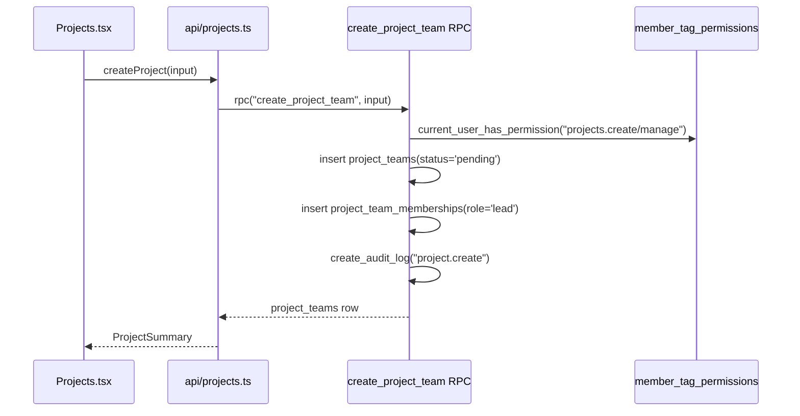
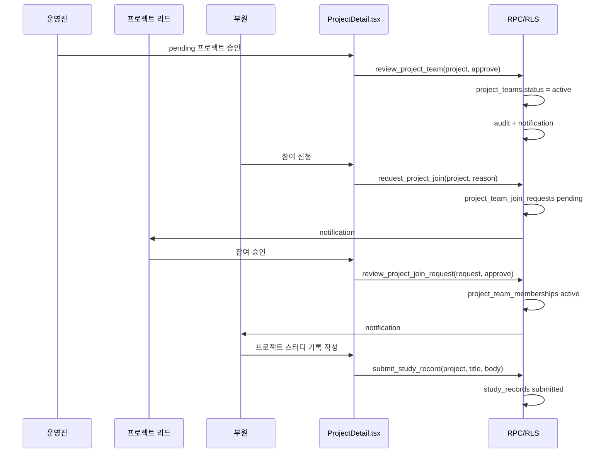

# 프로젝트 도메인

프로젝트의 실제 테이블은 `project_teams` 이고, 참여자는 `project_team_memberships` 로 연결된다. 생성 권한은 `projects.manage` 와 분리된 `projects.create` 로 둔다.

작업 공간, 스터디 기록, 자료, 과제, 알림, RLS까지 포함한 확장 설계는 [프로젝트 개발·스터디 DDD](./project-study-development.md)를 기준으로 한다.

## Invariants

1. **프로젝트 생성은 RPC로 한다.** 클라이언트가 `project_teams` 와 `project_team_memberships` 를 따로 insert 하지 않는다. `create_project_team(...)` 이 프로젝트 row 생성, 생성자 리드 멤버십 생성, 감사 로그를 한 트랜잭션에서 처리한다.
2. **생성 권한은 `projects.create` 또는 `projects.manage` 다.** `projects.read` 는 보기만 의미한다. `projects.manage` 는 기존 관리 권한이라 생성도 포함한다.
3. **생성자는 자동 리드다.** 프로젝트가 `pending` 상태여도 생성자는 `project_team_memberships.role='lead'` 로 붙어서 상세를 볼 수 있다.
4. **권한 부여는 태그에서 한다.** 운영자는 태그 생성/수정 팝업에서 `projects.create` 를 체크하고, 멤버 관리의 `+태그` 모달에서 해당 태그를 사용자에게 붙인다. 권한 체크만으로 태그나 사용자 할당이 자동 생성되지는 않는다.

## Touchpoints

| 영역 | 파일 | 역할 |
| --- | --- | --- |
| DB 권한/RPC | `supabase/migrations/20260506110000_project_create_permission_and_role_tags.sql` | `projects.create` seed, 직접 insert RLS 제한, `create_project_team(...)` |
| DB 운영/RLS | `supabase/migrations/20260506120000_project_review_join_study_core.sql` | 프로젝트 검토/참여 RPC, 직접 update/write 축소, 스터디 기록 테이블/RLS |
| API | `src/app/api/projects.ts` | `createProject()`, `reviewProjectTeam()`, `requestProjectJoin()`, `reviewProjectJoinRequest()` 가 RPC 호출 |
| 스터디 API | `src/app/api/studies.ts` | 프로젝트별 스터디 기록 조회/작성 |
| 목록 UI | `src/app/pages/member/Projects.tsx` | 권한이 있으면 `새 프로젝트` 버튼과 생성 모달 표시 |
| 상세 UI | `src/app/pages/member/ProjectDetail.tsx`, `src/app/pages/member/ProjectStudyPanel.tsx` | 프로젝트 승인/반려, 참여 신청/승인, 프로젝트 스터디 기록 |
| 전역 스터디 UI | `src/app/pages/member/StudyLog.tsx` | RLS로 읽을 수 있는 스터디 기록 목록 |
| 라우트 | `src/app/routes.tsx` | `/member/projects`, `/member/projects/:slug` 는 `projects.read/create/manage` 중 하나로 접근 |
| 사이드바 | `src/app/layouts/MemberLayout.tsx` | 프로젝트 메뉴 권한에 `projects.create` 포함 |
| 권한 UI | `src/app/config/nav-catalog.ts` | 태그 팝업에 `projects.create` 체크박스 노출 |

## 생성 흐름

## 운영 흐름

## 추가 Invariants

5. **프로젝트 승인/반려는 `review_project_team(...)` 으로만 한다.** direct `project_teams` update 정책은 제거했다.
6. **프로젝트 참여 신청/승인은 RPC로 한다.** direct `project_team_memberships` insert/update/delete 정책은 제거하고 `review_project_join_request(...)` 가 멤버십을 만든다.
7. **스터디 기록은 project member scope를 별도로 본다.** 프로젝트 공개 카드와 스터디 기록 권한을 같은 read helper 하나로 뭉치지 않는다.
8. **스터디 기록 오류는 원본 DB 오류를 프론트에 그대로 보여주지 않는다.** `sanitizeUserError` 를 통과한 사용자용 문구만 표시한다.
## 2026-05-05 update: project creation admin and auto slug

이번 변경에서 프로젝트 slug는 사용자가 직접 입력하지 않는다. 프론트는 `createProject()` 호출 시 `input_slug`를 `null`로 보내고, DB의 `create_project_team(...)` RPC가 프로젝트 이름을 기반으로 조직 안에서 중복되지 않는 slug를 자동 생성한다. 한글 이름처럼 ASCII slug로 바꾸기 어려운 경우에는 `project`, `project-2`처럼 안전한 기본값을 사용한다.

프로젝트 생성과 검토는 목록 화면 안에 묻어두지 않고 `/member/project-admin`에서 별도 관리한다. 이 화면은 `pending`, `active`, `rejected`, `archived` 상태를 그룹으로 나누고, 운영 권한자가 승인/반려 사유를 남길 수 있게 한다. 따라서 프로젝트가 여러 개 생겨도 생성 요청 큐와 운영 중 프로젝트가 한 화면에서 분리된다.

스터디 기록은 더 이상 단순 전역 목록으로만 보지 않는다. `/member/study-log`는 프로젝트 칩과 검색어로 기록을 좁히고, 결과를 프로젝트별 섹션으로 묶는다. 프로젝트 상세의 `ProjectStudyPanel.tsx`는 특정 프로젝트 안의 기록 작성/조회이고, 전역 `StudyLog.tsx`는 여러 프로젝트 기록을 비교하는 read model이다.

데모 확인용 seed는 `20260506130000_project_auto_slug_and_demo_seed.sql`에 있다. 4개 데모 프로젝트(`demo-robot-arm`, `demo-vision-lab`, `demo-ros-navigation`, `demo-ai-safety`), 4개 데모 계정, 5개 스터디 기록을 만들어 다중 프로젝트와 프로젝트별 기록 분리를 바로 확인할 수 있게 한다.

추가 touchpoint:

| 영역 | 파일 | 역할 |
| --- | --- | --- |
| DB 자동 slug/seed | `supabase/migrations/20260506130000_project_auto_slug_and_demo_seed.sql` | `create_project_team(...)` 자동 slug 생성, demo project/study seed |
| 프로젝트 생성 관리 UI | `src/app/pages/member/ProjectAdmin.tsx` | 생성 요청 검토, 승인/반려, 상태별 프로젝트 관리 |
| 라우팅 | `src/app/routes.tsx` | `/member/project-admin` 접근 제어 |
| 사이드바/권한 UI | `src/app/layouts/MemberLayout.tsx`, `src/app/config/nav-catalog.ts` | 프로젝트 생성 관리 메뉴와 권한 설정 노출 |
| 스터디 전역 기록 | `src/app/pages/member/StudyLog.tsx` | 프로젝트별 필터/그룹 read model |

## 2026-05-05 update: recruitment scope

프로젝트 목록은 일반 부원 기준으로 `내 프로젝트`가 기본이다. DB RLS도 같은 방향으로 닫는다. 비참여자는 기본적으로 다른 프로젝트를 볼 수 없고, 예외적으로 `status='active'`, `visibility='public'`, `recruitment_status='open'`인 프로젝트만 `모집중`으로 볼 수 있다.

`모집중`은 프로젝트 lifecycle status가 아니다. 프로젝트 상태는 계속 `active`이고, 모집 여부는 `project_teams.recruitment_status` (`closed` 또는 `open`)로 별도 관리한다. 이렇게 해야 `검토중`, `반려`, `종료` 같은 lifecycle과 “지금 새 멤버를 받는가”가 섞이지 않는다.

참여 신청은 `request_project_join(...)` RPC가 최종 권한이다. DB는 active/public/open 프로젝트가 아니면 참여 신청을 거절한다. 프론트의 참여 신청 버튼은 `project.isRecruiting && !project.isMember`일 때만 보이지만, 버튼이 숨겨져도 권한의 최종 판단은 RPC가 한다.

추가 touchpoint:

| 영역 | 파일 | 역할 |
| --- | --- | --- |
| DB 모집/RLS | `supabase/migrations/20260506140000_project_recruitment_scope.sql` | `recruitment_status`, `recruitment_note`, 모집중 read scope, 참여 신청 제한, 모집 상태 RPC |
| 프로젝트 목록 | `src/app/pages/member/Projects.tsx` | 기본 필터를 내 프로젝트로 두고 모집중 필터/배지 제공 |
| 프로젝트 상세 | `src/app/pages/member/ProjectDetail.tsx` | 모집중 안내, 참여 신청, 리드/운영자 모집 시작/마감 |
| 프로젝트 생성 관리 | `src/app/pages/member/ProjectAdmin.tsx` | active 프로젝트 모집 시작/마감 |
| 프로젝트 정책 | `src/app/api/project-policy.js` | `recruiting` 필터 |
