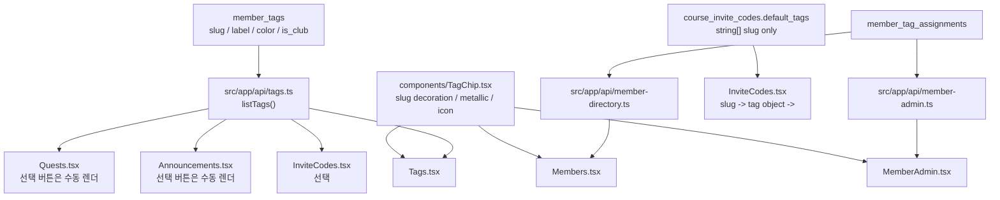

# 태그 렌더링 Touchpoints

태그의 데이터 기준은 `member_tags` / `member_tag_assignments` 이고, 태그 칩의 시각 기준은 `src/app/components/TagChip.tsx` 이다. 태그 디자인, 아이콘, 금속 질감, 라벨 표시 방식을 바꿀 때는 이 문서를 먼저 보고 영향을 받는 화면을 전부 확인한다.

## 왜 이 문서가 필요한가

태그는 권한·사이드바·공지 범위·퀘스트 청중·퀘스트 보상·초대코드 자동 부여·멤버 카드 표시를 동시에 건드린다. 그런데 현재 코드에는 `TagChip` 으로 통일된 곳과, 각 페이지가 직접 `span` / `button` 으로 그리는 곳이 섞여 있다. 그래서 `TagChip.tsx` 만 바꾸면 멤버 카드와 멤버 관리는 바뀌지만, 초대코드 같은 화면은 그대로 남아 태그 디자인이 달라진다.

## 현재 구조 요약



## 렌더링 매트릭스

| 영역 | 파일 | 현재 렌더링 | 데이터 | 태그 디자인 변경 시 확인 |
| --- | --- | --- | --- | --- |
| 공통 태그 칩 | `src/app/components/TagChip.tsx` | 단일 컴포넌트. slug별 아이콘/금속 질감/색상 처리 | `{ slug, label, color, isClub? }` | 태그 칩 자체 변경은 여기서 시작 |
| 멤버 디렉토리 카드/리스트 | `src/app/pages/member/Members.tsx` | `TagChip` 사용 | `MemberDirectoryProfile.memberTags` | 태그 칩 변경 자동 반영. 단, `ShieldCheck + 직위`, `Building2 + 동아리명` 메타는 별도 요약이며 원본 태그 칩을 없애면 안 됨 |
| 내 프로필 태그 | `src/app/pages/member/Members.tsx` | `TagChip` 사용 | `member.memberTags` | 태그 칩 변경 자동 반영 |
| 멤버 관리 행 태그 | `src/app/pages/member/MemberAdmin.tsx` | `TagChip` 사용, 회수 버튼 포함 | `AdminMemberRow.tags` | 태그 칩 변경 자동 반영 |
| 멤버 관리 +태그 모달 | `src/app/pages/member/MemberAdmin.tsx` | `TagChip` 사용, 선택 상태 전달 | `tagsCatalog` | 태그 칩 변경 자동 반영 |
| 태그 목록 미리보기 / 생성·수정 모달 | `src/app/pages/member/Tags.tsx` | `TagChip` 사용. 수정 모달에서 기본 정보·권한·사이드바를 같이 저장 | `listTags()` / `getTagBySlug()` 결과 | 태그 칩 변경 자동 반영. 권한/메뉴 변경도 목록 수정에서 빠지면 안 됨 |
| 퀘스트 카드의 보상/청중 표시 | `src/app/pages/member/Quests.tsx` | 내부 wrapper가 공통 `TagChip` 호출 | `QuestTagRef` | 태그 칩 변경 자동 반영 |
| 퀘스트 생성/수정 태그 선택 | `src/app/pages/member/Quests.tsx` | 수동 `button` + 색 점 + 체크 | `MemberTag[]` | `TagChip` 변경이 자동 반영되지 않음. 선택 UI까지 같은 모양이어야 하면 통합 필요 |
| 공지 목록 공개 범위 요약 | `src/app/pages/member/Announcements.tsx` | 수동 pill. 태그 이름을 텍스트로 요약 | `audienceTags` | 현재는 태그 칩이 아니라 visibility badge. 태그 칩으로 바꿀지 판단 필요 |
| 공지 작성/수정 공개 태그 선택 | `src/app/pages/member/Announcements.tsx` | 수동 `label` + checkbox + 색 점 | `MemberTag[]` | `TagChip` 변경이 자동 반영되지 않음. 선택 UI까지 같은 모양이어야 하면 통합 필요 |
| 초대코드 목록의 동아리 열 | `src/app/pages/member/InviteCodes.tsx` | 일반 텍스트 | `default_tags` 중 `isClub=true` 태그의 label. 여러 개면 slug ASC 첫 항목 | 태그가 아니라 파생 텍스트라 pill 로 꾸미지 않는다 |
| 초대코드 목록의 태그 열 | `src/app/pages/member/InviteCodes.tsx` | `TagChip` 사용 | `default_tags` slug → `member_tags` 카탈로그 매핑 | 태그 칩 변경 자동 반영 |
| 초대코드 발급 모달 태그 선택 | `src/app/pages/member/InviteCodes.tsx` | `TagChip` 사용 | `listTags()` 결과 | 태그 칩 변경 자동 반영 |
| 태그 상세 헤더 | `src/app/pages/member/TagDetail.tsx` | 태그 라벨 텍스트 + 별도 badge | `TagDetail` | 실제 칩 표시가 아니라 상세 헤더. 필요하면 `TagChip` 미리보기 추가 판단 |
| 태그 상세 가상 회원 미리보기 | `src/app/pages/member/TagDetail.tsx` | 수동 작은 pill | 입력 중인 `label/color` | 실제 멤버 카드처럼 보여야 한다면 `TagChip` 으로 통합 필요 |

## 이번 불일치의 정확한 원인

초대코드 페이지는 이제 두 값을 분리해서 다룬다.

1. `clubLabel`: 초대코드 행의 "동아리" 열에 보이는 일반 텍스트. `default_tags` 중 `isClub=true` 태그에서 파생한다. 여러 개면 slug ASC 첫 항목이다.
2. `defaultTagObjects`: 초대코드로 가입할 때 자동 부여할 태그 객체 배열. `default_tags` slug 배열을 `member_tags` 카탈로그에 매핑한 결과이며 목록/선택 UI 모두 `TagChip` 으로 그린다.

과거에는 초대코드 목록이 `default_tags` 문자열을 직접 노랑/보라 pill 로 그려 `TagChip.tsx` 변경이 반영되지 않았다. 이 패턴을 다시 만들지 않는다.

## 태그 변경 시 검색 키워드

PowerShell 기준:

```powershell
Get-ChildItem -Path src\app -Recurse -File -Include *.tsx,*.ts |
  Select-String -Pattern 'TagChip','default_tags.map','tagsCatalog.map','audienceTags','rewardTags','borderRadius: 999','tag.label','tag.slug'
```

이 검색으로 나오는 결과를 세 부류로 나눈다.

| 부류 | 의미 | 처리 |
| --- | --- | --- |
| `TagChip` 사용 | 공통 컴포넌트 영향권 | `TagChip.tsx` 변경으로 충분한지 확인 |
| `tag.label/tag.slug` + 수동 `button/span` | 태그인데 직접 렌더 | 같은 디자인이어야 하면 `TagChip` 으로 통합. 초대코드는 이미 통합됨 |
| status/visibility/usage badge | 태그가 아니라 상태 표시 | 태그 디자인과 일부러 달라도 됨. 단, 혼동되면 이름/스타일 분리 |

## 통합할 때 필요한 결정

초대코드 목록은 `src/app/api/invite-codes.ts` 에서 `default_tags` 문자열 배열을 `defaultTagObjects` 로 정규화한다. UI에서 다시 문자열 pill 을 만들지 않는다.

## 금지

- `ShieldCheck + 직위`, `Building2 + 동아리명` 메타를 추가했다는 이유로 원본 태그 칩 목록에서 해당 태그를 제거하지 않는다.
- `isClub=true` 라는 이유만으로 `TagChip` 위에 `Building2` 아이콘을 자동으로 붙이지 않는다. 건물 아이콘은 멤버 카드의 소속 메타(`Building2 + 동아리명`)에만 쓴다.
- `club_affiliation` 문자열을 실제 권한/소속의 단일 출처처럼 쓰지 않는다. 실제 권한/소속은 태그다.
- 새 태그 디자인을 특정 페이지에만 수동 복붙하지 않는다. 공통화가 필요한 렌더링이면 `TagChip` 을 쓰거나 별도 공통 선택 컴포넌트를 만든다.
